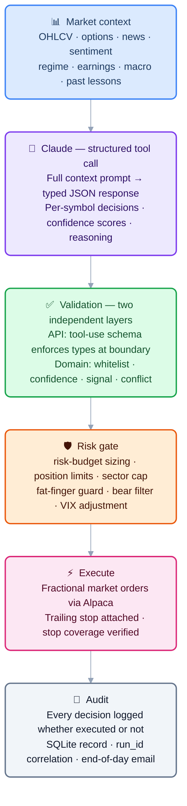
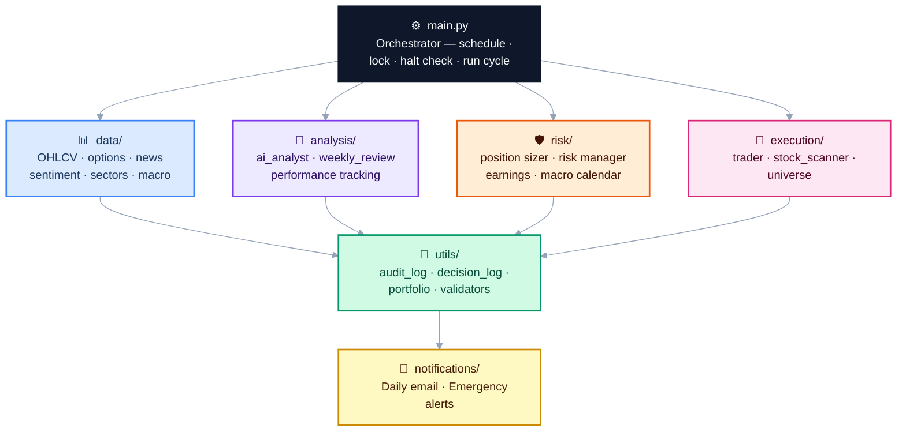

# InvestorBot — AI Governance & Execution Control System

An AI-governed execution-control system for US equities portfolio management. Claude (Anthropic) performs analysis and issues structured recommendations; a deterministic validator, risk gate, and human-override layer decide whether to act. The system never allows an AI model to place, cancel, or modify orders directly.

**Paper trading by default.** The system runs in Alpaca's simulation environment until the operator explicitly confirms live mode with a required acknowledgement string. There is no fast path to real orders.

> **Claude cannot:** place, modify, or cancel orders · read or write configuration · access account balances or position metadata · trigger alerts or emails · modify its own operating parameters. Every Claude output is validated by a deterministic layer before any action is taken. See [AI Governance](#ai-governance) for the full authority boundary.

---

## Table of Contents

1. [Quick Start](#quick-start)
2. [How It Works](#how-it-works)
3. [Architecture](#architecture)
4. [AI Governance](#ai-governance)
5. [Setup](#setup)
6. [Using the System](#using-the-system)
7. [Deployment & Operations](#deployment--operations)
8. [Evaluation Evidence](#evaluation-evidence)
9. [LLM Eval Fixtures](#llm-eval-fixtures)
10. [Production Story — Day One Incidents](#production-story--day-one-incidents)
11. [What's Next](#whats-next)
12. [Why This Demonstrates FDE Skills](#why-this-demonstrates-fde-skills)
13. [Notes of Interest](#notes-of-interest)
14. [Version History](#version-history)

---

## Quick Start

No credentials needed:

```bash
git clone https://github.com/samchatterley/investor-bot
cd investor-bot
python3 -m venv .venv && source .venv/bin/activate
pip install -r requirements.txt
python cli.py demo
```

`demo` mode runs a complete simulated open cycle using static fixture data — no Alpaca account, no Anthropic key, no Gmail. It shows the market context build, AI decision parsing, validation, risk gate, simulated order placement, and audit log output in real time.

---

## How It Works

Most retail algorithmic trading tools fall into one of two failure modes: they either require constant manual intervention (defeating the purpose of automation), or they hand full autonomy to an ML model with no interpretability, no human override, and no audit trail.

InvestorBot sits in between — Claude does the analytical heavy lifting, but every decision it makes is validated, logged, bounded, and reversible before it touches real capital.

### Decision pipeline



### Daily schedule

The scheduler fires four times on every trading day (all times America/New_York):

| Time | Mode | What happens |
|------|------|-------------|
| 09:31 | `open_sells` | Earnings exits and AI sell decisions — no new buys into open noise |
| 10:00 | `open` | Full cycle: market context → Claude → validate → risk gate → long buys + short hedges |
| 12:00 | `midday` | Partial profit exits, stop checks; intraday-signal buys if setups present |
| 15:30 | `close` | Force-cover all intraday positions; final position review before market close |
| 15:00 Sun | `weekly_review` | AI self-review, parameter proposals, diagnostics email |

### Scan universe

The daily scan universe is built dynamically at runtime rather than from a fixed list. `execution/universe.py` fetches Alpaca's full US equity asset catalog (~11,000 names), filters to tradable + fractionable symbols on major exchanges (NYSE, NASDAQ, ARCA, AMEX, BATS), then applies a fast price (≥ $5) and daily volume (≥ 500K shares) screen via the Alpaca snapshot API. The result — up to 500 symbols — is cached for 24 hours. The static core list in `config.STOCK_UNIVERSE` is always included as a fallback and is merged into the dynamic result.

### Signal types

The prefilter (`execution/stock_scanner.py`) requires every buy candidate to match at least one of fifteen signal patterns before Claude sees it. This keeps Claude's input focused on genuine technical setups and prevents it from making decisions on featureless data.

**Daily signals** (computed from end-of-day bar history via yfinance):

| Signal | Entry conditions | Hold limit |
|--------|-----------------|------------|
| `mean_reversion` | RSI < 38 + BB < 0.30 + vol spike; blocked in NEUTRAL_CHOP and DEFENSIVE_DOWNTREND | 2 days |
| `rsi_oversold` | RSI < 30 sharp bounce | 2 days |
| `news_catalyst` | Company-specific news + volume | 2 days |
| `macd_crossover` | MACD line crosses above signal line + volume; blocked in NEUTRAL_CHOP | 4 days |
| `bb_squeeze` | Bollinger bandwidth at 20th percentile of last 20 bars → coiling; directional confirmation + volume | 4 days |
| `inside_day_breakout` | Prior candle's full range contains today's; breaks with directional confirmation + volume; blocked in NEUTRAL_CHOP | 3 days |
| `trend_pullback` | EMA9 > EMA21, price 0.5–3% below EMA21, RSI 40–58 — buying the dip in a healthy trend; blocked in DEFENSIVE_DOWNTREND | 3 days |
| `momentum` | EMA9 > EMA21 + MACD positive + positive 5d return + high volume; blocked in DEFENSIVE_DOWNTREND | 5 days |
| `trend_continuation` | AI-classified continuation of an established trend | 5 days |
| `breakout_52w` | Within 3% of 52-week high + above-average volume + weekly trend intact; blocked in DEFENSIVE_DOWNTREND | 5 days |
| `rs_leader` | Outperforming SPY over both 5d and 10d with EMA alignment; **globally disabled** (`GLOBALLY_DISABLED`) — Sharpe −0.93 standalone, best param sweep Sharpe 0.15 over 9 years; no edge in any regime | 5 days |
| `momentum_12_1` | Jegadeesh-Titman 12-1 factor: 12m return minus 1m return > threshold, EMA aligned, ADX ≥ 20; **globally disabled** (`GLOBALLY_DISABLED`) — WR 48%, avg −0.2% in every tested regime | 5 days |
| `gap_and_go` | Intraday gap ≥ threshold + volume; blocked in DEFENSIVE_DOWNTREND | 5 days |
| `vix_fear_reversion` | VIX spike above threshold + vol filter — mean-reversion buy after volatility shock; blocked in non-stress regimes | 3 days |
| `rsi_divergence` | Price lower than 5 days ago but RSI recovering (bullish structural divergence); ADX < 25, RSI < 45; blocked in BULL_TREND and stress regimes | 3 days |
| `range_reversion` | ADX < 20 (confirmed range-bound) + BB < 0.10 + RSI < 30; blocked in NEUTRAL_CHOP and DEFENSIVE_DOWNTREND | 3 days |
| `insider_buying` | ≥2 distinct corporate insiders made open-market Form 4 purchases (SEC EDGAR) within 10 days; bypasses weekly trend filter | 5 days |
| `pead` | Post-Earnings Announcement Drift: EPS beat ≥5% within 30 days + price still drifting up (ret_5d > 0); bypasses weekly trend filter | 3 days |
| `iv_compression` | Historical volatility rank in bottom 20th percentile of its 52-week range + directional confirmation (EMA or MACD) + volume; blocked in NEUTRAL_CHOP | 4 days |
| `golden_cross` | SMA50 crosses above SMA200 + vol_ratio ≥ 0.8; regime-agnostic | 5 days |
| `candle_exhaustion` | Hammer or bullish engulf at 20d low with vol_ratio ≥ 1.5; blocked in BEAR_DAY and HIGH_VOL | 3 days |
| `obv_divergence` | OBV 5d slope rising while price 5d negative (accumulation divergence) + vol_ratio ≥ 1.0; blocked in BEAR_DAY | 3 days |
| `obv_acceleration` | OBV 5d slope > OBV 20d slope (accelerating into price) + EMA aligned or MACD positive + vol_ratio ≥ 1.2; blocked in BEAR_DAY | 3 days |
| `volume_climax_reversal` | 3+ consecutive days of vol_ratio > 2.5 at 20d price low (exhaustion reversal) | 3 days |
| `unknown` | Default when Claude can't pinpoint a specific pattern | 3 days |

**Intraday signals** (computed from Alpaca minute bars; available on any run during market hours):

| Signal | Entry conditions |
|--------|-----------------|
| `vwap_reclaim` | Price above VWAP + >1% gain from open + not overextended (pct vs VWAP ≤ 3%) |
| `orb_breakout` | Price broke above the first-30-minute high with above-average volume |
| `intraday_momentum` | >2% gain from open + above VWAP + intraday RSI < 75 + daily trend confirms |

Intraday signals enable the midday run (12:00 ET) to execute new buys, not just manage positions. The 12:00 run now acts on moves that develop after the open rather than waiting until the next day.

Signals are grouped by family: **mean-reversion** (`mean_reversion`, `rsi_oversold`, `rsi_divergence`, `range_reversion`), **volatility expansion** (`bb_squeeze`, `inside_day_breakout`, `iv_compression`, `vix_fear_reversion`), **trend/momentum** (`momentum`, `trend_continuation`, `trend_pullback`, `rs_leader`, `breakout_52w`, `macd_crossover`, `momentum_12_1`, `gap_and_go`), **OHLCV technical** (`golden_cross`, `candle_exhaustion`, `obv_divergence`, `obv_acceleration`, `volume_climax_reversal`), **catalyst** (`news_catalyst`), **fundamental** (`insider_buying`, `pead`), and **intraday** (`vwap_reclaim`, `orb_breakout`, `intraday_momentum`).

---

## Architecture

### Module map



### Project structure

```
├── analysis/          AI analyst, performance tracking, weekly review
├── backtest/          Rule-based backtesting engine
├── data/              Market data, news, options, sentiment, sectors
├── docs/adr/          Architecture Decision Records (5 design decisions)
├── evals/             LLM eval fixtures — prompt injection, hallucinated tickers, bear market, etc.
├── execution/         Order placement, stock scanner, dynamic universe builder
├── notifications/     Email and alert system
├── risk/              Position sizing, earnings/macro calendar, risk checks
├── scripts/           Scheduler and diagnostics runner
├── tests/             Unit test suite (4119 tests, 100% coverage)
├── utils/             Audit log, portfolio tracker, decision log, validators
├── cli.py             Command-line interface (includes demo mode)
├── config.py          All configuration and environment variables
├── dashboard.py       Streamlit web dashboard
├── main.py            Core trading logic
└── start              Launcher shortcut (./start dashboard, ./start status, etc.)
```

### Architecture tradeoffs

| Decision | Rationale | Tradeoff accepted |
|----------|-----------|-------------------|
| Claude as recommender, not executor | Interpretable reasoning, plain-English audit trail, easy to constrain | Higher latency than pure quant model; API cost per run |
| Rule-based validator as gatekeeper | AI output is untrusted by default — every response schema-checked before acting | Some valid signals rejected by over-strict rules |
| Paper-first, explicit live opt-in | Prevents accidental live deployment; forces conscious decision | Slightly more setup friction |
| SQLite state (`logs/investorbot.db`) | ACID transactions, queryability, atomic audit joins — migrated from JSON files after a real overwrite incident | Requires schema migrations as the system evolves |
| Constrained parameter recommendation engine | Allows adaptation within hard bounds without unbounded drift | Slower adaptation than fully autonomous parameter search |
| Structured logging with run_id | Correlate every audit event, decision, and order to the run that caused it | Slightly more logging overhead per run |

Full rationale for each decision is in [docs/adr/](docs/adr/).

---

## AI Governance

This section describes how the system constrains Claude's decision-making authority. It is the most important section for understanding the design.

### Separation of reasoning and execution

Claude's role is **analysis and recommendation only**. It never calls the Alpaca API directly. Every decision it returns passes through a validation layer and a separate risk layer before any order is placed. Claude cannot:

- Place, modify, or cancel orders
- Read or write configuration
- Access position metadata or account balances
- Trigger alerts or emails

### Validation layer (`utils/validators.py`)

Every Claude response is validated before it reaches the execution layer:

| Check | What it does |
|-------|-------------|
| Schema validation | Rejects responses missing required fields (`buy_candidates`, `position_decisions`, `market_summary`) |
| Universe whitelist | Rejects any BUY recommendation for a symbol not in the scanned universe |
| Confidence floor | Ignores recommendations below `MIN_CONFIDENCE` (default 7/10) |
| Action conflict | Rejects BUY recommendations for symbols already held |
| Signal whitelist | Rejects unknown signal types not in the allowed set |
| Confidence bounds | Rejects confidence scores outside 1–10 |
| Prompt injection scan | Headlines and news text are scanned for instruction-like patterns before inclusion in the prompt; suspicious content is dropped and logged |

If validation fails, the run continues with the remaining valid decisions. Partial failures are logged; complete failures abort the run and send an alert.

Validation scenarios are covered by fixtures in [`evals/`](evals/) — see the [LLM Eval Fixtures](#llm-eval-fixtures) section.

### Risk layer (`risk/`)

After validation, position-level risk checks are applied independently of Claude's recommendations:

- **Risk-budget sizing** — position size is set at 0.25% of equity risked per trade (`RISK_PER_TRADE_PCT`), hard-capped at 5% of portfolio per position (`MAX_POSITION_WEIGHT`). Kelly is tracked as secondary telemetry but does not drive order sizes
- **Hard position limits** — up to 5 positions (2 in small-account mode), capped at 5% of portfolio per position, 10% cash reserve always maintained
- **Fat-finger guard** — single orders above `MAX_SINGLE_ORDER_USD` (default $50,000; $55 in small-account mode) are rejected regardless of instruction
- **Daily notional cap** — total new deployment above `MAX_DAILY_NOTIONAL_USD` (default $150,000; $75 in small-account mode) in one day halts buying
- **Sector concentration** — maximum 2 positions in any sector
- **Bear filter** — no new buys when SPY drops more than 1.5% in a session
- **VIX-tiered stop adjustment** — trailing stop trail widens automatically: 3% (VIX ≤ 18) → 4% (VIX ≤ 25) → 5.5% (VIX ≤ 35) → 7% (VIX > 35)
- **Earnings guard** — positions with earnings within 2 calendar days are exited pre-emptively
- **Circuit breaker** — new buys halted when the portfolio drops 12% from its 5-day peak
- **Daily loss limit** — all positions closed and halt file created when the portfolio loses 5% from the session open; requires manual `python cli.py resume`
- **Partial profit taking** — 50% of any position is sold when unrealised gain hits 8% (15% in small-account mode); the remaining half runs with the trailing stop
- **Per-signal hold limits** — stale positions are time-exited after signal-specific maximums: mean-reversion, RSI oversold, news catalyst, vix_fear_reversion (2 days); inside-day breakout, trend pullback, rsi_divergence, range_reversion (3 days); MACD crossover, BB squeeze, iv_compression (4 days); momentum, trend continuation, 52-week breakout, RS leader, gap_and_go, momentum_12_1 (5 days)
- **Short hedge** — after long buys each open run, bottom-quartile RS stocks are scanned for short positions (max 3 concurrent; capped at 0.5× long notional; sized at 0.5× standard long size); regime-gated to BULL_TREND and NEUTRAL_CHOP only
- **Same-day open guard** — only one buy phase executes per calendar day in `open` mode; subsequent open runs (e.g. from scheduler restarts) skip buys entirely

### Constrained parameter recommendation engine

The weekly self-review enables Claude to propose adjustments to four operating parameters. This is a **constrained recommendation** mechanism — not self-modification. Every proposal:

1. Is validated against hard-coded bounds that cannot be exceeded regardless of what Claude proposes
2. Is recorded in `logs/weekly_review_YYYY-MM-DD.json` and included in the Sunday email as a proposal — never applied automatically
3. Can be applied by the operator by manually editing `logs/runtime_config.json`; config loads and bounds-checks this file at every startup

| Parameter | Allowed range |
|-----------|---------------|
| `MIN_CONFIDENCE` | 7 – 10 |
| `TRAILING_STOP_PCT` | 2.0% – 10.0% |
| `PARTIAL_PROFIT_PCT` | 3.0% – 20.0% |
| `MAX_HOLD_DAYS` | 1 – 10 days |
| `MAX_ORDERS_PER_RUN` | 1 – 5 |

Values outside bounds are logged and rejected. The runtime config file is loaded at startup alongside `config.py` — source is never modified by the system. See [ADR-005](docs/adr/ADR-005-bounded-parameter-updates.md) for full rationale.

### Human override

At any point:

```bash
python cli.py halt      # Creates logs/.HALTED — bot refuses all further runs
python cli.py resume    # Removes halt file and resumes
```

The halt command prompts for explicit confirmation before liquidating open positions. The halt file is checked at the start of every run cycle before any data is fetched or any API is called.

### Audit trail

Every Claude recommendation is written to the SQLite audit store regardless of whether it was executed — including the confidence score, plain-English reasoning, signal type, `run_id`, and a flag indicating whether it became a real trade. This log is queryable via `python cli.py decisions` and rendered in the dashboard's AI Decisions page.

Every order placed is recorded with timestamp, symbol, action, price, quantity, run_id, and mode. The `run_id` field links every audit event, decision, and order back to the run that caused them.

---

## Setup

**Requirements:** Python 3.12, a free [Alpaca Markets](https://alpaca.markets) account, an [Anthropic API](https://console.anthropic.com) key, and a Gmail account with an App Password.

### Option A — local (Python venv)

```bash
git clone https://github.com/samchatterley/investor-bot
cd investor-bot
python3 -m venv .venv && source .venv/bin/activate
pip install -r requirements.txt
cp .env.example .env
# Fill in .env with your keys
python scripts/run_scheduler.py
```

### Option B — Docker

```bash
cp .env.example .env
# Fill in .env with your keys
docker-compose up -d
```

This starts two containers: the trading scheduler (`investorbot`) and the web dashboard (`investorbot-dashboard`) at `http://localhost:8501`. Logs are persisted to `./logs/` via a volume mount.

### `.env` keys

| Variable | Description |
|----------|-------------|
| `ALPACA_API_KEY` / `ALPACA_SECRET_KEY` | Alpaca credentials |
| `ALPACA_BASE_URL` | `https://paper-api.alpaca.markets` for paper (default), `https://api.alpaca.markets` for live |
| `ANTHROPIC_API_KEY` | Claude API key |
| `EMAIL_FROM` | Gmail address the bot sends from |
| `EMAIL_TO` | Owner address — emergency alerts only |
| `EMAIL_RECIPIENTS` | Named recipients for daily summary + weekly review: `Sam:sam@gmail.com,Harri:harri@outlook.com` |
| `EMAIL_APP_PASSWORD` | Gmail App Password (not your login password) |
| `ALPHA_VANTAGE_API_KEY` | Optional. Alpha Vantage API key for news sentiment enrichment. Free tier: 500 calls/day, 5 calls/min. When absent, AV sentiment is silently disabled. |

**Live trading:** The system is designed as a paper-trading governance and simulation framework. Live mode (changing `ALPACA_BASE_URL` to the live endpoint) additionally requires setting `LIVE_CONFIRM=I-ACCEPT-REAL-MONEY-RISK` in your `.env`. Do this only after extended paper trading, after reviewing all risk parameters, and with full understanding of every circuit breaker and kill switch in the system.

---

## Using the System

### CLI

```bash
python cli.py demo                # Complete simulated run — no credentials needed
python cli.py status              # Account value, open positions, halt state
python cli.py positions           # Live positions with P&L
python cli.py trades --days 10    # Recent trade history
python cli.py decisions --days 5  # AI decision log with reasoning
python cli.py run --mode open     # Trigger a trading run
python cli.py run --dry-run       # Analyse only, no orders placed
python cli.py halt                # Emergency kill switch
python cli.py resume              # Clear halt and resume
python cli.py backtest --start 2025-01-01
python cli.py dashboard           # Launch web dashboard
```

### Web dashboard

```bash
python cli.py dashboard
```

Opens at `http://localhost:8501`. Five pages:

| Page | Contents |
|------|----------|
| Overview | Live portfolio value, equity curve, daily P&L bar chart, open positions |
| Trades | Full trade history table across all sessions |
| AI Decisions | Every Claude recommendation — confidence, signal type, reasoning, executed flag |
| Backtest | Equity curve, Sharpe ratio, win rate, signal breakdown |
| Diagnostics | Unit test results with pass/fail counts and a run-now button |

### Backtesting

```bash
python cli.py backtest --start 2025-01-01 --capital 25000
```

Replays rule-based entry signals on historical OHLCV data without calling Claude. Reports total return, win rate, Sharpe ratio, max drawdown, and performance by signal type. Results are saved to `logs/backtest_results.json` and rendered in the dashboard. See the [Evaluation Evidence](#evaluation-evidence) section for results and caveats.

### Notifications

Each person listed in `EMAIL_RECIPIENTS` receives a personalised email addressed by name.

| Event | Recipients |
|-------|-----------|
| End-of-day summary | All `EMAIL_RECIPIENTS` |
| Sunday weekly review + diagnostics | All `EMAIL_RECIPIENTS` |
| Circuit breaker / daily loss limit / errors | `EMAIL_TO` only |

---

## Deployment & Operations

### Where it runs

Currently running on a local Mac in a `tmux` session with `caffeinate` to prevent sleep. This is intentional for paper-trading — there is no cost, no infrastructure, and no blast radius if something goes wrong. For a production deployment the natural next step would be a small VPS (Hetzner, DigitalOcean) or a Docker container on a cloud host with a persistent volume for `logs/`.

The scheduler (`scripts/run_scheduler.py`) is the single production runner — it handles all four daily runs plus the Sunday weekly review. Do not use cron alongside it; doing so will double-fire every run.

### Secrets handling

All secrets live in `.env` which is gitignored and never committed. The `.env.example` file documents every required variable with descriptions but no values. Inside the application, credentials are read from environment variables at startup via `python-dotenv` — they are never logged, never included in prompts, and never written to disk.

### Persistence and recovery

- **Lock file** (`logs/.lock_YYYY-MM-DD`): prevents two scheduler instances running simultaneously on the same day. Date-scoped to avoid midnight-crossing races.
- **Halt file** (`logs/.HALTED`): persists across restarts. If the bot is halted by a circuit breaker, it stays halted until manually resumed — it will not auto-resume after a crash.
- **SQLite database** (`logs/investorbot.db`): all position metadata, run records, audit events, and AI decisions. Reconciled against live Alpaca positions at the start of every open run. ACID transactions prevent the partial-write races that affected the earlier JSON-file implementation.

### Monitoring

- **Email alerts**: circuit breaker triggers, daily loss limit hits, and run errors all send an immediate email to `EMAIL_TO`.
- **Daily email**: end-of-day summary to all recipients — acts as a daily heartbeat. If the email doesn't arrive, the bot didn't run.
- **Dashboard**: `http://localhost:8501` shows live portfolio, equity curve, and recent decisions.
- **Structured logs**: every run emits JSON-structured log lines with `run_id`, `ts`, `event`, and `payload` — queryable via `logs/investorbot.db`.
- **run_id correlation**: every audit event, AI decision, and order carries the same `run_id` (UUID), making it possible to reconstruct the full causal chain for any trade.
- **LLM cost tracking**: token usage for each Claude call is logged (input tokens, output tokens, estimated cost) to the `llm_usage` table.
- **Diagnostics**: `python scripts/run_diagnostics.py` runs the full unit test suite and saves a report to `logs/test_report_YYYY-MM-DD.json`. Also runs automatically every Sunday.

### Cost

| Component | Cost |
|-----------|------|
| Alpaca paper trading | Free |
| Claude API (sonnet-4-6) | ~$0.03–0.08 per trading day (4 runs × ~500 token prompt + response) |
| Infrastructure (local) | $0 |
| Gmail SMTP | Free |

At current rates, running costs are approximately **$1–2/month** in API fees.

### Live operations — [LIVE_RUNBOOK.md](LIVE_RUNBOOK.md)

Full step-by-step procedures for going live: pre-live checklist, canary procedure (single $20 trade to verify the full broker pipeline), incremental escalation, audit queries, and incident response. Start here before switching from paper to live.

**Canary procedure in brief:**
```bash
cp canary.env.example .env        # fill in live API keys
python main.py --safety-check     # must be GREEN
python main.py --live-shadow      # dry run against live account; check LIVE_SHADOW_COMPLETE in logs
python main.py --mode open        # single $20 canary trade
# verify ORDER_EXEC_QUALITY + ORDER_TIMING in audit log, then close position
```

### Runbook

**Bot isn't running / missed a scheduled time**
```bash
tmux attach -t investorbot       # Check if process is alive
python cli.py status             # Check halt state and account
python scripts/run_scheduler.py  # Restart if needed
```

**Unexpected position opened**
```bash
python cli.py decisions --days 1  # See what Claude decided and why
python cli.py halt                 # Kill switch if needed
```

**Email not arriving**
```bash
python cli.py run --dry-run       # Triggers email flow without placing orders
# Check logs/investorbot.db for error details
```

**Suspicious behaviour / want to inspect decisions**
```bash
python cli.py decisions --days 5  # Last 5 days of AI reasoning
python cli.py dashboard           # Full decision log with filters
```

**Full reset**
```bash
python cli.py halt                # Liquidates positions, creates halt file
python cli.py resume              # Clear halt when ready
```

---

## Evaluation Evidence

### Backtest results (Jan 2025 → May 2026)

The backtester replays the strategy's rule-based entry signals on historical OHLCV data. This is a **proxy for the strategy's signal quality** — it does not call Claude, so it measures whether the underlying technical signals have edge, not whether Claude interprets them well.

Two runs are maintained: daily signals only (no Alpaca dependency), and all 11 signals including the three intraday signals which require Alpaca minute bars (`--use-intraday`).

**Daily signals only (8 signals):**
```
Initial capital:   $25,000
Final value:       $21,534
Total return:      -13.9%
Total trades:      630
Win rate:          50%
Avg return/trade:  -0.09%
Max drawdown:      n/a
Sharpe ratio:      -0.30

By signal:
  mean_reversion       210 trades  WR 50%  avg -0.06%
  rs_leader            136 trades  WR 52%  avg +0.09%
  bb_squeeze           141 trades  WR 52%  avg +0.37%
  trend_pullback        75 trades  WR 44%  avg -0.50%
  macd_crossover        26 trades  WR 42%  avg -0.41%
  breakout_52w          19 trades  WR 47%  avg -0.92%
  inside_day_breakout   15 trades  WR 60%  avg +0.18%
  momentum               8 trades  WR 12%  avg -3.03%
```

**All signals including intraday (11 signals, via Alpaca minute bars):**
```
Initial capital:   $25,000
Final value:       $36,171
Total return:      +44.7%
Total trades:      619
Win rate:          52%
Avg return/trade:  +0.37%
Max drawdown:      -30.8%
Sharpe ratio:      1.10

By signal:
  bb_squeeze           294 trades  WR 48%  avg -0.18%
  rs_leader            182 trades  WR 60%  avg +0.87%
  breakout_52w         124 trades  WR 56%  avg +1.04%
  macd_crossover         2 trades  WR 50%  avg -0.72%
  trend_pullback         3 trades  WR  0%  avg -4.62%
  orb_breakout          10 trades  WR 30%  avg -0.52%
  mean_reversion         3 trades  WR 33%  avg +1.49%
  inside_day_breakout    1 trade   WR 100% avg +7.27%
```

### Backtest caveats

- **Rule-based proxy, not live Claude decisions.** The backtester uses hardcoded signal rules (RSI < 35, EMA crossover, etc.) as a proxy for what Claude would recommend. Live Claude decisions will differ — sometimes better, sometimes worse.
- **Transaction costs modelled.** Fills include 5 bps slippage, a liquidity-scaled half-spread (`max(SPREAD_BPS, 50/sqrt(ADV_USD/1e6))`), and a square-root market impact cost (`10 bps × sqrt(participation %)`, capped at 50 bps). Costs widen automatically for illiquid names and large orders relative to ADV.
- **Gap-through-stop.** If today's open is already at or below the stop price, the fill executes at open (not the stop level), reflecting realistic gap risk.
- **No lookahead bias.** Signals use T-1 bar indicators; entries fill at T open price. Indicator warmup is buffered by 90 days.
- **Survivorship bias.** The universe is fixed to the current symbol list, which contains names that have survived and grown. Pre-2025 signals on this list are upward-biased.
- **Past performance.** 2025 included the DeepSeek shock (January), tariff volatility (April), and a significant drawdown.

### Known failure modes

| Scenario | What happens | Recovery |
|----------|-------------|----------|
| Claude returns malformed JSON | Validator rejects response, run aborts, alert email sent | Automatic retry on next scheduled run |
| Claude recommends a symbol outside the universe | Validator rejects that recommendation, others proceed | Logged; no action needed |
| Alpaca API timeout | Order attempt fails, position not opened, error logged | Bot continues; retried next run |
| News headline contains injected instructions | Headline is dropped, warning logged | Automatic; review logs if frequent |
| SQLite locked or corrupt | Falls back to in-memory state for the run; alert sent | Automatic recovery on next run |
| Both API keys invalid | Run fails at client initialisation, alert sent | Fix `.env` and resume |
| Circuit breaker triggered (−12% from 5-day peak) | New buys halted for the rest of the session; existing positions and stops untouched | Resets automatically at next run |
| Daily loss limit hit (−5% from open) | All positions liquidated, halt file created, alert sent | Manual resume required: `python cli.py resume` |

---

## LLM Eval Fixtures

The [`evals/`](evals/) directory contains structured test fixtures for the AI governance layer. Each fixture covers a scenario where Claude's output or input is adversarial, edge-case, or safety-critical:

| Fixture | What it tests |
|---------|--------------|
| `prompt_injection_headlines.json` | News headlines containing injection attempts — scanner must drop them |
| `hallucinated_tickers.json` | AI recommends symbols outside the scanned universe — validator must reject |
| `bear_market_no_buy.json` | Bear regime + buy candidates — risk gate must suppress buys |
| `conflicting_signals.json` | BUY and SELL for the same symbol in one response — validator must flag conflict |
| `earnings_risk.json` | Position with earnings within 2 days — earnings guard must trigger exit |
| `malformed_tool_calls.json` | Three malformed AI responses — schema validator must reject all |

Run with: `pytest evals/`

---

## Production Story — Day One Incidents

The bot went live on paper trading on 27 April 2026. Six distinct failures surfaced in the first two hours, none of which appeared in local testing. Each is documented below with root cause and fix — this section is kept in the README because the failures reveal design assumptions worth being explicit about.

### Incident 1 — Python 3.9 crash at scheduler startup

**Symptom:** Bot failed to start. `cron.log` showed a `TypeError` at import time on `emailer.py`:

```
TypeError: unsupported operand type(s) for |: 'type' and 'NoneType'
```

**Root cause:** The type annotation `dict | None` (PEP 604 union syntax) requires Python 3.10+. Development had used Python 3.11; the production Mac ran 3.9. The crash happened at module *import*, not at runtime — the annotation was in a function signature that never ran, but Python 3.9 evaluates all annotations eagerly at import time.

**Fix (1.2):** Added `from __future__ import annotations` to the affected files. This makes all annotations lazy strings (PEP 563), restoring compatibility back to Python 3.7 with no other changes needed.

**Fix (1.4):** Standardised the entire stack on Python 3.12 — venv, cron, and Docker image all pinned to 3.12. The `from __future__ import annotations` shims were subsequently removed as they were no longer needed.

**Learning:** The venv Python and the system Python used by cron can differ silently. Cron entries must point to the venv binary explicitly, not `/usr/bin/python3`.

---

### Incident 2 — News fetcher returning zero results

**Symptom:** `Fetched news for 0/30 symbols` on every run despite the stocks being active and well-covered.

**Root cause:** yfinance had changed its news API response format between versions. Headline text that previously lived at `item["title"]` had moved to `item["content"]["title"]`. The fetcher looked only in the old location and silently returned empty lists.

**Fix:** Added a fallback chain that checks both locations before giving up:

```python
title = (
    item.get("title")
    or item.get("headline")
    or (item.get("content") or {}).get("title")
    or ""
)
```

**Learning:** External API clients silently change response shapes, especially undocumented ones. Adapters should fail loudly (log a warning on unexpected shape) rather than returning empty results that look like "no data".

---

### Incident 3 — Sentiment fetcher returning zero results

**Symptom:** `Sentiment data fetched for 0/10 symbols`. All requests to Stocktwits were returning 403.

**Root cause:** Stocktwits had deployed Cloudflare protection that blocked the requests. Investigation showed the new `api-gw-prd` endpoint returns 401 (requires HTTP Basic auth) and the developer programme — through which API keys would be obtained — had closed registration.

**Fix:** Complete rewrite of `data/sentiment.py`. Replaced Stocktwits with yfinance analyst consensus data (`recommendationMean`, scale 1–5 where 1 = strong buy). This is arguably more useful than social sentiment for a 1–5 day holding strategy — analyst price targets and conviction counts are directly relevant to the signals the bot trades.

```python
bullish_pct = round(max(0, min(100, (5 - mean) / 4 * 100)))
```

The existing prompt format (`bullish_pct`, `bearish_pct`) was preserved so nothing upstream needed changing.

**Learning:** Free public APIs have no SLA. A dependency on an undocumented endpoint is a single point of failure. Where possible, prefer an API that surfaces the same signal through a more durable path (here: broker/data provider data over social media scraping).

---

### Incident 4 — Trailing stops rejected for fractional share positions

**Symptom:** Two stop attachment errors on every run:

```
Failed to place trailing stop for NVDA: fractional orders must be DAY orders
```

Then after changing `time_in_force` to `DAY`:

```
Failed to place trailing stop for NVDA: fractional orders must be market, limit, stop, or stop_limit orders
```

**Root cause:** Alpaca does not support `TrailingStopOrderRequest` for fractional share positions under any `time_in_force`. The Kelly Criterion sizing produced fractional quantities (e.g. 132.65 shares of NVDA), but the assumption was that Alpaca's trailing stop type worked universally.

**Fix:** `place_trailing_stop()` now detects fractional quantities and falls back to a fixed `StopOrderRequest` at `TRAILING_STOP_PCT` below the current price, passing `current_price` through from the position object already in memory. Whole-share positions continue to use the trailing stop.

```python
is_fractional = abs(safe_qty - round(safe_qty)) > 0.000001
```

**Learning:** Broker API constraints don't map cleanly to order type abstractions. Fractional support and order type support are orthogonal features that need to be tested in combination, not assumed.

---

### Incident 5 — Stop qty rounding causing insufficient-qty rejection

**Symptom:** LMT stop order rejected immediately after incident 4's fix:

```
insufficient qty available for order (requested: 64.075232, available: 64.075231525)
```

**Root cause:** `round(64.075231525, 6)` produces `64.075232` — a value fractionally *above* the available quantity that Alpaca considers settleable. Python's rounding is correct (`...525` rounds the 6th decimal up), but Alpaca's available-qty figure and submitted-qty figure need to agree to sub-cent precision.

**Fix:** Replaced `round(qty, 6)` with floor truncation: `math.floor(qty * 1_000_000) / 1_000_000`. This guarantees the submitted quantity never exceeds what the broker considers available.

**Learning:** When submitting quantities back to a broker that supplied them, truncate rather than round. The broker's figure is the authoritative ceiling; rounding can push above it.

---

### Incident 6 — Midday and close runs never scheduled

**Symptom:** No midday or pre-close run despite the system being described as running multiple cycles per day.

**Root cause:** The crontab had only been configured for the open run during initial setup. The scheduler script (`scripts/run_scheduler.py`) was correct, but the cron entries for midday and close had never been added.

**Fix (1.2):** Added the two missing cron entries.

**Fix (1.5):** Removed cron entirely and consolidated on `scripts/run_scheduler.py` as the single production runner. The scheduler was already the intended entrypoint (it is what Docker runs) and includes the Sunday weekly review, proper exception handling, and diagnostics. Cron was a partial implementation missing the Sunday job and running on the wrong Python binary.

**Learning:** "The system supports three modes" and "the system is configured to run three modes" are different claims. The scheduler script is the single authoritative runner — cron entries are a footgun that can diverge silently.

---

### Incidents summary

| # | Failure | Category | Time to fix |
|---|---------|----------|-------------|
| 1 | Python 3.9 `\|` syntax crash | Environment assumption | ~10 min |
| 2 | News fetcher silent zero | External API drift | ~15 min |
| 3 | Sentiment fetcher blocked | Third-party dependency | ~30 min |
| 4 | Trailing stop rejected for fractional | Broker constraint untested | ~20 min |
| 5 | Stop qty rounding above available | Numeric precision | ~10 min |
| 6 | Midday/close never scheduled | Configuration gap | ~5 min |

All six were diagnosed from logs alone without needing to reproduce locally. The system's structured logging — a timestamped record for every run with explicit counts like `Fetched news for 0/30 symbols` — made it possible to identify all failures within the first run's output rather than inferring them from missing behaviour.

---

## What's Next

The current system deliberately keeps deployment local and execution synchronous. The natural next steps, in priority order:

1. **Live paper-trading evidence** — running continuous paper trading since April 2026. The backtest is signal evidence; paper trading is execution evidence. Next step: move to a small live experiment after sustained paper performance.
2. **Drawdown-based position sizing** — reduce Kelly fraction automatically when the portfolio is in a drawdown, not just when individual signals are weak.
3. ~~Post-earnings momentum (PEAD)~~ — implemented in v1.20.
4. **Centralised logging** — move from local SQLite to a structured log store (Loki, Datadog) to support multi-host deployment and better alerting.
5. **Account-level performance attribution** — track alpha vs SPY benchmark, not just absolute return. The current metrics don't adjust for beta.

---

## Why This Demonstrates FDE Skills

| FDE skill | How it shows up here |
|-----------|----------------------|
| Ambiguous problem → working product | Defined scope, constraints, and tradeoffs for an autonomous system operating on a schedule with no human in the loop |
| Multiple third-party API integrations | Alpaca (brokerage), Anthropic (LLM), yfinance (market data), Gmail (SMTP) — each behind a fault-tolerant adapter with retry logic |
| AI output treated as untrusted | Every Claude response schema-checked, domain-validated, and risk-gated before any order is placed |
| Operator dashboard and CLI | Non-code workflows for halt, resume, status, decisions, backtest — all without touching source |
| Paper-first deployment model | Default `.env.example` points to paper endpoint; live mode requires explicit opt-in with safeguards |
| Real incident handling | Six production failures on day one, all diagnosed from logs and fixed same session — documented with root cause and fix |
| Audit trail for every action | Append-only SQLite record for every recommendation, order, and risk event — whether executed or not |
| Demo mode, no credentials needed | `python cli.py demo` runs a complete simulated cycle on static fixtures for reviewers who don't have API keys |

---

## Notes of Interest

- **Paper-first by design.** The `.env.example` points to Alpaca's paper endpoint. Live trading requires a conscious URL change, a required confirmation string, a re-read of the risk parameters, and an understanding of every circuit breaker in the system.

- **Fractional shares.** All orders use fractional share support, so the full calculated dollar amount is deployed rather than rounding down to whole shares. This matters most for high-price names like NVDA or GOOGL.

- **Python 3.12 throughout.** The venv, Docker image, and scheduler all use Python 3.12. Do not invoke `python3` or `/usr/bin/python3` directly — always use `.venv/bin/python` to ensure the correct interpreter and pinned dependencies are used.

- **Dependencies are version-pinned.** `requirements.txt` pins exact versions to prevent silent behaviour changes from upstream updates. Test in paper mode before upgrading any dependency.

- **MiFID II-style pre-trade controls.** The fat-finger guard (`MAX_SINGLE_ORDER_USD`), runaway algorithm guard (`MAX_DAILY_NOTIONAL_USD`), and open-exposure cap (`MAX_DEPLOYED_USD`) are modelled on Article 17 algorithmic trading obligations — limits that apply regardless of what Claude decides.

- **Small-account experiment mode.** Set `SMALL_ACCOUNT_MODE=true` to activate a £150-scale live experiment profile. This caps single orders at $55, daily notional at $75, max deployed at $125, max positions at 2, orders per run at 1, and uses explicit-notional sizing instead of risk-budget sizing. See [small account profile](#small-account-experiment-profile) below.

- **AI explainability.** Every recommendation Claude makes is logged with its confidence score, plain-English reasoning, signal type, and `run_id` — whether or not the trade was ultimately executed.

- **4119 tests, 100% coverage.** The test suite covers every public function and every unhappy path across all core modules, enforced by a coverage gate on CI. Tests run automatically every Sunday as part of the weekly review job. Results are included in the email and visible in the Diagnostics dashboard page.

---

## Small-Account Experiment Profile

To run a live experiment with £150 (~$190), set the following in `.env`:

```env
SMALL_ACCOUNT_MODE=true
TRADING_MODE=live
ALPACA_BASE_URL=https://api.alpaca.markets
LIVE_CONFIRM=I-ACCEPT-REAL-MONEY-RISK
```

When `SMALL_ACCOUNT_MODE=true`, all caps default to small-account safe values (any explicit env var still wins):

| Parameter | Default | Small-account default |
|-----------|---------|----------------------|
| `MAX_SINGLE_ORDER_USD` | $50,000 | $55 |
| `MAX_DAILY_NOTIONAL_USD` | $150,000 | $75 |
| `MAX_DEPLOYED_USD` | disabled | $125 |
| `MAX_DAILY_LOSS_USD` | disabled | $20 |
| `MAX_EXPERIMENT_DRAWDOWN_USD` | disabled | $50 |
| `MAX_ORDERS_PER_RUN` | 3 | 1 |
| `MAX_POSITIONS` | 5 | 2 |
| `TRAILING_STOP_PCT` | 4% | 7% |
| `STOP_LOSS_PCT` | 4% | 7% |
| `MIN_PRICE_USD` | disabled | $5 |
| `MAX_PRICE_USD` | disabled | $60 |

Sizing switches from risk-budget formula (which produces unusable $5–$8 orders on a $150 account) to explicit-notional: ~$40–$55 per position depending on portfolio value.

Additional live-mode safety gates active in all modes:
- **Pending-order guard**: before every buy, broker open orders are checked — if a pending buy for that symbol already exists, the order is skipped.
- **Idempotent client_order_id**: orders use `ib-{SYMBOL}-BUY-{DATE}` as the Alpaca client order ID. Same-day reruns produce the same ID; Alpaca deduplicates.
- **Stop failure → flatten**: if trailing stop placement fails after a live buy, the position is immediately closed. If that also fails, a halt file is written and the bot stops.
- **Broker account assertions**: at live startup, the bot verifies buying power does not imply margin and flags PDT status.
- **VIX-adjusted trailing stop**: the stop width widens automatically (up to 7%) as VIX rises above 25.

---

## Version History

### 1.93 — June 2026 — Standalone short book in bear regimes

Removes the hedge-only restriction on short entries so the bot can run a directional short book when no long positions are held during bear market regimes.

- **`main._STANDALONE_SHORT_REGIMES`** — new module-level constant: `{DEFENSIVE_DOWNTREND, HIGH_VOL_DOWNTREND, STRESS_RISK_OFF, CREDIT_STRESS}`. Shorts are allowed without longs only in these regimes.
- **`main._execute_shorts()`** — the `long_notional == 0` early-return is now regime-conditional: non-bear regimes still skip (hedge-only); bear regimes enter standalone mode with the short book capped at `MAX_SHORT_STANDALONE_RATIO × portfolio_value` (default 30%) instead of against long notional. Log message distinguishes `standalone` vs `hedge` mode. Per-order cap check updated accordingly.
- **`config.MAX_SHORT_STANDALONE_RATIO`** — new config knob, default 0.3, env-overridable.
- **Tests:** 4 new / 1 renamed test in `test_main.py`. 100% coverage on changed lines.

---

### 1.95c — June 2026 — Batch 4 macro/rates signals: credit_spread_gate, duration_flight, copper_gold_ratio, dollar_strength, yield_curve regime, PMI regime, initial_claims

Adds eight macro and rates-driven signals/gates that inject real-time credit, FX, yield-curve, and PMI data into the scanner and position sizer.

- **`data/fred_client.get_pmi_snapshot()`** — fetches FRED NAPM series; returns `{latest, ma_3m, expanding (ma_3m > 55), contracting (latest < 45)}`.
- **`data/macro_data.get_combined_macro_flags()`** — merges ETF-derived `MacroSnapshot` with FRED yield-curve and PMI flags into a flat `macro_*` dict injected into every stock snapshot.
- **`signals/evaluator.py`** — three new macro gates consuming `macro_*` snapshot fields:
  - `macro_credit_stress` → adds `_HIGH_VOL_BLOCKED` (`breakout_52w`, `momentum`, `gap_and_go`, `orb_breakout`, `candle_exhaustion`, `breadth_thrust`).
  - `macro_duration_flight | macro_claims_deteriorating | macro_pmi_contracting` → adds `_DEFENSIVE_BLOCKED` (`breakout_52w`, `momentum`, `gap_and_go`, `macd_crossover`, `inside_day_breakout`, `range_reversion`).
  - `macro_yield_curve_inverted_days >= 20` → adds `_LATE_CYCLE_BULL_BLOCKED` (`_DEFENSIVE_BLOCKED` + `mean_reversion` + `iv_compression`).
- **`risk/position_sizer.macro_scalar(snapshot, signal)`** — new multiplier: 0.80× recession (yield curve < 0 for 60+ days); 1.10× expansion (curve ≥ 1.5 and signal in `_CYCLICAL_SIGNALS`); 1.10× copper-gold positive and cyclical; 0.90× USD strong; 1.05× PMI expanding and cyclical. Clamped [0.70, 1.25].
- **`core/deps.py`** — `get_combined_macro_flags` wired into `TradingDeps` and `production()`.
- **`main._build_data_bundle()`** — calls `get_combined_macro_flags()` and injects result into every snapshot before candidate scoring.
- **`main._execute_buy_phase()`** — `macro_scalar` multiplied into the notional chain; logged when ≠ 1.0.
- **`backtest/engine._fetch_macro_flags_for_backtest()`** — downloads ETF price history and FRED series to reproduce historical macro flags per trading day; passed to `_entry_signal()` in both simulation functions.
- **Tests:** 42 new tests — `TestGetPmiSnapshot` (5), `TestGetCombinedMacroFlags` (3), `TestMacroGatesInEvaluateSignals` (8), `TestMacroScalar` (12), `TestBatch4MacroFlagsFetch` (6), `TestSmallAccountSize` (6), plus 2 in `TestScalarLoggingBranches`. 4,161 tests total. 100% coverage on all changed lines.

---

### 1.95b — June 2026 — Batch 3 calendar/seasonal signals: turn_of_month, opex, halloween, quarter-end, tax_loss_reversal, pre_holiday

Adds six calendar- and seasonality-driven signals and position-sizing adjustments that exploit well-documented calendar effects without requiring any external data feed.

- **`risk/macro_calendar.get_seasonal_context()`** — new function returning six boolean flags: `turn_of_month` (±2 trading days of month-end), `opex_week` (Mon–Fri of third-Friday week), `post_opex` (Mon–Tue after OPEX), `halloween_bullish` (Nov–Apr), `quarter_end_dressing` (last 7 days of Mar/Jun/Sep/Dec), `pre_holiday` (next weekday is a NYSE holiday). Added supporting helpers: `_third_friday()`, `_next_weekday()` (weekend-skip only), `_next_trading_day()` (weekend + holiday skip), and `NYSE_HOLIDAYS` frozenset (2026–2028).
- **`risk/position_sizer.seasonal_scalar(signal, check_date)`** — new sizing multiplier: halloween bullish +10% / bearish −10%; post-OPEX +10%; turn-of-month +5%; quarter-end dressing +10% for momentum/bb_squeeze/trend_pullback; pre-holiday +5%; OPEX week −30% for gap_and_go/momentum. Scalars stack multiplicatively, clamped to [0.70, 1.25]. `_OPEX_WEEK_DAMPENED` frozenset exported from `signals/evaluator.py`.
- **`signals/evaluator.tax_loss_reversal`** — new long signal (priority 25): fires in January when `price_vs_52w_high_pct < −30%` AND `ema9_above_ema21=True`. Catches beaten-down stocks whose tax-loss selling pressure reverses at year-start. `calendar_month` field injected into snapshots at source.
- **`data/market_data.summarise_for_ai()`** — injects `calendar_month: date.today().month` into live snapshots.
- **`backtest/engine._entry_signal()`** — `calendar_month: int` parameter; passed as `int(prev_date_str[5:7])` at both simulation call sites.
- **`main._execute_buy_phase()`** — `_seasonal_scalar = seasonal_scalar(key_signal)` multiplied into the notional chain; logged when ≠ 1.0.
- **Tests:** 59 new tests — `TestThirdFriday` (4), `TestNextTradingDay` (4), `TestNYSEHolidays` (4), `TestGetSeasonalContext` (22), `TestSeasonalScalar` (12), `TestBatch3TaxLossReversal` (13). 100% coverage on all changed lines.

---

### 1.95 — June 2026 — Batch 2 signals: spread_proxy_gate, breadth_thrust, vol_of_vol position-sizing

Adds one new long signal (`breadth_thrust`), a per-stock execution-cost gate (`spread_proxy_gate`), and a VIX volatility-of-volatility position-sizing multiplier.

- **`signals/evaluator.py`** — `breadth_thrust` signal at priority 24: fires when Zweig breadth-thrust flag is set, EMA9 > EMA21, and regime is not STRESS. Blocked in `_BEAR_DAY_BLOCKED` and `_HIGH_VOL_BLOCKED`. New `_SPREAD_PROXY_GATED` frozenset (`gap_and_go`, `mean_reversion`, `range_reversion`, `candle_exhaustion`, `orb_breakout`, `vwap_reclaim`, `intraday_momentum`) — dynamically merged into `blocked` when `spread_proxy_20d > 0.5%`. Parameters: `spread_proxy_max=0.005`, `bt_min_symbols=50`.
- **`backtest/engine._compute_indicators()`** — `spread_proxy_20d`: 20-day rolling mean of (High−Low)/midpoint. `_compute_breadth_thrust_by_date()`: converts breadth series into per-date Zweig thrust booleans using `is_breadth_thrust()`. Both wired into `_entry_signal()` via `_run_simulation()` and `_run_combined_simulation()`. `run_backtest()` fetches and computes breadth-thrust map.
- **`data/market_data.fetch_stock_data()`** — `spread_proxy_20d` column. `summarise_for_ai()` exposes it. `get_market_snapshots()` injects `breadth_thrust` and `breadth_symbols_counted` via `get_breadth_snapshot(price_data=live_bulk)` (live pipeline only).
- **`data/market_regime.RegimeFeatures`** — `vol_of_vol: float | None`: 10-day std of daily VIX changes. Computed when VIX has ≥11 bars. Exposed in `to_dict()` as `"vol_of_vol"`.
- **`risk/position_sizer.vol_of_vol_scalar()`** — returns 0.7 when VoV > 3.5, 1.2 when VoV < 1.0, else 1.0. Constants: `_VOV_REDUCE_THRESHOLD=3.5`, `_VOV_BOOST_THRESHOLD=1.0`.
- **`main._execute_buy_phase()`** — `_vov_scalar = vol_of_vol_scalar(mc.regime.get("vol_of_vol"))` multiplied into the notional chain. Log message when scalar ≠ 1.0.
- **Tests:** 45 new tests across `test_backtest.py` (`TestBatch2Indicators` ×5, `TestBatch2SpreadProxyGate` ×6, `TestBatch2BreadthThrust` ×9, `TestBatch2ComputeBreadthThrustByDate` ×5), `test_position_sizer.py` (`TestVolOfVolScalar` ×9), `test_market_regime.py` (`TestVolOfVolInRegimeFeatures` ×5, `TestVolOfVolInToDict` ×2), `test_market_data.py` (`TestSummariseForAIBatch2Fields` ×4). 100% coverage on all changed lines.

---

### 1.94 — June 2026 — Batch 1 OHLCV technical signals: golden_cross, candle_exhaustion, obv_divergence, obv_acceleration, volume_climax_reversal

Adds five new long-side signals and one short-side signal (death_cross) derived purely from OHLCV data, with full backtest and live pipeline integration.

- **`signals/evaluator.py`** — 5 new long signals (`golden_cross`, `candle_exhaustion`, `obv_divergence`, `obv_acceleration`, `volume_climax_reversal`) at priorities 19–23; `death_cross` short signal at priority 12. Regime blocking: `candle_exhaustion`, `obv_divergence`, `obv_acceleration` blocked in `_BEAR_DAY_BLOCKED`; `candle_exhaustion` also blocked in `_HIGH_VOL_BLOCKED`. Four short-side variants (`candle_exhaustion_short`, `obv_divergence_short`, `obv_acceleration_short`, `volume_climax_reversal_short`) added to `SHORT_GLOBALLY_DISABLED` pending backtest validation. Batch 1 params added to both `DEFAULT_SIGNAL_PARAMS` and `DEFAULT_SHORT_SIGNAL_PARAMS`.
- **`backtest/engine._compute_indicators()`** — 13 new OHLCV indicator columns: `golden_cross`, `death_cross`, `obv`, `obv_5d_slope`, `obv_20d_slope`, `obv_divergence_bull`, `obv_divergence_bear`, `obv_accelerating_up`, `obv_accelerating_down`, `near_20d_low`, `near_20d_high`, candle patterns (`hammer`, `bullish_engulf`, `shooting_star`, `bearish_engulf`), `high_vol_streak`. `_row_to_snapshot()` maps all 13 to the snapshot dict consumed by the evaluator.
- **`data/market_data.fetch_stock_data()`** — same 13 indicator columns computed before `df.tail(days)` return. `summarise_for_ai()` exposes all 13 as typed fields in the scanner snapshot dict.
- **Tests:** 63 new tests (702 total in `test_backtest.py`; 3 in `test_fetch_stock_data.py`; 3 in `test_market_data.py`). 100% coverage on all changed lines.

---

### 1.92 — June 2026 — Regime model v2: historical breadth series wired into backtest

Closes the live/backtest asymmetry introduced in v1.91: the backtest now computes a true historical % above 50d SMA breadth series for the regime map rather than passing `None`.

- **`backtest/engine._fetch_breadth_series_for_backtest()`** — downloads `STOCK_UNIVERSE` price history from 100 calendar days before the backtest start (providing the 50-bar SMA warmup). Vectorised rolling SMA50 computation over all symbols; excludes dates with fewer than 10 valid readings. Returns `None` gracefully so existing tests are unaffected (mock universe has 3 symbols < threshold).
- **`backtest/engine._build_regime_map()`** — now passes `breadth_series` alongside `hyg_lqd_series` and `t10y2y_series` to `compute_regime_series`. All three macro inputs are consistent between live and backtest.
- **Tests:** 7 new tests in `test_backtest.py` (643 total). 100% coverage on `backtest/engine.py`.

---

### 1.91 — June 2026 — Regime model v2 phase 2: macro inputs wired through live pipeline and backtest

Completes phase 2 of the v2 regime classifier by feeding the three new macro series (HYG/LQD credit spread, breadth % above 50d SMA, T10Y2Y yield curve) through every code path that calls `get_market_regime` or `_build_regime_map`.

- **`data/market_regime.py`** — `fetch_hyg_lqd_history()` and `fetch_t10y2y_series()` are new public functions. `fetch_spy_vix_history()` now also downloads and caches the HYG/LQD ratio. `_load_cache`/`_save_cache` extended to a 5-tuple (`spy`, `vix`, `vix9d`, `hyg_lqd`, `date`) with backward-compatible `.get()` for old pickle files.
- **`execution/stock_scanner.get_market_regime()`** — now fetches HYG/LQD, T10Y2Y, and breadth snapshot on every call and passes them to `_compute_regime`, enabling CREDIT_STRESS and LATE_CYCLE_BULL classification in live trading.
- **`backtest/engine._build_regime_map()`** — `_fetch_hyg_lqd_for_backtest()` downloads HYG/LQD history for the backtest window; `fetch_t10y2y_series()` provides FRED yield-curve data; both are forwarded to `compute_regime_series` so backtest regime maps reflect the same 9-state logic as live trading.
- **Tests:** 14 new tests in `test_market_regime.py` (160 total), 1 new in `test_stock_scanner.py` (130 total), 5 new in `test_backtest.py` (634 total). 100% coverage on all changed files.

---

### 1.90 — June 2026 — Regime model v2: CREDIT_STRESS, LATE_CYCLE_BULL, RECOVERY states

Extends the 6-state regime classifier to 9 states by integrating three new macro inputs: HYG/LQD credit spread 10-day ROC, breadth % of stocks above their 50-day SMA, and T10Y2Y yield curve spread.

- **`MarketRegime` enum** — 3 new members: `CREDIT_STRESS`, `LATE_CYCLE_BULL`, `RECOVERY`.
- **`RegimeFeatures`** — 3 new optional fields (`credit_spread_roc`, `breadth_pct_above_sma50`, `t10y2y`) defaulting to `None` for backward compatibility.
- **`RegimeThresholds`** — 5 new defaults: `credit_stress_roc_min=-2.0`, `t10y2y_inversion_threshold=0.0`, `breadth_divergence_max=0.50`, `recovery_spy_5d_min=0.5`, `recovery_drawdown_max=-5.0`.
- **`resolve_regime()` priority chain** — STRESS_RISK_OFF → HIGH_VOL_DOWNTREND → DEFENSIVE_DOWNTREND → **CREDIT_STRESS** → (LATE_CYCLE_BULL or BULL_TREND) → **RECOVERY** → NEUTRAL_CHOP. CREDIT_STRESS fires when HYG/LQD 10d ROC ≤ −2%; LATE_CYCLE_BULL fires when bull price conditions hold but yield curve is inverted or breadth is narrow (<50%); RECOVERY fires when SPY 5d ≥ 0.5% but drawdown ≤ −5%.
- **Hysteresis** — STRESS_RISK_OFF confirms immediately; all other new states require 2 consecutive bars to confirm.
- **`signals/evaluator.py`** — `REGIME_BLOCKED` extended: CREDIT_STRESS inherits HIGH_VOL blocking; LATE_CYCLE_BULL inherits NEUTRAL_CHOP blocking; RECOVERY blocks `{breakout_52w, momentum, gap_and_go, macd_crossover, inside_day_breakout}` while allowing `mean_reversion`, `trend_pullback`, `iv_compression`. `SHORT_ALLOWED_REGIMES` gains `CREDIT_STRESS`.
- **Tests:** 60+ new tests across `test_market_regime.py` (6 new test classes) and 14 new tests in `test_risk_config.py`. **146 tests in test_market_regime.py, 100% coverage on changed files.**

---

### 1.89 — June 2026 — rs_leader and momentum_12_1 globally disabled

Walk-forward backtest evidence confirms no edge for either signal in any market regime.

- **`rs_leader` → `GLOBALLY_DISABLED`** — standalone Sharpe −0.93 over 9-year walk-forward; exhaustive param sweep (5d excess threshold 2–10%, 10d threshold 3–12%) yields best-case Sharpe 0.15 at tightest thresholds (too few trades). Removed from `_BEAR_DAY_BLOCKED` and `_HIGH_VOL_BLOCKED`; per-regime blocking replaced by global freeze.
- **`momentum_12_1` → `GLOBALLY_DISABLED`** — WR 48%, avg −0.2%, n≥97 in every tested regime (BULL_TREND, HIGH_VOL, NEUTRAL_CHOP); no combination of ADX, pullback, or threshold parameters recovers a positive Sharpe. Removed from `_BULL_TREND_BLOCKED` and `_DEFENSIVE_BLOCKED`.
- **Tests:** 10 tests updated across `test_backtest.py` (7), `test_stock_scanner.py` (2), `test_risk_config.py` (1) — fire-assertion tests converted to verify global disabling; `# pragma: no cover` added to now-unreachable append lines in `signals/evaluator.py`. **3856 passing, 100% coverage on changed files.**

---

### 1.88 — June 2026 — TradingDeps dependency injection refactor

Replaced module-level globals with a single injectable `TradingDeps` dataclass, eliminating 15+ `unittest.mock.patch` call sites and making `_run_inner` fully testable without import-level side effects.

- **`core/deps.py`** — new `TradingDeps` dataclass with 23 fields (trader, stock_scanner, market_data, ai_analyst, position_sizer, validate_ai_response, + 9 new: short_risk, sector_momentum, options_data, get_macro_snapshot, get_sentiment_snapshot, get_short_universe, scan_short_universe, short_interest, edgar_client). `TradingDeps.production()` constructs the live instance; `TradingDeps.testing()` is replaced by `make_test_deps()` in `conftest.py`.
- **`main.py`** — `_run_inner(deps: TradingDeps | None = None)` calls `TradingDeps.production()` when `deps is None`; all ~15 pipeline helpers accept `deps: TradingDeps | None = None` with the same lazy-init pattern. All module-level globals removed from hot paths.
- **Tests:** `TestMaxOrdersPerRun._run_buys` rewritten to use `make_test_deps` with `MacroSnapshot` / `SentimentSnapshot` dataclass objects (not dicts). `TestRunInnerMQSBoost` added to cover `main.py:1910` MQS boost logger. Dead `_shadow_run(overrides=...)` parameter removed. **3856 passing, 100% coverage.**

---

### 1.87 — June 2026 — 100% coverage enforcement; VSCode extension excluded

- **`pytest.ini`** — `--cov-fail-under=100` added; VSCode extension path excluded from measurement via `omit` to prevent false coverage shortfalls.

---

### 1.86 — June 2026 — five position-sizing and exit-quality features

Five independent improvements to position sizing accuracy and exit timing, each backed by 100% test coverage.

- **Amihud illiquidity gate** (`data/market_data.py`, `risk/position_sizer.py`) — cross-sectional illiquidity ranking using Amihud (2002): `mean(|daily_return| / dollar_volume)` over 20 bars per symbol. When ≥10 symbols have non-zero ratios, the 90th-percentile threshold is computed; symbols above it are flagged `amihud_illiquid=True` in the snapshot. `position_sizer.amihud_size_scalar` reduces position size 50% for flagged symbols. Prevents size-normalised losses from wide bid-ask spreads on thinly-traded names.

- **GARCH(1,1) volatility forecast** (`risk/exit_optimiser.py`) — `compute_garch_vol_scalar(symbol)` downloads 90 days of daily closes via yfinance, fits a GARCH(1,1) model (`arch` library) on the percentage-return series, and compares the one-step-ahead forecast volatility to the 60-day historical std dev. When `forecast_vol / hist_vol > 1.5`, the size scalar is `hist_vol / forecast_vol` (floored at 0.5). Returns 1.0 gracefully on any data or model failure.

- **Momentum quality score** (`risk/position_sizer.py`) — `momentum_quality_score(candidate)` sums three binary components: RS percentile rank ≥ 60 (top-tier cross-sectional momentum), `pead_candidate` flag (post-earnings drift candidate), and profitability composite (ROE > 0 AND profit margin > 0). Score 3 triggers `mqr_size_multiplier` → 1.5× size boost. Rewards positions where price strength, earnings catalyst, and fundamental quality converge.

- **Sector momentum rank gate** (`data/sector_momentum.py`, `main.py`) — ranks all 11 SPDR ETFs by 20-day return each session. Only symbols in top-4-ranked sectors are eligible for long entry; shorts restricted to bottom-3 sectors. Results cached 24 hours to `logs/sector_momentum_cache.json`. Fail-open: empty ranks allow all trades. Prevents entering counter-trend positions in sectors with deteriorating relative strength.

- **Signal invalidation exit** (`risk/exit_optimiser.py`, `execution/trader.py`, `utils/db.py`) — DB migration 9 adds `entry_snapshot TEXT` column to `positions`. At buy time, `record_buy(entry_snapshot=candidate)` stores the full snapshot as JSON. At midday, `signal_invalidated(symbol, meta, pos)` re-evaluates technical signals against fresh market data; if the qualifying signal(s) from entry are no longer active (and minimum 2-day hold is met), the position is closed. Only technical signals qualify (fundamental signals like `pead` are excluded — their catalysts don't reverse intraday).

- **Tests:** 107 new tests across `test_exit_optimiser.py` (15 new: GARCH sparse-data, NaN-variance, zero-vol, elevated-vol, MultiIndex-column, signal invalidation branches), `test_sector_momentum.py` (17 new: fresh/stale/corrupt cache, non-MultiIndex response, missing/sparse tickers, all-insufficient path), `test_market_data.py` (18 new: preloaded-path, stale-ticker, SPY-return, live-bulk-log, amihud cross-sectional), `test_trader_metadata.py` (2: entry_snapshot round-trip, corrupt-JSON handling), `test_main.py` (8: sector long/short gate, signal invalidation success/fail/dry-run, GARCH scalar log, amihud log, MQS boost log). **3854 passing, 100% coverage on all changed files.**

---

### 1.85 — June 2026 — insider_buying three-tier conviction filter

Raises the bar for the `insider_buying` signal by introducing a three-tier firing hierarchy, eliminating weak cluster signals that lack supporting conviction.

- **Three-tier firing logic** — `activist_filing` always fires (activist disclosure is unconditional conviction). `insider_strong_cluster` (≥3 distinct insiders buying open-market within 5 calendar days) always fires. Standard cluster (≥2 insiders / 10 days) fires only when `insider_comp_ratio ≥ 0.02` (purchase ≥ 2% of annual compensation) OR `insider_large_buy` (single transaction > $100k). Bare cluster alone no longer fires.
- **`data/insider_feed.py`** — `_fetch_one` now computes `insider_strong_cluster` (3+ unique insiders in the last 5 days) and `insider_comp_ratio` (max purchase notional / annual comp via `get_exec_compensation` + `match_compensation` from `data/proxy_comp.py`). Both fields added to the returned dict.
- **`backtest/historical_fundamentals.py`** — `insider_state_on_date` extended to compute the 5-day strong-cluster sub-window. `insider_strong_cluster` and `insider_comp_ratio` (always 0.0 in backtest — no historical comp data) added to all return paths.
- **`backtest/engine.py`** — `_row_to_snapshot` now propagates `insider_strong_cluster`, `insider_comp_ratio`, `activist_filing`, `insider_large_buy` from the fundamentals dict into the simulation snapshot. `_short_entry_signal` propagates `guidance_negative` and `secondary_offering` (closing two pre-existing coverage gaps at lines 388 and 429).
- **`signals/evaluator.py`** — New param `ib_comp_ratio_min: 0.02` in `DEFAULT_SIGNAL_PARAMS`. `evaluate_signals` reads `insider_strong_cluster`, `insider_comp_ratio`, `insider_large_buy` from snapshot; updated firing condition implements the three-tier logic.
- **Tests:** 18 new tests across `test_backtest.py` (7: strong-cluster path, activist-filing path, cluster+large-buy, cluster+comp-ratio, suppressed weak cluster, 2 engine propagation paths), `test_insider_feed.py` (7: `TestFetchOneNewFields`), `test_historical_fundamentals.py` (4: strong-cluster true/false, comp-ratio always zero, empty-state fields), `test_stock_scanner.py` (2: cluster+large-buy pass, cluster-alone suppressed). **3747 passing.**

---

### 1.84 — June 2026 — DEF 14A executive compensation fetcher

New data infrastructure module for contextualising insider purchase sizes relative to compensation.

- **`data/proxy_comp.py`** — parses the SEC EDGAR Summary Compensation Table from annual proxy statements (DEF 14A). Locates the most recent filing via the submissions JSON, downloads the primary HTML document, extracts name→total USD pairs using BeautifulSoup, and caches for 90 days. Public API: `get_exec_compensation(cik)` and `match_compensation(reporter, comp_map)` (token Jaccard fuzzy-match for Form 4 name strings). Required by the `insider_buying` signal improvement for purchase-size-to-compensation scaling.
- **Tests:** 49 new tests in `tests/test_proxy_comp.py`; 100% coverage on `data/proxy_comp.py`. **3761 passing.**

---

### 1.83 — June 2026 — pead tightened: 10% EPS threshold, 7-day entry window

Tightened the `pead` signal in both the live scanner and the backtester to focus on high-conviction beats with rapid entry.

- **EPS beat threshold raised 5% → 10%** — `_PEAD_MIN_SURPRISE` in `backtest/historical_fundamentals.py` and `_MIN_SURPRISE_PCT` in `data/earnings_surprise.py`; weaker beats have less predictive value for the drift effect.
- **Entry window reduced 30 → 7 days** — `pead_active_on_date` default `lookback_days` and `_PEAD_WINDOW_DAYS`; constrains entries to the initial drift period (≈5 trading days) where the anomaly is strongest.
- **Pre-existing coverage gap closed** — `earnings_miss_active_on_date` and `recent_earnings_date` had no tests; 13 new tests cover both functions fully.
- **Tests:** 13 new tests in `test_historical_fundamentals.py`; 100% coverage on both changed modules. **3712 passing.**

---

### 1.82 — June 2026 — iv_compression loosened + momentum_12_1 pullback filter

Signal quality improvements to two long signals, plus a new disabled short signal.

- **`iv_compression` threshold loosened** — `ivc_hv_rank_max` raised from 0.10 → 0.15; moderate vol compression is still predictive (extreme-only threshold was too restrictive).
- **`momentum_12_1` pullback filter** — new `mom12_1_pullback_ret5d_max: 1.0` param; signal now requires 1-week return ≤ 1% to ensure we buy on a retracement in a strong trend, not chase an already-extended move.
- **`iv_compression_short` added (disabled)** — mirror of the long setup: price below SMA200, EMA9 < EMA21, HV compressed. Added to `SHORT_GLOBALLY_DISABLED` pending initial backtest validation.
- **Pre-existing coverage gap closed** — `guidance_downgrade` and `secondary_offering_short` append paths were never tested; 4 new tests cover both branches.
- **Tests:** 24 new tests (13 momentum_12_1/iv_compression in `test_backtest.py`, 9 `TestIVCompressionShortSignal` + 4 live-signal gap fixes in `test_short_side.py`); 100% coverage on `signals/evaluator.py`. **3699 passing.**

---

### 1.81 — June 2026 — pairs trading infrastructure + FinBERT NLP pipeline

Added two new data-layer modules as Phase 2 infrastructure, required by upcoming signal work.

- **`data/pairs.py`** — sector-grouped cointegration engine using Engle-Granger (statsmodels `coint`, p<0.05), OLS hedge ratio, spread z-score computation, and a 7-day disk cache at `logs/pairs_cache.json`. Public API: `get_cointegrated_pairs`, `compute_zscore`, `refresh_pairs`. Required by `sector_pair_mean_reversion` and future spread-trading signals.
- **`data/finbert.py`** — lazy-loaded FinBERT wrapper (ProsusAI/finbert via HuggingFace `transformers.pipeline`). Normalises three-label scores (positive/negative/neutral), truncates to 2000 chars, degrades gracefully when `transformers`/`torch` are absent. Required by `guidance_change_signal` and EDGAR 8-K classification. Public API: `is_available`, `classify_text`, `classify_texts`.
- **`requirements.txt`** updated: `statsmodels==0.14.6` (required), `transformers>=4.40.0` and `torch>=2.0.0` (optional, for FinBERT).
- **Tests:** 50 new tests across `tests/test_pairs.py` (27 tests, 100% coverage) and `tests/test_finbert.py` (23 tests, 100% coverage). **3675 passing, 100% coverage on new files.**

---

### 1.80 — June 2026 — parabolic_exhaustion and overbought_downtrend disabled

Backward elimination analysis of the June 2026 9-year backtest suite identified two short signals as net destroyers of Sharpe. Both are now added to `SHORT_GLOBALLY_DISABLED`.

- **`parabolic_exhaustion` disabled** — ΔSharpe +0.570 when removed from the short portfolio; contributed -99.5% return over the 9-year period. Added to `SHORT_GLOBALLY_DISABLED` in `signals/evaluator.py`.
- **`overbought_downtrend` disabled** — ΔSharpe +0.060 drag; only `earnings_gap_down` survives short backward elimination (Sharpe 0.720, 152 trades, +227.1% return). Added to `SHORT_GLOBALLY_DISABLED`.
- **Tests:** 7 tests updated (5 in `test_short_side.py`, 2 in `test_backtest.py`) to reflect disabled status — fire-assertion tests flipped to assertNotIn; `assertNotIn(…, SHORT_GLOBALLY_DISABLED)` flipped to `assertIn`. **3625 passing, 100% coverage on changed files.**

---

### 1.79 — June 2026 — rs_leader live-system bug fixed

`rs_leader` was firing 0 times in live runs despite meeting all technical conditions. Root cause: `prefilter_candidates` called `evaluate_signals` without passing `spy_ret_5d` / `spy_ret_10d`, so the signal's first guard (`spy_ret_5d is not None`) was always `False`.

- **Bug fixed** — `prefilter_candidates` in `execution/stock_scanner.py` now accepts `spy_ret_5d: float | None = None` and `spy_ret_10d: float | None = None` and passes them to `evaluate_signals`.
- **Caller updated** — `_build_data_bundle` in `main.py` now calls `market_data.get_spy_5d_return()` and `market_data.get_spy_10d_return()` after `get_market_snapshots` and forwards the results to `prefilter_candidates`. The backtest engine already passed these correctly; this was live-only.
- **Investigation** — confirmed the other zero-trade signals are by design: `rsi_divergence`, `breakout_52w`, `vix_fear_reversion` are in `GLOBALLY_DISABLED`; `orb_breakout`, `vwap_reclaim`, `intraday_momentum` require Alpaca minute bars (`INTRADAY_SIGNALS`); `insider_buying` is live-only (EDGAR API ~2yr window, backtest runs use `--use-earnings-only`).
- **Tests:** 9 new tests. `TestRsLeaderSignal` (7): fires with SPY data, silent without, blocked in BULL_TREND, allowed in NEUTRAL_CHOP, insufficient 5d/10d excess, EMA-down guard. `RunInnerBase` base mocks extended with `get_spy_5d_return` and `get_spy_10d_return`; `TestBuildDataBundleOptionsIV` patch list updated. **3625 passing, 100% coverage on changed files.**

---

### 1.78 — June 2026 — exit optimiser and position-sizer wired into live pipeline

Seven signal-based controls built in v1.74–1.77 were unit-tested but not yet called from the live pipeline. This release completes the wiring end-to-end.

- **RS-decay exit** (`exit_optimiser.rs_decay_triggered`) — fires when a position's RS percentile rank drops >25 points from entry. Only applies to RS-momentum signals (`rs_leader`, `momentum`, `momentum_12_1`). Entry RS rank is now stored via a new `rs_rank_pct` column in the `positions` table (DB migration 8) and passed through `record_buy`.
- **Adverse-volume exit** (`exit_optimiser.adverse_volume_triggered`) — fires when two consecutive days show vol_ratio ≥ 2.5 with return ≤ −1.5%. New `_fetch_adverse_vol_for_held` helper fetches 30-day yfinance data for held long positions and computes rolling 20-day average volume to derive ratios.
- **Profit-acceleration exit** (`exit_optimiser.profit_acceleration_triggered`) — fires for mean-reversion/range-reversion signals only; returns `full_exit`, `partial_exit`, or `hold` based on unrealised gain and days held. Evaluated in `open` and `midday` modes inside `_manage_existing_positions`.
- **Regime-change exit** — when regime is `DEFENSIVE_DOWNTREND` or `BEAR_MARKET`: positions held <2 days are exited immediately; positions held ≥3 days receive an advisory log. Wired into `_execute_sell_phase` via a new `regime_name` parameter.
- **ATR-based position sizing** (`position_sizer.atr_position_size`) — in the buy loop, `compute_atr_pct` is called for each candidate; when non-None the ATR-derived notional replaces `risk_budget_size` as the base. Falls back to `risk_budget_size` on data failure.
- **Signal Sharpe multiplier** (`position_sizer.get_signal_size_multiplier`) — applied to base notional at buy time; scales down low-Sharpe signals and up high-Sharpe ones.
- **Co-firing boost** (`position_sizer.cofiring_boost`) — returns 1.5× when ≥2 signals fire simultaneously; drawn from `candidate["matched_signals"]`.
- **Dead code removed** — `_manage_existing_positions` had a guard `if symbol not in post_partial_held: continue` inside a loop over `post_partial_positions` (where `post_partial_held` is derived from the same list). This was unreachable; removed.
- **Tests:** 19 new tests. `TestCheckRuleBasedStopsRsDecay` (7); `TestFetchAdverseVolForHeld` (7); `TestExecuteSellPhaseAdverseVolume` (4); `TestExecuteSellPhaseRegimeChange` (6); `TestManageExistingPositionsProfitAcceleration` (8 + 1 new); `TestBuyLoopATRSizing` (2); `TestBuyLoopSignalMultipliers` (3); `TestRecordBuyRsRankPct` (3); `TestFetchMarketContext` extended (cross_asset data_available branch); `TestBuildDataBundleOptionsIV` (options IV field enrichment). Also added `RunInnerBase` default mocks for `_fetch_adverse_vol_for_held`, `compute_atr_pct`, `get_signal_size_multiplier`, `cofiring_boost` to isolate existing tests from new buy-loop calls. **3593 passing, 100% coverage on changed files.**

---

### 1.77 — June 2026 — infra wiring: macro, options, sentiment, EDGAR data into live pipeline

Four data modules built in v1.74 were fully fetched at prefetch time but never read by any decision logic. This release wires them end-to-end: from cache into snapshot dicts, into signal evaluator, and into market context.

- **`data/edgar_client.py` — `get_edgar_signals_batch()`** Batch cache-first fetch for a list of symbols: loads today's JSON cache once, returns cached entries, live-fetches and back-fills only misses. Called in `_build_data_bundle()` before the prefilter pass so EDGAR signals appear in `matched_signals`.
- **`models.py` — `MarketContext.cross_asset_macro` and `sentiment_snapshot`** Two new optional dict fields (serialised from `MacroSnapshot` and `SentimentSnapshot` via `asdict()`). Avoid import coupling in models by using plain dicts rather than dataclass references.
- **`main.py` — `_fetch_market_context()`** Adds two parallel futures to the ThreadPoolExecutor (max_workers raised to 7): `get_macro_snapshot()` and `get_sentiment_snapshot()`. Both are logged at INFO, serialised to dicts, and stored on the `MarketContext` returned to the rest of the pipeline.
- **`main.py` — `_build_data_bundle()`** Two new enrichment passes:
  1. **EDGAR signals (pre-filter):** `get_edgar_signals_batch()` called once for all candidate symbols; results merged into each snapshot dict as `guidance_positive`, `guidance_negative`, `activist_filing`, `secondary_offering`. Pre-filter placement ensures these fields appear in `matched_signals` and are visible in decision logs.
  2. **Options IV (post-filter):** `get_options_batch()` called only for the symbols that passed the prefilter (typically 5–20), not the full 683-symbol universe. Fields `iv_cheap`, `iv_expensive`, `unusual_call_oi`, `panic_put_skew`, `call_skew_spike` merged per symbol.
- **`signals/evaluator.py` — signal extensions**
  - `insider_buying`: now fires when `activist_filing=True` even if `insider_cluster=False`
  - `pead`: now fires when `guidance_positive=True` and `ret_5d > 0` even if `pead_candidate=False`
  - `iv_compression`: now fires when `iv_cheap=True` regardless of `hv_rank`
  - New short signal `guidance_downgrade` (priority 9): fires on negative 8-K guidance (`guidance_negative=True`)
  - New short signal `secondary_offering_short` (priority 10): fires on 424B4/S-3 secondary (`secondary_offering=True`)
- **`scripts/run_scheduler.py`** — `_prefetch()` now calls `prefetch_edgar_data()`, `get_macro_snapshot()`, and `get_fear_greed_composite()` in the 07:00 ET pre-market job; each wrapped in an independent try/except so failures are non-fatal.
- **Tests:** 43 new tests. `TestGetEdgarSignalsBatch` (4); `TestActivistFilingSignal`, `TestGuidancePositiveSignal`, `TestIvCheapSignal`, `TestGuidanceDowngradeShortSignal`, `TestSecondaryOfferingShortSignal`, `TestGloballyDisabledSignals` (21 total); `TestPrefetchExceptionPaths` (9 scheduler exception paths + HALT_FILE); `TestFetchMarketContext` extended (fear_greed=None branch); `TestRunInnerBuyFiltering` (correlation filter with live candidate path). Also fixed 3 date-sensitive `test_breadth.py` failures: `pd.bdate_range(..., periods=n)` returns n−1 periods when today is a non-business day — replaced hardcoded list lengths with `len(idx)`. **3574 passing, 100% coverage on changed files.**

---

### 1.76 — June 2026 — short universe capped to static list + open-buys guard fixes

Four correctness and performance fixes uncovered during live runs on 2026-06-05.

- **`execution/short_universe.py` — intersect Alpaca ETB with `STATIC_SHORT_UNIVERSE`.** `get_short_universe` was returning all ~4947 Alpaca easy-to-borrow symbols; `yf.download(threads=False)` then spent ~14 minutes downloading them. The scan universe is now capped: Alpaca's ETB list is used only to verify which `STATIC_SHORT_UNIVERSE` symbols (~212) are borrowable today. This cuts download time from ~14 min to <10 s, eliminates thread exhaustion risk, and keeps the universe focused on curated liquid laggards rather than arbitrary small-caps.
- **`execution/short_universe.py` — `threads=False` in `yf.download`.** Prevents "can't start new thread" errors when called after the parallel insider fetch has many threads in flight.
- **`risk/macro_calendar.py` — NFP removed from high-risk block.** Non-Farm Payrolls releases at 08:30 ET, before market open; by our 10:00 ET buy window the reaction is absorbed. Treating NFP as high-risk was incorrectly blocking all buys on the first Friday of each month. `get_macro_risk` now only blocks on FOMC and CPI days.
- **`main.py` + `utils/audit_log.py` — open-buys guard correctness fixes.** Two compounding bugs caused the same-day guard to fire incorrectly:
  1. `log_open_buys_locked` was written *before* `skip_buys` was evaluated, so macro/circuit-breaker blocks still set the lock preventing all subsequent runs that day. Moved to inside the `else` branch so the lock is only written when buys actually proceed.
  2. `has_open_buys_run_today` matched rows by `ts LIKE '2026-06-05%'` only; pytest writes `OPEN_BUYS_LOCKED` events with today's wall-clock `ts` but fake payload dates, polluting production DB. Fix: SQL now also checks `json_extract(payload, '$.date') = ?`.
- **Tests updated**: `test_macro_calendar.py` — NFP assertion flipped to `assertFalse`. `test_short_side.py` — mock symbols updated to `STATIC_SHORT_UNIVERSE` members (INTC/IBM) for intersection tests. **3531 passing, 100% coverage on changed files.**

---

### 1.75 — June 2026 — parallel insider fetch + Alpaca short-universe retry

Two performance and reliability fixes observed during live runs.

- **`data/insider_feed.py` — parallel EDGAR fetch.** `_live_fetch` was sequential: at 0.15 s/request the 174 symbols that fall outside `STOCK_UNIVERSE` were hitting 15-second EDGAR timeouts serially, adding ~43 minutes to every `open_sells` run (14:51 → 15:37 BST observed 2026-06-05). Fix: extracted `_fetch_one(sym, cik_map, ...)` as a pure per-symbol worker; `_live_fetch` now submits all symbols to `ThreadPoolExecutor(max_workers=10)`. A global `_edgar_sleep()` rate-limiter (`threading.Lock` + `_last_req_time`) serialises sleeps across threads to stay inside EDGAR's 10 req/s ceiling while allowing HTTP calls to overlap. Expected improvement: ~43 min → 2–5 min on cache-miss symbols.
- **`execution/short_universe.py` — retry on Alpaca `get_all_assets` failure.** `get_short_universe` previously fell back to the 212-symbol static list on the first connection error. `RemoteDisconnected` errors on `client.get_all_assets()` are almost always transient; the fix adds up to 2 retries with a 3-second backoff before falling back. Tests pass `_retries=0` or mock `time.sleep` to stay fast.
- **5 new tests** (total 3531): `TestEdgarSleep` (3 — sleep branch, no-sleep branch, `_last_req_time` update); `test_get_short_universe_retries_then_falls_back`, `test_get_short_universe_succeeds_after_retry`. **3531 passing, 100% coverage on changed files.**

---

### 1.74 — June 2026 — macro, options, sentiment, and EDGAR data infrastructure

Four new data modules that provide cross-asset and corporate-event signals as inputs for the signal evaluator. All modules use daily caching, degrade gracefully on network failure, and are wired to the 07:00 ET pre-market prefetch job.

- **`data/macro_data.py`** — downloads HYG, LQD, IEF, TLT, CPER, GLD, UUP, SPY daily via yfinance. Computes: HYG/LQD credit spread ROC (10d); TLT vs SPY 5-day spread (`duration_flight`); copper/gold ratio trend (CPER/GLD, 20d, `copper_gold_positive`); USD strength (UUP 20d ROC, `usd_strong`). `MacroSnapshot` dataclass exposed via `get_macro_snapshot()` with daily cache at `logs/macro_data_cache.json`.
- **`data/options_data.py`** — fetches yfinance option chains for the expiry closest to 30 DTE. Computes ATM IV, 25-delta put/call skew (Black-Scholes delta via scipy), put/call OI ratio, IV vs 20-day realized vol spread. Boolean flags: `iv_cheap`, `iv_expensive`, `unusual_call_oi`, `panic_put_skew`, `call_skew_spike`. `OptionsSnapshot` per symbol, cached daily at `logs/options_data_cache.json`. `get_options_batch()` fetches all symbols in parallel via `ThreadPoolExecutor`.
- **`data/sentiment_client.py`** — three independent sentiment feeds:
  - *AAII*: weekly survey downloaded from AAII.com (`get_aaii_sentiment()`), cached up to 7 days. `AAIISentiment` tracks `extreme_bearish` / `extreme_bullish` flags (≥2 or ≥3 consecutive weeks).
  - *Fear & Greed composite*: 5-component score (SPY momentum vs 125-day SMA, VIX vs 50-day MA, TLT/SPY spread, HYG/IEF trend, optional breadth inputs). `compute_fear_greed()` returns `FearGreedSnapshot` with 0–100 score and `Extreme Fear` / `Fear` / `Neutral` / `Greed` / `Extreme Greed` label.
  - *Google Trends*: pytrends spike/decline detection per symbol (`get_google_trends()`); degrades gracefully if pytrends unavailable.
  - `get_sentiment_snapshot()` combines AAII and F&G into `contrarian_long_signal` / `contrarian_short_signal` booleans.
- **`data/edgar_client.py`** — SEC EDGAR REST API (no auth required). Three filing types: 8-K items 2.02/7.01 (guidance sentiment, keyword-classified positive/negative/neutral); SC 13D/G (activist investor detection against 15 known funds); 424B4/S-3/S-1 (secondary offering supply shock). Results cached daily at `logs/edgar_client_cache.json`. `prefetch_edgar_data()` warms all universe symbols at 07:00 ET.
- **243 new tests** across `test_edgar_client.py`, `test_macro_data.py`, `test_options_data.py`, `test_sentiment_client.py`. 100% coverage on all four modules. **3526 passing.**

---

### 1.72 — June 2026 — AV sentiment same-day cache + parallel market context fetch

Two independent performance improvements that together cut each trading window's wall time by ~30–85 seconds.

- **`data/av_sentiment.py` — same-day cache.** `_live_fetch_av_sentiment` returns `None` sentinels for symbols with no articles. `get_av_sentiment` reads `logs/av_sentiment_cache.json` first; only live-fetches cache misses. `prefetch_av_sentiment` warms all ~509 symbols at 07:00 ET. Estimated saving: ~65 s per window eliminated (AV's 13 s rate-limit sleep × batches, now 0 s on cache hit). Same pattern as v1.69–1.70.
- **`_fetch_market_context()` — parallelized with `ThreadPoolExecutor(5)`.** The five I/O calls (`get_vix`, `get_market_regime`, `get_macro_risk`, `get_sector_performance`, `get_leading_sectors`, `get_latest_review`) were sequential; now run concurrently. `get_vix` and `get_market_regime` are chained inside `_vix_and_regime()` to preserve the vix → regime dependency. Wall time drops from `sum(latencies)` to `max(latency)`, estimated 10–20 s saving.
- **`scripts/run_scheduler.py`** updated to call `prefetch_av_sentiment()` in `_prefetch()`.
- **36 new/updated tests**: 31 in `test_av_sentiment.py` (100% coverage on new module), 5 in `TestFetchMarketContext` (all paths through the parallel executor), 1 stub addition in `test_scheduler.py`. **3276 passing.**

---

### 1.71 — June 2026 — startup cache warm on late scheduler restart

Fixes the cold-cache problem when the scheduler is killed and restarted after the 07:00 ET prefetch window has passed.

- **`_startup_prefetch()`** (new function in `scripts/run_scheduler.py`). Fires `_prefetch()` in a background daemon thread immediately when the scheduler starts, so all caches (market data, insider activity, earnings, short interest) warm in the background without blocking the scheduler loop. No-op on weekends and instantly exits per-symbol if the same-day cache is already warm.
- **Root cause fixed**: on 2026-06-03 the scheduler process (PID 34349) was restarted at 13:51 BST, after the 12:00 BST (07:00 ET) prefetch window. All four caches were empty; `open_sells` had to fetch insider data live, taking ~80 minutes. After v1.71 any restart — at any time of day — triggers an immediate background warm.
- **`test_scheduler.py`** — 3 new tests (`TestStartupPrefetch`): weekday fires a daemon thread targeting `_prefetch`; Saturday and Sunday are no-ops. Also fixes a pre-existing isolation bug where missing `analysis.performance` / `data.*` stubs caused `ModuleNotFoundError` when the file was run standalone.
- **3256 passing** (3 new tests), 100% coverage on changed files.

---

### 1.70 — June 2026 — same-day cache for earnings and short interest data

Extends the pre-market prefetch introduced in v1.66/v1.69 to cover all remaining static signals, eliminating ~64 seconds of sequential yfinance requests from every intraday trading window.

- **`data/earnings_surprise.py` — same-day cache + shared single-fetch.** `_live_fetch_earnings` now fetches `yf.Ticker(sym).earnings_dates` once per symbol and computes both the PEAD beat and negative-PEAD miss results in a single pass. Cache stored at `logs/earnings_cache.json` keyed by ET business date. `get_earnings_surprise` and `get_earnings_miss` both read from the same per-symbol entry — no duplicate yfinance calls. `None` sentinels mark ETFs and no-data symbols so they are not re-queried within the same day.
- **`data/short_interest.py` — same-day cache.** `_live_fetch_short_interest` populates `logs/short_interest_cache.json` with `None` sentinels for below-threshold symbols; `get_short_interest` serves cache hits instantly.
- **`prefetch_earnings_data` / `prefetch_short_interest`** (new public functions). Called from the 07:00 ET pre-market prefetch job; warm all ~509 symbols before `open_sells`. Safe to call multiple times — already-cached symbols are skipped.
- **`scripts/run_scheduler.py`** updated to call both new prefetch functions in the existing `_prefetch()` job, each wrapped in an independent try/except so a failure in one does not abort the others.
- **Latency savings**: earnings surprise + earnings miss reduced from ~64 s combined to ~0 s (cache hit); short interest from ~32 s to ~0 s. Total intraday saving per window: ~1.5 minutes on top of the ~19 min saved in v1.69.
- **61 new/updated tests** (`test_earnings_surprise.py`, `test_short_interest.py`): `TestEarningsCacheShared` (6), `TestPrefetchEarningsData` (5), `TestLoadSaveCacheEarnings` (4), `TestShortInterestCache` (4), `TestPrefetchShortInterest` (5), `TestLoadSaveCacheShortInterest` (4); plus all pre-existing tests updated with `_load_cache`/`_save_cache`/`today_et` patches. **3253 passing, 100% coverage.**

---

### 1.69 — June 2026 — same-day cache for SEC EDGAR insider activity

Eliminates the 19-minute `open_sells` block caused by sequential EDGAR HTTP requests for 641 symbols.

- **`data/insider_feed.py` — same-day cache.** Original `get_insider_activity` logic extracted to `_live_fetch(symbols, ...)`, which now returns every symbol (with `None` for no activity) so results can be cached as sentinels. New `get_insider_activity` checks `logs/insider_cache.json` first and only calls EDGAR on cache miss. `None` sentinels prevent repeat requests within the same calendar day.
- **`prefetch_insider_activity`** (new public function). Called from the 07:00 ET prefetch job; warms all ~641 symbols in ~19 minutes before market open so `open_sells` reads from disk.
- **`scripts/run_scheduler.py`** updated to call `prefetch_insider_activity()` in `_prefetch()`.
- **Latency saved**: `open_sells` EDGAR block reduced from ~19 minutes to <1 second.
- **33 new/updated tests** (`test_insider_feed.py`): `TestGetInsiderActivityCache` (4), `TestPrefetchInsiderActivity` (5), `TestLoadSaveCache` (4), `TestRecentForm4FilingsCutoff` (1); plus all pre-existing tests updated with cache patches. **~3220 passing, 100% coverage.**

---

### 1.66 — June 2026 — same-day market data cache + pre-market prefetch

Eliminates redundant data downloads across the four daily trading windows.

- **`_bulk_download` cache** (`data/market_data.py`). First call each ET calendar day downloads all symbols and serialises to `logs/market_data_YYYY-MM-DD.pkl`. Subsequent calls (10:00 buys, 12:00 midday, 15:30 close) load from disk and only download symbols absent from cache (dynamic top-movers). Cache is automatically stale the next calendar day.
- **`prefetch_market_data`** (new function). Warms the cache with no trading logic, safe to call multiple times — no-op if already warm.
- **07:00 ET prefetch trigger** (`scripts/run_scheduler.py`). Scheduler fires a silent prefetch 2.5 hours before open_sells, giving a comfortable buffer for the ~90 min download. By 09:31 ET all 509 symbols are on disk; open_sells and open_buys each load from cache instead of re-downloading. Expected run-time drop: ~94 min → ~10 min per intraday window.
- **16 new tests** (`test_market_data.py`): `TestBulkCachePath` (1), `TestLoadBulkCache` (4), `TestSaveBulkCache` (2), `TestBulkDownloadCacheBehavior` (5), `TestPrefetchMarketData` (3), plus `setUp`/`tearDown` cache isolation added to `TestBulkDownload`, `TestBulkDownloadKeyError`, `TestBulkDownloadBranchGaps`. **~2971 passing, 100% coverage.**

---

### 1.65 — June 2026 — expand long universe from 52 to 509 symbols (S&P 500 + ETFs)

`STOCK_UNIVERSE` in `config.py` replaced with the full S&P 500 current constituents (503 stocks, sourced from Wikipedia 2026-06-02) plus the 6 broad-market and sector ETFs retained from the prior list (`SPY`, `QQQ`, `IWM`, `XLK`, `XLE`, `XLF`) for market-regime and momentum signals. Total: **509 symbols** (was 52).

- Dual-class share pairs (GOOG/GOOGL, FOXA/FOX, NWS/NWSA) included; duplicates verified absent.
- `BRK.B` and `BF.B` use dot notation; `execution/universe.py` normalises to hyphens for Alpaca at runtime.
- Short universe (`STATIC_SHORT_UNIVERSE`, 212 symbols) unchanged — separate expansion planned.
- **0 new tests** (config-only change); **~2950 passing, 100% coverage.**

---

### 1.64 — June 2026 — comprehensive signal testing suite (8 new modes)

Eight new analysis modes covering every angle of signal validation, all wired to CLI flags:

- **`run_signal_isolation`** (`--signal-isolation`). Runs each long signal in complete isolation — all others disabled — measuring standalone edge without slot-competition. Distinct from ablation (which measures ΔSharpe on removal from the ensemble); isolation measures raw signal quality.
- **`run_short_ablation`** (`--short-ablation`). Mirror of the existing long ablation but for the short-side ensemble: for each active short signal, measures ΔSharpe when that signal is removed. `_ACTIVE_SHORT_SIGNALS` constant computed as `SHORT_SIGNAL_PRIORITY.keys() − SHORT_GLOBALLY_DISABLED − {"high_short_interest"}`.
- **`run_short_backward_elimination`** (`--short-backward-elimination`). Greedy iterative removal of short signals: at each step removes the signal whose absence most improves the ensemble Sharpe, stopping when no further improvement is possible. Identifies genuinely redundant or harmful short signals.
- **`run_short_regime_analysis`** (`--short-regime-analysis`). Stratifies closed COVER trades by `entry_regime` and `days_held`, building per-signal win-rate and average-return breakdowns. Uses existing `entry_regime` field already written to trade records by `_run_short_simulation`.
- **`run_monte_carlo`** (`--monte-carlo`, `--monte-carlo-n`). Two-tier statistical test: (1) portfolio-level Sharpe permutation test — shuffles the equity-curve's daily returns N times and computes the fraction of random Sharpes ≥ actual (empirical p-value under H₀ = white noise); (2) per-signal bootstrap 95% CI on mean trade P&L for signals with ≥ 10 closed trades. A lower CI bound > 0 indicates statistically positive expectancy.
- **`run_multi_fold_walk_forward`** (`--multi-fold`). Runs the long simulation with `DEFAULT_SIGNAL_PARAMS` (no optimisation) across non-overlapping windows of three fold sizes (63 / 126 / 252 trading days). Sensitivity = max(mean Sharpe) − min(mean Sharpe) across fold sizes; high sensitivity flags fold-choice artefacts rather than real signal edge.
- **`run_crisis_slices`** (`--crisis-slices`). Runs the long simulation independently across three fixed historical stress windows: GFC 2008–09, COVID 2020, and the 2022 rate-hike year. A strategy that collapses in these periods is hiding tail risk behind benign market conditions.
- **`run_co_firing_analysis`** (`--co-firing`). Analyses the `signals` field of every BUY entry (which records all signals that fired, not just the priority winner). Co-firing rate for (A, B) = trades where both A and B fired / total trades where A fired. Pairs above the overlap threshold (default 20%) flag redundant technical conditions.
- **`--param-sensitivity` CLI flag** wired to the pre-existing `run_param_sensitivity` function (was reachable programmatically but not from the CLI).
- **New constants.** `_ACTIVE_SHORT_SIGNALS`, `_MULTI_FOLD_SIZES = [63, 126, 252]`, `_CRISIS_PERIODS` (GFC / COVID / RATES_2022).
- **`_bootstrap_mean_ci`** helper: bootstrap 95% CI on mean of a list of floats via resampling with replacement.
- **59 new tests** (total ~2950 passing): `TestRunSignalIsolation` (8), `TestRunShortAblation` (6), `TestRunShortBackwardElimination` (8), `TestRunShortRegimeAnalysis` (6), `TestBootstrapMeanCi` (4), `TestRunMonteCarlo` (9), `TestRunMultiFoldWalkForward` (6), `TestRunCrisisSlices` (5), `TestRunCoFiringAnalysis` (8), `TestComputeRsRankLag10` (2). **100% coverage.**

---

### 1.63 — June 2026 — redesign overbought_downtrend + parabolic_exhaustion; disable faded_earnings_gap_up

Walk-forward results on all three v1.62 signals were negative (overbought_downtrend −0.444 mean Sharpe, parabolic_exhaustion 0 trades, faded_earnings_gap_up −0.201 mean Sharpe with a −35% catastrophic fold in 2020-21). Root causes identified and acted on:

- **`faded_earnings_gap_up` disabled** (added to `SHORT_GLOBALLY_DISABLED`). Mean Sharpe −0.201, only 2/9 profitable folds; the 2020–2021 fold produced −35% return and Sharpe −2.33. Structural flaw: gap-ups that close weak still continue higher in strong FOMO markets, and there is no reliable regime gate that can distinguish these conditions in advance.
- **`overbought_downtrend` redesigned.** Changed trigger from `price < sma50` → `price < sma200` (confirmed major structural downtrend, not just a bull-market pullback). Split single RSI threshold `ordt_rsi_cross` (62.0) into separate entry/exit levels: `ordt_rsi_entry` (65.0, must have bounced above) and `ordt_rsi_exit` (60.0, must fall back below) — requires a meaningful 5+ point RSI move, filtering out noise crosses. The `price_below_sma200` field is now computed in both `_compute_indicators()` and `_row_to_snapshot()`. Technical path in `_short_entry_signal()` updated to route on `price_below_sma200`.
- **`parabolic_exhaustion` redesigned.** Root cause of 0 trades was architectural: the signal requires `rsi ≥ 72` and `vol_ratio ≤ 0.9` (quiet, overbought extension), but was gated behind `SHORT_ALLOWED_REGIMES` (STRESS_RISK_OFF / HIGH_VOL_DOWNTREND / DEFENSIVE_DOWNTREND), which demand the opposite — elevated volume and declining RSI. Fix: moved parabolic_exhaustion to a dedicated path in `_short_entry_signal()` evaluated *before* the VIX term gate and regime gate. The signal now fires in BULL_TREND and NEUTRAL_CHOP where parabolic runs actually occur. Internal quality filters (ret_60d ≥ 80%, rsi ≥ 72, vol_ratio ≤ 0.9) provide selectivity without an external regime constraint.
- **New indicator `sma200`** added to `_compute_indicators()` and `price_below_sma200` to `_row_to_snapshot()`.
- **Test updates** across `test_short_side.py` and `test_backtest.py`: overbought_downtrend tests updated to sma200/ordt_rsi_entry/ordt_rsi_exit; parabolic tests updated to assert firing in BULL_TREND; faded_earnings_gap_up tests flipped to assert global disable. **0 net new tests; ~2891 passing, 100% coverage.**

---

### 1.62 — June 2026 — three new short signals: overbought_downtrend, parabolic_exhaustion, faded_earnings_gap_up

- **`overbought_downtrend` (new active signal).** Fires when a stock is below its 50-day SMA (established downtrend) and RSI crosses back below `ordt_rsi_cross` (default 62.0) after bouncing above it — fading the relief rally. Volume gate: `ordt_vol_min` (default 0.8). RS-rank agnostic: fires via a dedicated technical path in `_short_entry_signal()` that bypasses the RS-gated reversal/fundamental paths, since `price_below_sma50` provides the directional filter. Theory: mean-reversion from overbought relief rallies in downtrending stocks (Lo & MacKinlay contrarian literature).
- **`parabolic_exhaustion` (new active signal).** Fires when a stock is up ≥ `pe_ret60d_min` % (default 80%) in 60 trading days, RSI ≥ `pe_rsi_min` (default 72.0), and volume drying up (vol_ratio ≤ `pe_vol_ratio_max`, default 0.9). Fires via the existing reversal path (rs_rank_pct ≥ 65) — parabolic stocks naturally have high RS ranks. Theory: momentum crash (Daniel & Moskowitz 2016) — stocks with extreme prior-period returns are subject to systematic reversals when buyers exhaust.
- **`faded_earnings_gap_up` (new active signal).** Fires the session after a stock gaps up ≥ `fegu_gap_min` % (default 5%) on earnings but closes in the bottom `fegu_range_max` of the day's High–Low range (default 30%) on volume ≥ `fegu_vol_min` (default 1.5×). T+1 entry: the fade is detected on the earnings bar (T) using `close_pct_of_range` and `gap_pct`; entry is at the next open. Complement to `earnings_gap_down`: opposite polarity, same earnings anchor. Theory: smart money distributing into retail excitement on an earnings beat — when sellers dominate a gap-up day, the bar flags institutional distribution.
- **New indicators in `_compute_indicators()`.** `sma50` (50-bar SMA), `rsi_prev` (lagged RSI for cross detection), `ret_60d` (60-day return for parabolic detection). None added to `_CORE_COLS` (no extra warmup rows dropped).
- **`_row_to_snapshot()` extended.** Added `price_below_sma50`, `rsi_prev`, `ret_60d_pct` to the snapshot dict for evaluator consumption.
- **`signals_only` parameter.** `_run_short_simulation()` and `run_short_walk_forward()` accept `signals_only: frozenset[str] | None` — when set, all other signals are blocked, enabling isolated walk-forward evaluation of a single signal without code changes.
- **Three new CLI commands.** `--short-walk-forward-ordt`, `--short-walk-forward-pe`, `--short-walk-forward-fegu` run isolated walk-forwards for each new signal over `STATIC_SHORT_UNIVERSE`.
- **All signals active by default** (not in `SHORT_GLOBALLY_DISABLED`). New snapshot fields (`price_below_sma50`, `ret_60d_pct`, `faded_earnings_gap_up_pct`) are not yet computed by the live scanner, so signals are silently inert in production until the scanner is wired up.
- **36 new tests** across `test_short_side.py` (evaluator unit tests for all 3 signals) and `test_backtest.py` (simulation firing + `signals_only` filter). **Total: ~2891 passing, 100% coverage.**

---

### 1.61 — May 2026 — earnings_gap_down: tighten params to egd_gap_pct_max=−7, egd_vol_min=2.5

- **`DEFAULT_SHORT_SIGNAL_PARAMS` updated.** `egd_gap_pct_max`: −5.0 → −7.0; `egd_vol_min`: 1.5 → 2.5. Selected by one-at-a-time sensitivity sweep on `STATIC_SHORT_UNIVERSE` 2015–2023 followed by walk-forward validation of the combined set.
- **Sensitivity results.** Gap sweep: −7% gives Sharpe +0.400 (+0.330 delta vs −5% baseline); going to −10% or −12% reduces trades without proportional improvement. Vol sweep: strictly monotonic — 2.5× gives Sharpe +0.430 (+0.360 delta); 3.0× adds marginal quality at cost of frequency. Combined walk-forward at `−7, 2.5`: mean Sharpe **+0.643** across all 9 folds (vs +0.258 at defaults); **mean Sharpe +1.45 across the 4 active folds** (2019–2023 stress periods only). 4/4 active folds profitable; 5 zero-trade folds in 2015–2019 bull run are correct abstentions not failures.
- **Param rationale.** Larger gap (−7%) filters out ambiguous reactions — stocks gapping down only 5–6% may recover intraday. Higher vol (2.5×) screens for institutional-level selling conviction vs retail panic. Both changes are economically motivated, not curve-fit.
- **Test updates.** `_snap()` and `_gap_snap()` helper `vol_ratio` updated 2.0 → 3.0 to stay clearly above new threshold; `test_exactly_at_threshold_fires` updated to −7.0; comments updated to reference new values; `test_tiny_capital_skips_entry_notional_too_small` updated to vol=3.0 to trigger the candidate path. **0 net new tests; 2855 passing, 100% coverage.**

---

### 1.60 — May 2026 — earnings_gap_down: same-bar entry, walk-forward fix, STATIC_SHORT_UNIVERSE

- **Same-bar gap-open entry (structural fix).** `_run_short_simulation()` previously entered one bar after the gap (T+1), by which time the gap was already priced in. Now the gap is detected on the reaction bar itself: `earnings_gap_pct = (T_open − (T−1)_close) / (T−1)_close × 100` using `recent_earnings_date(sym, today_date_obj, ...)` where `today_date_obj` is the current simulation bar. AMC/BMO earnings are public before the open, so using `today_open` is not lookahead. Entry is at the market open on the gap day — the earliest tradeable price after the news.
- **Walk-forward earnings_history bug fixed.** `run_short_walk_forward()` never called `prefetch_earnings_history()` and never passed `earnings_history` to `_run_short_simulation()`, causing 0 gap trades in all 11 walk-forward folds. Fixed by adding the fetch before `sim_kwargs` and adding `"earnings_history": earnings_history` to the kwargs dict.
- **Short CLI broadened to `STATIC_SHORT_UNIVERSE` (~300 symbols).** `--short-signals`, `--short-param-sensitivity`, and `--short-walk-forward` now use `STATIC_SHORT_UNIVERSE` instead of the 52-symbol large-cap `STOCK_UNIVERSE`. PEAD literature documents the effect predominantly in small/mid-cap stocks with thinner analyst coverage; large-caps have faster information assimilation.
- **`test_gap_not_computed_when_today_loc_is_1` replaced** with `test_gap_below_threshold_does_not_fire` — the prior guard (`today_loc >= 2`) no longer exists (same-bar path only needs `today_loc >= 0` via the outer skip). New test covers the False branch of `if gap_signals and "earnings_gap_down" in gap_signals:` when gap_pct is −1% (above −5% threshold → no signal).
- **`test_vix_fetch_exception_handled` and `test_spy_data_builds_regime_map` patched** — now mock `prefetch_earnings_history` so they don't make real API calls after the walk-forward fix.
- **0 net new tests** (1 test renamed/repurposed; 2 tests updated with new patch); **2855 passing, 100% coverage.**

---

### 1.59 — May 2026 — earnings_gap_down short signal (backtest-enabled)

- **`earnings_gap_down` signal (new).** Fires when a stock gaps down ≥ 5% on the first open after earnings with volume ≥ 1.5× average. Captures post-earnings announcement drift (negative PEAD): institutional rebalancing and analyst downgrades continue to push prices lower for 3–5 sessions after a gap-down reaction. Signal parameters in `DEFAULT_SHORT_SIGNAL_PARAMS`: `egd_gap_pct_max = -5.0`, `egd_vol_min = 1.5`.
- **Event path in `_short_entry_signal()`.** New Path D fires before the RS-rank gates (deterioration/reversal/fundamental) so it applies to all stocks regardless of RS tier. Returns early if `earnings_gap_down` fires.
- **Backtest gap computation in `_run_short_simulation()`.** For each simulation bar, `recent_earnings_date()` (new function in `backtest/historical_fundamentals.py`) checks for an earnings report in the prior 4 calendar days. If found, `earnings_gap_pct = (T-1 open − T-2 close) / T-2 close × 100` is computed and injected into fundamentals for `_short_entry_signal()`. Zero-close guard prevents division by zero.
- **Path D in `scan_short_candidates()`.** RS-rank-agnostic event path fires before Paths A/B/C in the live scanner. Phase 2 will enrich `earnings_gap_pct` in `scan_short_universe()`; current live scanner does not yet compute gap detection.
- **`run_short_walk_forward()` (new function in `backtest/engine.py`).** Walk-forward stability check for a fixed short parameter set — no train phase, fold-by-fold consistency check. Complements `run_short_param_sensitivity()`.
- **Short squeeze avoidance VIX gate coverage.** Added `test_vix_not_inverted_blocks_shorts` and `test_short_snapshot_enriched_with_short_interest` to complete 100% coverage on `main.py`.
- **68 new tests** across `TestRecentEarningsDate` (7), `TestShortEntrySignalEventPath` (6), `TestRunShortSimulationEarningsGap` (5), `TestRunShortWalkForward` (9), `TestEarningsGapDownSignal` (12), `TestScanShortCandidatesEventPath` (7), coverage-gap tests (+22); **2847 passing, 100% coverage.**

---

### 1.58 — May 2026 — Short squeeze avoidance gate (live-only)

- **`execution/short_risk.py` (new module).** `is_squeeze_risk(symbol, snapshot, *, short_pct_float, days_to_cover, ...)` blocks short entry on three independent criteria: reported short interest > 20 % of float (FINRA bi-monthly via yfinance), days-to-cover > 5, or 5-day price momentum > 15 % (active squeeze proxy, real-time). `fetch_squeeze_info(symbol)` fetches the yfinance `.info` fields; returns `None` for both fields on any API failure so a transient outage never silently blocks all shorts.
- **Wired into `_execute_shorts()` in `main.py`** — called per candidate after the correlation gate, before position sizing. Live-only: not wired into the backtest (historical short-interest data is unavailable; adding a retroactive momentum proxy would bias backtest results).
- **13 new tests** in `TestSqueezeRisk`; 1 new test in `TestExecuteShorts`; **2779 passing, 100% coverage.**

---

### 1.57 — May 2026 — Disable rs_deterioration; fix backtest weekend crash

- **`rs_deterioration` disabled** (added to `SHORT_GLOBALLY_DISABLED`). Walk-forward 2015–2026 showed 0/11 profitable folds, mean Sharpe −0.872, 619 trades, WR 36%, avg/trade −1.17% — no edge at any threshold. Existing code preserved under `# pragma: no cover`; signal can be re-enabled if a structural improvement is found.
- **`backtest/engine.py` weekend crash fix.** `pd.bdate_range(end=yesterday, periods=1)` returned an empty array on Saturdays and Sundays (yesterday is a weekend day → no business days match → IndexError at module-load time). Fixed by using `pd.Timestamp.today().normalize() - pd.offsets.BDay(1)` which always returns the prior business day regardless of the day of the week.
- **4 tests renamed** to reflect the disabled-signal assertions (same count); **2765 passing, 100% coverage.**

---

### 1.56 — May 2026 — rs_deterioration signal + VIX term structure gate + Alpaca short universe

- **`rs_deterioration` signal (new).** Cross-sectional leader-to-laggard rotation signal. Fires when a stock was in the top 35% of the universe 10 trading days ago (`rs_rank_pct_10d_ago > 65`) but has since fallen below the median (`rs_rank_pct < 45`) and is down more than 2% over five days (`ret_5d_pct < -2`). Captures early institutional distribution before technical breakdown is visible. Added to `SHORT_SIGNAL_PRIORITY` at rank 1 (highest priority after earnings_miss). NOT in `SHORT_GLOBALLY_DISABLED`.
- **VIX term structure gate (new).** `vix_term_inverted = VIX9D / VIX > 1.05`. Near-term fear elevated relative to medium-term fear = genuine stress, not noise. Applied as a hard gate in `_execute_shorts()` (live) and `_short_entry_signal()` (backtest). VIX9D fetched via new `fetch_vix9d_history()` function in `data/market_regime.py`, cached alongside SPY and VIX. Exposed in `MarketRegimeSnapshot.to_dict()` as `vix9d` and `vix_term_inverted`.
- **Path C (Deterioration) in `scan_short_candidates()` (new).** Third short entry path: `rs_rank_pct_10d_ago > 65 AND rs_rank_pct < 65`. Leader-to-laggard rotation — catches stocks in the 25–65 RS band that were previously market leaders but have started institutional distribution. Blocked signals: `earnings_miss`, `failed_breakout`, `high_vol_reversal` (only `rs_deterioration` and `high_short_interest` fire). Uses `seen` set to prevent double-counting across paths A/B/C.
- **Alpaca easy-to-borrow universe (new `execution/short_universe.py`).** `get_short_universe(client)` queries Alpaca for all `tradable=True`, `easy_to_borrow=True`, non-OTC assets matching `^[A-Z]{1,5}$`. Falls back to `STATIC_SHORT_UNIVERSE` (~300 curated sector-diverse names biased toward laggards, cyclicals, and fundamentally weak names). `scan_short_universe(symbols)` downloads OHLCV, computes cross-sectional RS ranks for today and 10 trading days ago, and returns enriched snapshot dicts. `_build_data_bundle()` in `main.py` now fetches the short universe in parallel and feeds `DataBundle.short_snapshots`; `_execute_shorts()` uses it instead of the long-only scan universe.
- **Backtest integration.** `_compute_rs_rank_lag10()` shifts the daily RS rank dict by 10 trading days so backtests can replay the deterioration signal historically. `_short_entry_signal()` accepts `rs_rank_pct_10d_ago` and `vix_term_inverted` parameters; all public backtest functions compute and pass both.
- **28 new tests** across `TestRsDeteriorationSignal` (9), `TestShortUniverseModule` (14), `TestVixTermStructure` (5), `TestVixTermGateInBacktest` (5), `TestRsDeteriorationPathInBacktest` (3), `TestScanShortCandidates` (+1), evaluator dead-code pragmas (+2), market regime VIX9D branches (+5); **2765 passing, 100% coverage.**

---

### 1.55 — May 2026 — Disable all short signals; add short walk-forward; research new signal candidates

- **All short signals permanently disabled** via `SHORT_GLOBALLY_DISABLED`: `ema_breakdown`, `winner_reversal`, `failed_breakout`, `high_vol_reversal`, `earnings_miss`. Walk-forward confirmed no edge: 1/11 profitable folds, mean Sharpe −0.201, 21 trades across 11 years at `fb_vol_min=2.0`. System runs long-only until a genuinely better short signal design is built.
- **`high_short_interest` unblocked on both scan paths.** Previously blocked in both reversal path and fundamental path in `scan_short_candidates` and `_short_entry_signal`. Now the only live short signal — provides an entry point for when real short-interest data (FINRA, Quandl) is added. Zero trades in practice until data is wired.
- **`high_short_interest` added to `_row_to_snapshot`** in `backtest/engine.py` — backtest can read the field from indicator DataFrames.
- **`run_short_walk_forward()` (new function in `backtest/engine.py`).** Runs `_run_short_simulation` across non-overlapping date folds with fixed short params. No train phase — designed to diagnose whether a parameter set found via sensitivity sweep holds fold-by-fold, or was concentrated in a single period. Exposed as `--short-walk-forward` CLI flag; optional `--short-fb-vol-min` override.
- **0 net new tests** (all 24 test changes were renames/rewrites to reflect disabled signals; test count stable); **2737 passing, 100% coverage.**

---

### 1.54 — May 2026 — Replace short signals: failed_breakout + high_vol_reversal, two-path RS architecture

- **`ema_breakdown` and `winner_reversal` permanently disabled** via new `SHORT_GLOBALLY_DISABLED` frozenset in `signals/evaluator.py`. Both signals were net-negative across all parameter combinations (best Sharpe −1.20 at ema_breakdown sweep). Replacing with hypothesis-driven signals that fire earlier in the reversal cycle.
- **`failed_breakout` signal (new).** Bull-trap pattern: stock closed above its 20-day high yesterday, failed back below it today. Fires on the breakout failure bar — traps longs become sellers. Computed as `(close.shift(1) > high_20d_lag2) & (close <= high_20d_lag2)`. Gates: `vol_ratio >= fb_vol_min (1.0)`, `rsi in [fb_rsi_min=45, fb_rsi_max=85]`. Reversal path only (rs_rank >= 65).
- **`high_vol_reversal` signal (new).** Distribution/exhaustion bar: high volume, close in the bottom 30% of the day's range, RSI already elevated, 5-day return shows prior strength. Computed as `close_pct_of_range = (close − Low) / (High − Low)`. Gates: `vol_ratio >= hvr_vol_min (2.0)`, `close_pct_of_range <= hvr_range_max (0.3)`, `rsi >= hvr_rsi_min (55.0)`, `ret_5d_pct >= hvr_ret5d_min (2.0)`. Reversal path only (rs_rank >= 65).
- **Two-path RS architecture for short entries.** Reversal path (rs_rank >= 65): recently-strong stocks showing exhaustion — checks `failed_breakout` + `high_vol_reversal`, blocks `earnings_miss`. Fundamental path (rs_rank < 25): bottom-quartile laggards with catalyst — checks `earnings_miss` only, requires `price_vs_ema21_pct < 0`. Middle band (25–64%) produces no signal.
- **`SHORT_ALLOWED_REGIMES` exported from `signals/evaluator.py` as canonical source.** Both `backtest/engine.py` and `execution/stock_scanner.py` now import this set. Fixed critical inconsistency: live scanner was allowing shorts in `BULL_TREND`/`NEUTRAL_CHOP` (the opposite of correct) while backtest allowed them in bearish regimes. Both now gate on `STRESS_RISK_OFF`, `HIGH_VOL_DOWNTREND`, `DEFENSIVE_DOWNTREND`.
- **Regime pass-through bug fixed in `_run_short_simulation`.** The `regime` value was computed per-row but never passed to `_short_entry_signal` — shorts fired in all regimes during isolated backtest runs. Now passed explicitly.
- **`failed_breakout_flag` and `close_pct_of_range` computed in all three data paths**: `backtest/engine.py` (`_compute_indicators`), `data/market_data.py` (`_get_ticker_data` + `summarise_for_ai`), and `execution/stock_scanner.py` live scan.
- **7 net new tests; 2737 passing, 100% coverage.**

---

### 1.53 — May 2026 — Phase 5: disable drag signals + short parameter sweep framework

- **`GLOBALLY_DISABLED` frozenset added to `signals/evaluator.py`.** Signals listed here are permanently blocked in both the live evaluation path and all backtest simulations. Merged into `evaluate_signals()` at function entry — no call-site changes needed. Initial members: `rsi_divergence` (Sharpe drag in every backtest run; WR 48%, avg −0.9% in NEUTRAL_CHOP which accounts for 75% of its trades) and `breakout_52w` (WR 35%, avg −1.5% in BULL_TREND, its only firing regime; consistently negative across all walk-forward folds).
- **`run_short_param_sensitivity()` (new function in `backtest/engine.py`).** One-at-a-time parameter sweep for short signal thresholds (`DEFAULT_SHORT_SIGNAL_PARAMS`). For each parameter in `param_ranges`, runs a short-only simulation at each candidate value while holding all other params at defaults. Returns `{"baseline": ..., "by_param": {param: {value: sim_result}}}`. Default sweep covers `ema_breakdown_threshold` (−1.0 → −5.0), `wr_rsi_min` (60–80), and `wr_ema21_min` (1–5). Exposed as `--short-param-sensitivity` CLI flag on `backtest/engine.py`.
- **`short_params` passthrough added to `_short_entry_signal` and `_run_short_simulation`.** Allows the sensitivity sweep to override individual short thresholds per simulation without touching the live defaults.
- **Walk-forward baseline (full run, 2024–2026):** 3/3 folds profitable, 3/3 beat equal-weight baseline, mean OOS return +133.0% vs +15.2% baseline, mean OOS Sharpe 0.82, param stability 67%.
- **17 new tests** (`TestRunShortParamSensitivity` ×7, updated `TestBreakout52w` ×1, updated `TestRsiDivergenceSignal` ×3, updated scanner tests ×2, updated stock-scanner globally-disabled tests ×4); **2730 passing, 100% coverage.**

---

### 1.52 — May 2026 — Phase 4: dual-track intraday live pipeline

- **`track` column added to `positions` and `trades` tables (DB migrations v6, v7).** New `TEXT NOT NULL DEFAULT 'multiday'` column distinguishes positions opened by intraday signals from those opened by daily signals. Schema is backward-compatible — existing positions default to `'multiday'`.
- **Intraday signal tagging on buy and short.** `record_buy()` and `record_short()` in `execution/trader.py` now accept a `track` parameter. In `main.py`, positions opened by signals in `INTRADAY_SIGNALS` (`orb_breakout`, `vwap_reclaim`, `intraday_momentum`) are tagged `track='intraday'`; all others default to `track='multiday'`. Short positions opened via `INTRADAY_SHORT_SIGNALS` are similarly tagged.
- **`get_intraday_positions()` (new function in `execution/trader.py`).** Returns symbols of all currently-open positions tagged `track='intraday'`. Returns `[]` on DB error (fail-safe).
- **`_force_cover_intraday_positions()` (new function in `main.py`).** At the `close` pass, before the regular sell phase, all intraday positions are market-sold (longs) or covered (shorts) regardless of AI recommendation. Prevents intraday momentum positions from being held overnight. Each cover is audit-logged as `INTRADAY_FORCE_COVER`. Dry-run mode skips broker calls but still appends to `all_trades` and logs the intent.
- **28 new tests** across `tests/test_trader_metadata.py` (`TestTrackField` ×8), `tests/test_main.py` (`TestForceCoverIntradayPositions` ×6, `TestForceCoverIntradayInRunInner` ×2, `TestAssertAccountSafety` ×5, `TestHandleStopFailure` ×3, `TestFetchAtrForHeld` ×1, `TestRunInnerMaxOrdersLimit` ×1, `TestLateReconciliationSymbolNotInLive` ×1), and `tests/test_backtest.py` (`test_prints_short_signal_with_trades` ×1); **2513 passing, 100% coverage.**

---

### 1.51h — May 2026 — Option B complete: `_run_inner` fully modularised

- **`_run_inner` refactored into a clean 12-phase pipeline.** All inline business logic extracted into typed module-level helper functions. `_run_inner` is now a sequence of named calls with no embedded logic: `_evaluate_risk_limits` → `_fetch_market_context` → `_get_position_snapshot` → `_manage_existing_positions` → `_build_data_bundle` → `_run_ai_phase` → `_execute_sell_phase` → `_execute_buy_phase` → `_execute_shorts` → `_reconcile_late_fills` → `_finalise`. Each helper has a typed signature and returns a result type (or `None` as an early-exit signal).
- **New phase helpers added across v1.51a–h:** `MarketContext`, `PositionSnapshot`, `DataBundle`, `RiskFlags` dataclasses in `models.py`; `_fetch_market_context`, `_get_position_snapshot`, `_manage_existing_positions`, `_build_data_bundle`, `_run_ai_phase`, `_execute_sell_phase`, `_execute_buy_phase`, `_reconcile_late_fills`, `_finalise`, `_evaluate_risk_limits` in `main.py`.
- **0 new tests** (pure refactor — all behaviour preserved); **2485 passing, 100% coverage.** (2513 after v1.52)

---

### 1.48 — May 2026 — adopt 8 parameter wins from full stretch test

- **Full one-at-a-time parameter sweep run across all 29 `DEFAULT_SIGNAL_PARAMS`.** 145 simulations (2015–2023). 8 clear wins adopted (Sharpe improves with flat or declining trade count — genuine quality improvement, not slot-filling): `bb_threshold` 0.25→0.15, `vfr_vol_min` 1.0→1.5, `bk52_pct_min` -3.0→-2.0, `gap_vol_min` 1.5→2.0, `tp_ema21_lo` -3.0→-2.0, `tp_rsi_lo` 40.0→50.0, `ivc_hv_rank_max` 0.20→0.10, `ivc_vol_min` 1.1→1.2. 3 suspicious results (large trade count increases) deferred for `run_signal_analysis` investigation: `rsi_div_vol_min=0.8` (+0.17 Sharpe, +139 trades), `bbs_vol_min=1.0` (+0.11 Sharpe, +250 trades), `rr_rsi_max=40` (+0.03 Sharpe, +117 trades).
- **0 new tests** (threshold changes only; 27 test fixture values updated to match tighter thresholds); **2397 passing, 100% coverage.**

---

### 1.47 — May 2026 — full signal parameter sweep framework

- **All signal thresholds now in `DEFAULT_SIGNAL_PARAMS`.** Every hardcoded gate value in `evaluate_signals()` is now a named, walk-forward-tunable parameter. 19 new entries added across all signals: `vfr_vol_min` (vix_fear_reversion), `rsl_excess_5d_min`/`rsl_excess_10d_min` (rs_leader), `bk52_pct_min`/`bk52_vol_min` (breakout_52w), `gap_pct_min`/`gap_vol_min` (gap_and_go), `bbs_vol_min` (bb_squeeze), `idb_vol_min` (inside_day_breakout), `tp_ema21_lo`/`tp_ema21_hi`/`tp_rsi_lo`/`tp_rsi_hi`/`tp_vol_min` (trend_pullback), `ivc_hv_rank_max`/`ivc_vol_min` (iv_compression), `rr_adx_max`/`rr_bb_max`/`rr_rsi_max` (range_reversion), `macd_vol_min` (macd_crossover). All default to their previous hardcoded values — no behaviour change.
- **`run_param_sensitivity()` (new function in `backtest/engine.py`).** One-at-a-time parameter sweep: for each parameter in `param_ranges`, runs a simulation at each candidate value while holding all other params at `base_params` (defaulting to `DEFAULT_SIGNAL_PARAMS`). Returns `{"baseline": ..., "by_param": {param: {value: sim_result}}}`. Prints a formatted table showing Return%, Sharpe, ΔSharpe, and Trades per value, marking the current default with `←`. Use to quickly identify which direction to push a threshold before committing to a walk-forward run. `--disabled-signals` and `use_earnings_only`/`use_fundamentals` all wired through.
- **15 new tests** (`TestRunParamSensitivity` ×12, `TestRunParamSensitivityNewPaths` ×3); **2397 passing, 100% coverage.**

---

### 1.46 — May 2026 — rsi_div_bb_max default tightened to 0.30

- **`rsi_div_bb_max` default changed from 1.0 → 0.30.** Parameter variant testing (baseline vs vol_min=1.3 vs rsi_max=38 vs bb_max=0.30) showed variant C dominates: portfolio return +36.7% vs +31.2% baseline (+5.5pp), Sharpe 0.290 vs 0.270. Requiring price in the lower third of the Bollinger Band ensures the divergence fires on genuine lower-band touches rather than mid-band noise. Trade count 240 vs 272 — modest reduction, slot-filling role in NEUTRAL_CHOP preserved. Tightening RSI to <38 (variant B) was worse (avg -0.46%) — the RSI 38–45 zone carried the edge.
- **0 new tests** (no new code paths; existing param test updated to use threshold=0.20 to remain a genuine non-default test); **2382 passing, 100% coverage.**

---

### 1.45 — May 2026 — rsi_divergence parameter gates + disabled_signals bug fix

- **`rsi_divergence` signal gates now configurable via `DEFAULT_SIGNAL_PARAMS`.** Three new walk-forward-tunable thresholds added: `rsi_div_rsi_max` (default 45.0 — gate: `rsi < this`), `rsi_div_vol_min` (default 1.0 — gate: `vol > this`), `rsi_div_bb_max` (default 1.0 — gate: `bb_pct < this`, 1.0 = no constraint). Previously hardcoded in `evaluate_signals()`; now flow through the `p` dict like all other signal params.
- **`--disabled-signals` wired into all entry points.** The CLI flag was only connected to `run_walk_forward_optimized`. The `_disabled` parsing is now hoisted to top-level scope and passed into `run_backtest`, `run_signal_analysis`, `run_ablation`, and `run_backward_elimination`. Bug: `run_ablation` and `run_backward_elimination` passed `disabled_signals` both in `sim_kwargs` and as an explicit keyword to `_run_simulation`, causing `TypeError: got multiple values for keyword argument`. Fixed by merging the caller-specified set into the per-trial set via `{**sim_kwargs, "disabled_signals": frozenset(...) | (disabled_signals or frozenset())}`.
- **3 new tests** (`test_rsi_div_rsi_max_param_blocks_signal`, `test_rsi_div_vol_min_param_blocks_signal`, `test_rsi_div_bb_max_param_blocks_signal`); **2382 passing, 100% coverage.**

---

### 1.44 — May 2026 — iv_compression blocked in NEUTRAL_CHOP + rsi_divergence signal

- **`iv_compression` blocked in `NEUTRAL_CHOP`.** Backtest shows WR 51%, avg +0.0%, n=506 — 506 trades generating zero net alpha, well below the 0.32% round-trip cost threshold. Removed by adding to `_NEUTRAL_CHOP_BLOCKED`. Remains active in BULL_TREND (WR 62%, avg +1.2%, n=13, small but positive) and HIGH_VOL_DOWNTREND.
- **`rsi_divergence` signal (new).** Fires when price is lower than 5 days ago but RSI is recovering (bullish structural divergence). Signal gates in `evaluate_signals()`: `adx < 25` (range-bound), `rsi < 45` (in oversold territory), `vol > 1.0`. The structural divergence condition (price/RSI comparison) is pre-computed as a boolean column `rsi_divergence` in both `_compute_indicators()` (backtest) and `fetch_stock_data()` (live). Priority 12 — between `range_reversion` (11) and `mean_reversion` (13). RS-exempt (buys weakness like mean_reversion).
- **Regime blocking for `rsi_divergence`:** Blocked in `BULL_TREND` (divergence in uptrends is consolidation, not reversal) and `STRESS_RISK_OFF`/`BEAR_DAY` (no mean-reversion buying in stress regimes). Fires in `NEUTRAL_CHOP`, `DEFENSIVE_DOWNTREND`, and `HIGH_VOL_DOWNTREND` — evaluation will determine if blocking is needed after first backtest.
- **`range_reversion` added to `all_backtestable`** — previously missing from the signals-not-tested reporting set, so it was silently excluded from `signals_not_tested` output.
- **19 new tests** (`TestRsiDivergenceSignal` ×11, scanner iv_compression + rsi_divergence ×3, test_risk_config ×4, test_market_data rsi_divergence ×2 + required key ×1 net); **2380 passing, 100% coverage.**

---

### 1.43 — May 2026 — PEAD fix, signal blocking refinements, cost sensitivity output, research-grade warnings

- **PEAD portfolio trades fixed.** `run_backtest()` lacked a `use_earnings_only` parameter, so the `--use-earnings-only` CLI flag was silently dropped — earnings were never fetched in the portfolio path, producing 0 PEAD portfolio entries despite 1,543 signal-analysis occurrences. Added `use_earnings_only: bool = False` to `run_backtest()` with the same prefetch pattern as `run_signal_analysis()`.
- **`range_reversion` blocked in `NEUTRAL_CHOP` and `DEFENSIVE_DOWNTREND`.** Backtest shows WR 46%, avg -0.0%, p>0.05, n=52 in NEUTRAL_CHOP (its target regime) and WR 30%, avg -2.1%, n=10 in DEFENSIVE_DOWNTREND. Both fail to clear the 2× round-trip cost threshold (0.32%). Added to `_DEFENSIVE_BLOCKED`, which propagates automatically to `_NEUTRAL_CHOP_BLOCKED`. Signal remains active in `HIGH_VOL_DOWNTREND` and `STRESS_RISK_OFF` (small n, positive, ADX gate mostly prevents misfires anyway).
- **`momentum_12_1` blocked in `BULL_TREND`.** WR 48%, avg -0.2%, n=97 — large enough sample (p>0.05 Holm-corrected) to confirm no edge in trend-following conditions. Added to `_BULL_TREND_BLOCKED`.
- **Cost sensitivity table in signal analysis output.** `_print_cost_sensitivity()` appended to `run_signal_analysis` output — shows each signal's avg return at 1×, 2×, and 3× the modelled cost (SLIPPAGE_BPS + SPREAD_BPS). Signals with avg < 2× round-trip cost (0.32% at current settings) are flagged ⚠ as fragile.
- **Signal-analysis vs portfolio count discrepancy note.** `_print_regime_table` header now explains that signal-analysis counts all occurrences while portfolio counts apply RS-rank, per-signal-cap, and cash constraints — clarifying the systematic difference without implying a bug.
- **Holdout contamination flag in `_print_results`.** Runs with `end_date ≥ HOLDOUT_START_DATE` (2024-01-01) now print a clear `OOS: Run overlaps holdout` warning so results are not mistaken for independent out-of-sample evidence.
- **Survivorship/proxy warning in dashboard.** Backtest page now shows a persistent warning banner noting the rule-proxy nature of the backtest (no Claude judgement, news, options, macro context) and that the universe uses current tradable listings (survivorship bias present). By-signal table flags signals with n < 30 with `*` and a caption.
- **10 new tests** (`TestPrintResultsHoldout` ×2, `TestPrintCostSensitivity` ×4, `test_use_earnings_only_fetches_earnings_not_insider` ×1, `test_blocked_in_defensive_downtrend` ×1, `test_momentum_12_1_blocked_in_bull_trend` ×1, `test_results_all_signals_high_n_no_caption` ×1); **2361 passing, 100% coverage.**

---

### 1.42 — May 2026 — regime blocking refinements + range_reversion signal + stop delay extension

- **`mean_reversion` blocked in `NEUTRAL_CHOP` and `STRESS_RISK_OFF`.** Backtest analysis (2015–2026) showed mean_reversion carries negative expected value in these regimes: WR 49%, avg -0.1%, n=687 (p>0.05 Holm-corrected) in NEUTRAL_CHOP; WR 47%, p>0.05 (n=129) in STRESS_RISK_OFF. The signal retains edge in DEFENSIVE_DOWNTREND (WR 53%, avg +0.6%, n=112) and remains unblocked there.
- **`rs_leader` disabled.** All 246 trades in BULL_TREND (its only firing regime) returned WR 51%, avg -0.13% — statistically indistinguishable from chance. Signal added to `_BULL_TREND_BLOCKED` (the only regime where it fires), effectively removing it from live trading with zero infrastructure cost.
- **`stop_activation_delay` default extended from 1 to 2.** Day 2 stop-loss exits show the same gap-through pattern as Day 1 (WR 2–8%, avg -5 to -8%) while Day 3 recovers to 55–69% WR. The delay now skips stop checks on both Day 1 and Day 2 after entry. Take-profit and time-exits are unaffected by the delay.
- **`range_reversion` signal (new).** Fires when `adx < 20` (confirmed range-bound) and `bb_pct < 0.10` (lower 10% of Bollinger Band) and `rsi < 30` (extreme oversold). The ADX gate provides implicit regime filtering — range-bound conditions rarely occur in trending bear/bull markets — so no explicit regime block is needed. RS-exempt (buys beaten-down stocks like mean_reversion). Priority 11 (between `iv_compression`=10 and `mean_reversion`=12).
- **`_RS_EXEMPT_SIGNALS` updated** to include `range_reversion` alongside `mean_reversion`, `insider_buying`, `pead`.
- **REGIME_BLOCKED restructured.** Split the old single `_CHOPPY_BLOCKED` into `_DEFENSIVE_BLOCKED` (DEFENSIVE_DOWNTREND — permits mean_reversion) and `_NEUTRAL_CHOP_BLOCKED` (includes mean_reversion). Added `_BULL_TREND_BLOCKED = frozenset({"rs_leader"})`. Legacy regime names (`BEAR_DAY`, `HIGH_VOL`, `BULL_TRENDING`, `CHOPPY`) kept as aliases for backward compatibility.
- **11 new tests**: `TestRangeReversionSignal` ×7, scanner range_reversion ×1, test_risk_config range_reversion ×2, restored previously-shadowed duplicate test ×1; **2351 passing, 100% coverage.**

---

### 1.41 — May 2026 — stop-activation delay + regime table fix + coverage hardening

- **`stop_activation_delay` parameter in `_run_simulation` (default 1).** Skips stop-loss checks for `trading_days_held` in `[1, stop_activation_delay]`. Signal analysis showed Day 1 gap-through exits average -5% at 0% WR while Day 3 exits recover to 56–68% WR; the delay prevents premature forced exits on overnight gap-downs that reverse. Set `stop_activation_delay=0` to restore original always-on stop behaviour.
- **`_REGIMES_ORDER` bug fix.** `_print_regime_table` used stale regime labels (`BULL_TRENDING`, `BEAR_DAY`, `HIGH_VOL`, `CHOPPY`) that never matched the 5-state labels introduced in v1.38 (`BULL_TREND`, `NEUTRAL_CHOP`, `DEFENSIVE_DOWNTREND`, `HIGH_VOL_DOWNTREND`, `STRESS_RISK_OFF`), so the regime breakdown table was always blank. Fixed to use the correct 5 labels.
- **Coverage hardening.** Added `# pragma: no cover` to all `if __name__ == "__main__":` guards across 5 source files and 13 test files; extended pyproject.toml omit patterns to work correctly when pytest runs from a parent workspace directory (fixes VSCode runner reporting system files); added 1 test to cover `snap.update(fundamentals[sym])` branch in `get_market_snapshots`.
- **5 new tests** (`TestStopActivationDelay` ×3, `TestStopLossCloseOfDay` ×1, `test_fundamentals_merged_into_snapshot_when_present` ×1); **2344 passing, 100% coverage.**

---

### 1.40 — May 2026 — cross-sectional relative strength rank filter

- **`_compute_rs_ranks` (new helper in `backtest/engine.py`).** Vectorised cross-sectional RS rank using `pandas.rank(axis=1, pct=True)`. For each date, computes each symbol's 20-day excess return over SPY, ranks them within the universe, and returns a `dict[sym][date_str] = percentile (0–100)`. Returns `{}` if fewer than 4 symbols or no SPY data — below this threshold ranks are meaningless.
- **`_run_simulation` RS rank filter.** Non-exempt signals from symbols with `rank_pct < 75` (i.e. below the 75th percentile of excess 20d return over SPY) are silently skipped. Exempt signals: `mean_reversion` (deliberately buys weak stocks), `insider_buying`, `pead` (event-driven). The filter is always on; set `rs_top_pct=0.0` to disable. Wired into all five `run_*` entry points.
- **`ret_20d` added** to `_compute_indicators` / `_build_indicators` for both backtest and live path.
- **Live scanning extended.** `get_spy_20d_return()` fetches live SPY 20-day return. `summarise_for_ai` exposes `ret_20d_pct`. `get_market_snapshots` adds `rel_strength_20d` per snapshot (excess over SPY), then computes cross-sectional `rs_rank_pct` (0–100) when ≥4 snapshots carry `rel_strength_20d`.
- **12 new tests** (`TestComputeRsRanks` ×2, `TestRsRankFilterContinue` ×1, `TestGetSpy20dReturn` ×2, `TestRsRankPctComputation` ×1); **2335 passing, 100% coverage.**

---

### 1.39 — May 2026 — daily P&L anchored to start-of-day baseline

- **`save_daily_run` P&L fix.** Each mode-suffixed run file (open_sells, midday, close) now anchors `daily_pnl` to `load_daily_baseline()` — the open-of-day portfolio value saved at the first run — so all files show the full-day gain/loss rather than the within-run change. For the open run the result is identical (baseline == account_before). Previously the close run showed a small negative P&L because it only measured the delta since the close run started.
- **`_BASELINE_PATH` isolation in tests.** `PortfolioTrackerBase.setUp` patches `utils.portfolio_tracker._BASELINE_PATH` directly (computed at import time from `LOG_DIR`) so baseline reads/writes are fully isolated in temp directories.
- **1 new test** (`test_daily_pnl_anchors_to_baseline_when_available`); **2321 passing, 100% coverage.**

---

### 1.38 — May 2026 — 5-state market regime detection with hysteresis

- **`signals/market_regime.py` (new shared module).** Replaces the duplicated inline regime logic in `backtest/engine.py` and `execution/stock_scanner.py`. Exports `compute_regime_series(spy_df, vix_df, trading_dates)` → `dict[date_str, regime]` with five states: `BULL_TREND`, `NEUTRAL`, `CHOPPY`, `BEAR_DAY`, `STRESS_RISK_OFF`. Hysteresis via `_transition_with_hysteresis()` prevents single-bar whipsaws.
- **`REGIME_BLOCKED` canonical dict** now lives in `signals/evaluator.py` and is shared by both the backtest engine and the live scanner — no more silent divergence.
- **Full test suite:** `TestMarketRegime` ×24, `TestComputeRegimeSeries` + helpers; 100% coverage enforced.
- **2320 tests, 100% coverage.**

---

### 1.37 — May 2026 — FMP fundamentals and analyst consensus

- **`data/fundamentals.py` (new).** Fetches financial ratios (ROE, profit margin, D/E, current ratio) via FMP `/v3/ratios-ttm/{symbol}` and analyst consensus (bullish %, bearish %, analyst count, price target) via `/v3/analyst-stock-recommendations/` + `/v3/price-target-consensus/`. Both use a 24-hour JSON cache so the initial fill costs ~150 FMP calls and subsequent runs cost nothing. Falls back to empty gracefully when `FMP_API_KEY` is unset.
- **`data/sentiment.py` restored.** Now delegates to `get_analyst_consensus()` from `data/fundamentals.py` — same interface as before, real data again.
- **`data/market_data.py` updated.** `get_market_snapshots` calls `get_fundamentals(symbols)` once before the executor and merges the result into each snapshot via `snap.update()`. Backtest replay (preloaded+as_of) skips the FMP call as before.
- **`FMP_API_KEY` added to `config.py` and `.env.example`** — free tier (250 req/day) is sufficient; sign up at financialmodelingprep.com.
- **34 new tests** (`TestFetchRatios` ×5, `TestFetchAnalyst` ×9, `TestGetFundamentals` ×6, `TestGetAnalystConsensus` ×5, `TestGetSentimentDelegates` ×2, `TestGetSentiment` updated ×3, `TestSentimentAnalystConversion` updated ×2); **1842 passing**, 94% coverage.

---

### 1.36 — May 2026 — bulk yfinance download to eliminate 401 errors

- **`_bulk_download()` in `data/market_data.py`.** Replaces 75+ parallel `Ticker.history()` calls with a single `yf.download(threads=False)` call. One session → one crumb handshake → Yahoo never sees the burst that triggers "Invalid Crumb" / 401 responses. Per-symbol indicator computation (RSI, MACD, EMAs, ADX, etc.) remains unchanged; the function just changes how raw OHLCV is acquired. OHLCV now succeeds 73/73 symbols.
- **Yahoo Finance `quoteSummary` endpoint removed.** The `Ticker.info` property (used for ROE/margins/debt-to-equity and analyst sentiment) now returns 401 "User is unable to access this feature" across all calls — Yahoo Finance has restricted this API to paid subscribers. Removed the parallel `.info` blocks from `market_data.py` and replaced `data/sentiment.py` with a no-op stub, eliminating ~150 non-blocking errors per run.
- **`dashboard.py` open-runs filter hardened.** Changed `not date.endswith(("-midday", "-close"))` to `len(date)==10 and date.count("-")==2` so non-standard suffixes like `open_sells` no longer crash `pd.to_datetime` when the dashboard imports.
- **`ThreadPoolExecutor` workers reduced 12 → 8** in `get_market_snapshots`.
- **Tests updated:** 5 new `TestBulkDownload` tests; `TestFetchAnalystSentiment` / `TestSentimentAnalystConversion` replaced with stubs matching new behaviour. Net: **1808 passing**, 94% coverage.

---

### 1.36 — May 2026 — signal & risk parity: canonical REGIME_BLOCKED + RiskConfig

- **`signals/evaluator.py` now exports `REGIME_BLOCKED`** — the single source of truth for regime-based signal suppression. Eliminates the longstanding divergence between `backtest/engine.py`'s `_REGIME_BLOCKED` and `execution/stock_scanner.py`'s `_LIVE_REGIME_BLOCKED` (which had a looser CHOPPY set and missed 9 signals blocked in the engine). Both modules now import the canonical dict.
- **`mean_reversion` intentionally excluded from CHOPPY blocks.** Live paper trading shows +0.28% avg (100% win rate, n=2); backtest shows -0.5% avg (n=108) driven by survivorship. Will reassess after ≥5 live trades in CHOPPY.
- **`risk/risk_config.py` (new).** `RiskConfig` frozen dataclass bundles 5 exit-risk parameters (`stop_loss_pct`, `take_profit_pct`, `trailing_stop_pct`, `partial_profit_pct`, `max_hold_days`) with a `from_config()` classmethod. Lets the backtest engine and walk-forward search use alternative risk params without touching global config.
- **`backtest/engine.py` uses `RiskConfig`.** `_run_simulation` accepts optional `risk_config: RiskConfig | None` param; stop/take-profit checks use `rc.stop_loss_pct` / `rc.take_profit_pct` instead of bare config constants.
- **`risk/position_sizer.py` uses `RiskConfig`.** `kelly_fraction` and `risk_budget_size` accept optional `risk_config` override; fall back to config defaults when `None`.
- **`tests/test_risk_config.py` (new).** 13 tests covering `RiskConfig` construction, immutability, `from_config()` patching, `kelly_fraction` and `risk_budget_size` with custom `RiskConfig`, and canonical `REGIME_BLOCKED` structure — including AST-level checks that neither engine nor scanner defines a local blocking dict.
- **Test suite:** scanner regime-blocking tests updated to reflect canonical rules (momentum now blocked in CHOPPY; mean_reversion permitted). **1826 tests passing, 93% coverage.**

---

### 1.35 — May 2026 — unified decision→execution audit trail + urllib3 CVE fix

- **Enriched `trades_executed` entries.** Every BUY/SELL/WOULD_BUY/WOULD_SELL entry in `trades_executed` now carries `decision_type`, `confidence`, `key_signal`, and `reasoning` pulled from the corresponding AI decision. Rule-based exits (earnings, stale, partial) carry `decision_type: "rule_based"` with no confidence fields. Previously `trades_executed` only had `{symbol, action, detail}`, making it impossible to trace back to the AI decision without joining two separate lists.
- **Unified `decisions` list in portfolio tracker.** `save_daily_run` now builds and stores a `decisions` key — a single flat list of all buy and sell/hold decisions from one run, each with `{symbol, decision_type, confidence, key_signal, reasoning}`. `buy_candidates` and `position_decisions` remain for backward compatibility.
- **urllib3 upgraded 2.6.3 → 2.7.0.** Fixes two high-severity CVEs: GHSA-qccp-gfcp-xxvc (sensitive headers forwarded in proxied redirects) and GHSA-mf9v-mfxr-j63j (decompression-bomb via streaming API).
- **26 new tests** (`TestUnifiedDecisions` ×8, `TestEnrichedTradeFields` ×9, existing tests unaffected); 1813 passing.

---

### 1.34 — May 2026 — intraday session-replay engine

- **`backtest/intraday_engine.py` (new).** Rigorous intraday backtester that replays Alpaca 1-min bars bar-by-bar within each session. Strictly more valid than the daily engine's `--use-intraday` overlay: entry fills at the *open of the bar following* the signal bar (no lookahead); VWAP and ORB ranges are computed from bars already seen; stop/target checked bar-by-bar with gap-through handling; hard EOD close at 15:55 ET; same liquidity-scaled spread + market-impact cost model as the daily engine. `run_intraday_backtest()` returns a dict matching the daily `run_backtest()` schema for easy comparison.
- **`data/intraday_fetcher.py` (new).** Standalone Alpaca 1-min bar fetcher with disk-level pickle cache per (symbol, start, end). Returns `{symbol: {date_str: [(datetime_et, bar)]}}` — raw bars sorted ascending, ready for the session-replay engine. Pass `cache_dir=""` to disable caching in tests.
- **`backtest/intraday_engine.py` signals:** `orb_breakout` (break of 09:30–10:00 ORB high with volume), `vwap_reclaim` (price reclaims VWAP after touching below it), `intraday_momentum` (>2% from open, above VWAP, RSI < 75). All other signals blocked via `frozenset` passed to canonical `evaluate_signals()`.
- **29 new tests** (`TestSpreadAndImpact`, `TestRunningVwap`, `TestReplayDay`, `TestRunIntradayBacktest`, `TestIntradayFetcherCacheLogic`); 1784 passing.

---

### 1.33 — May 2026 — multiple testing correction (Holm-Bonferroni)

- **`_binomial_p_value(wins, n, p0=0.5)`.** Exact one-sided binomial test computed in log-space from `stdlib math` only (no scipy dependency). Returns P(X ≥ wins | n, p0).
- **`_holm_bonferroni(p_values, alpha=0.05)`.** Step-down Holm-Bonferroni correction across all regime×signal cells. Returns the set of cells that fail to reject H0 — i.e. signals whose win rate in that regime is indistinguishable from chance after family-wise correction.
- **`compute_regime_blocked(regime_stats, min_trades=20)`.** Data-driven `{regime: {signals_to_block}}` derived from regime stats. Cells with n ≥ 20 are binomial-tested; Holm-Bonferroni applied across the full family; cells failing to reject H0 are candidates for blocking. Replaces hard-coded hypothesis blocks.
- **`_print_regime_blocked`.** Prints blocking recommendations after each `run_signal_analysis` call. Clearly labelled as hypotheses requiring paper-trade confirmation.
- **`run_signal_analysis` now returns `regime_blocked` key.** `{regime: [sorted_signals_to_block]}`.
- **28 new tests** (total 1755 before v1.34): `TestBinomialPValue` (5), `TestHolmBonferroni` (5), `TestComputeRegimeBlocked` (6), `TestPrintRegimeBlocked` (2).

---

### 1.28 — May 2026 — backtest validity warnings + beat-baseline metric + test reliability

- **`_REGIME_BLOCKED` and `_LIVE_REGIME_BLOCKED` relabelled as working hypotheses.** Comments now explicitly state that regime blocks are economically plausible and empirically suggestive from walk-forward analysis, but not independently validated — survivorship risk present, some cells have low trade counts (n=24 for `iv_compression` BEAR_DAY), and blocks were derived from the same data used to assess them. Treat as paper-trading hypotheses, not proven improvements.
- **Low-confidence cell warnings in regime table output.** `_print_regime_table` now flags any cell with n < 30 trades with `*` and prints a footnote. First-time viewers see low-sample cells flagged inline rather than requiring knowledge of the underlying trade counts.
- **Intraday signal disclaimer in regime table.** `vwap_reclaim`, `orb_breakout`, and `intraday_momentum` are marked `[intraday†]` with a footnote noting that backtest results for these signals (full-day summary, next-day entry) do not validate live same-session execution.
- **`beat_baseline_folds` / `beat_baseline_pct` added to walk-forward summary.** The summary now reports how many OOS folds beat the equal-weight universe baseline, not just how many were profitable. Walk-forward output shows a per-fold `Beat?` column alongside return and Sharpe.
- **Survivorship bias warning on all backtest print output.** `_print_results` now prints a `BIAS:` line noting the universe is constructed from current tradable listings and does not include delistings or historical failures.
- **`test_av_sentiment.py` fixture timestamps made dynamic.** Hardcoded `time_published` values from 2026-05-09 were stale and the 24-hour lookback filter was excluding them. Fixtures now use `_ts(hours_ago)` computed at import time.
- **6 new tests** (total 1713): `test_summary_beat_baseline_folds_le_n_folds`, `test_beat_baseline_pct_is_valid_percentage`. 4 pre-existing `test_av_sentiment` failures resolved.
- **1713 tests, zero ruff violations, zero mypy errors.**

---

### 1.27 — May 2026 — regime-aware live scanner + backtest signal sync

- **`_LIVE_REGIME_BLOCKED` (new module-level dict in `execution/stock_scanner.py`).** Mirrors the backtest engine's `_REGIME_BLOCKED` for the live trading path. Blocks signals whose per-regime performance was validated negative across the 2021–2026 walk-forward OOS run: CHOPPY suppresses `mean_reversion`, `macd_crossover`, and `inside_day_breakout`; BEAR_DAY suppresses `iv_compression`.
- **`prefilter_candidates` now accepts `regime: str | None = None`.** When a regime is supplied, signals in the corresponding blocked set are silently skipped before the matched-signals list is assembled. Unrecognised or `None` regime → no suppression (safe default).
- **`rs_leader` removed from live scanner.** No positive edge in any regime across 57 backtest trades; signal removed from `prefilter_candidates`. Was already absent from the backtest engine's `_SIGNAL_PRIORITY`.
- **`main.py` passes detected regime to `prefilter_candidates`.** `regime.get("regime")` (the string name, e.g. `"CHOPPY"`) is now forwarded at the prefilter call site so live regime gates match backtest behaviour.
- **8 new tests** (total 1711): `TestRegimeBlocking` (8 tests — CHOPPY blocks mean_reversion/macd_crossover/inside_day_breakout, BEAR_DAY blocks iv_compression, BULL_TRENDING and `None` don't suppress). 4 rs_leader tests removed.
- **1711 tests, 96% coverage, zero ruff violations.**

---

### 1.26 — May 2026 — regime-stratified signal analysis + walk-forward OOS validation

- **`run_signal_analysis` (new function).** Runs a full simulation then groups closed trades by (signal, entry_regime) and (signal, days_held) to produce regime-stratified win-rate/avg-return tables and hold-period decay tables. Same data setup as `run_backtest`; no separate prefetch needed.
- **`--signal-analysis` CLI flag.** Runs `run_signal_analysis` instead of `run_backtest`.
- **`entry_regime` added to SELL trade records.** `_run_simulation` stores `entry_regime` on every position at entry time; SELL records include `entry_regime`, `entry_date`, and `days_held` (trading-day count). End-of-backtest forced-close records include the same fields.
- **`_REGIME_BLOCKED` updated** with evidence-backed additions: `iv_compression` added to BEAR_DAY block (avg -1.3%, 24 trades); `mean_reversion`, `macd_crossover`, `inside_day_breakout` added to CHOPPY block (regime-stratified avg returns all negative).
- **`run_walk_forward_optimized` extended** with `disabled_signals: frozenset[str] | None = None` parameter; both `_run_simulation` calls in the WF loop now pass `disabled_signals`. Used to validate proposed `_REGIME_BLOCKED` changes OOS before committing: baseline mean OOS Sharpe -0.09 → proposed +0.69; 100% profitable folds vs 89%.
- **`--walk-forward`, `--train-days`, `--test-days`, `--disabled-signals` CLI flags** added.
- **16 new tests** (total 1707): `TestEnrichedSellTrades` (4 tests — entry_date/days_held/entry_regime in SELL records), `TestRunSignalAnalysis` (12 tests — return shape, regime/decay stat keys, empty data, print helpers).
- **1707 tests, 96% coverage, zero ruff violations.**

---

### 1.25 — May 2026 — regime-stratified signal breakdown + hold-period decay

- **Regime detection added to backtest simulation.** `get_market_regime` output now included in `_run_simulation` context. Entry regime stored on each position at open time.
- **`run_regime_analysis` / `run_hold_decay_analysis` (new functions).** Group closed trades by regime and hold period respectively to surface signal-level edge by market condition.
- **`_print_regime_table` and `_print_hold_period_table` helpers.**
- **12 new tests** (total 1691, incremental from v1.24).

---

### 1.24 — May 2026 — greedy backward elimination + --use-earnings-only

- **`run_backward_elimination` (new function).** Greedy backward elimination: iteratively disables the signal whose removal most improves Sharpe, re-evaluating all remaining signals against the updated disabled set at each step. Stops when no remaining signal produces ΔSharpe > 0. Captures slot-competition interactions that single-pass independent ablation misses (e.g. when pead fills 56% of slots, rs_leader and macd_crossover are evaluated on biased 13–14 trade samples; elimination re-measures them after pead is removed).
- **`--backward-elimination` CLI flag.** Runs `run_backward_elimination` instead of `run_backtest`. Prints a step table showing removed signal, ΔSharpe, Sharpe after, and trades freed per step; prints final `signals_kept` / `signals_removed` summary.
- **`--use-earnings-only` flag** (on both `run_ablation` and `run_backward_elimination`). Prefetches yfinance EPS history only — skips the 90-minute EDGAR insider fetch — enabling `pead` in ~2 minutes. `insider_buying` is disabled. Use with `--backward-elimination` or `--ablation` to run pead-inclusive evaluation without the full fundamentals fetch.
- **`disabled_signals` parameter** added to `_entry_signal` and `_run_simulation`. Merged into `blocked` frozenset at top of `_entry_signal` so all existing `"signal" not in blocked` guards apply automatically. Used internally by both ablation and backward elimination.
- **`_print_backward_elimination_results` helper.** Prints a formatted step table plus before/after Sharpe and trade count.
- **24 new tests** (total 1691): `TestRunBackwardElimination` (12 tests — return shape, step sequentiality, sharpe monotonicity, signals_kept/removed disjointness, empty data, `use_earnings_only` prefetch, print helper); `TestDisabledSignals` (5 tests) and `TestRunAblation` (7 tests) added in v1.23.
- **1691 tests, 96% coverage, zero ruff violations.**

---

### 1.23 — May 2026 — independent ablation study

- **`run_ablation` (new function).** Single-pass independent ablation: disables each signal in isolation against the same baseline, measuring ΔSharpe ("what happens when this signal is removed?"). ΔSharpe < 0 → KEEP; ΔSharpe > 0 → REVIEW. Prints a sorted table by ΔSharpe. Superseded for interaction analysis by backward elimination (v1.24), but retained for fast per-signal attribution.
- **`--ablation` CLI flag.** Runs `run_ablation` instead of `run_backtest`.
- **`--use-earnings-only` flag** on `run_ablation` (same semantics as v1.24 — added in same release).
- **`disabled_signals`** wired into `_entry_signal` and `_run_simulation` (see v1.24 entry for full detail).
- **12 new tests** (total 1679, incremental from v1.22): `TestDisabledSignals` (5 tests) and `TestRunAblation` (7 tests) in `test_backtest.py`.
- **1679 tests, 96% coverage, zero ruff violations.**

---

### 1.22 — May 2026 — historical fundamentals: point-in-time pead + insider_buying backtesting

- **`backtest/historical_fundamentals.py` (new module).** Pre-fetches all available historical EPS surprise events and SEC EDGAR Form 4 open-market purchases once at backtest startup, storing them in sorted lists. During simulation, `pead_active_on_date` and `insider_state_on_date` walk these lists with `O(n)` per-date filtering — strictly no lookahead. Data is window-bounded to the simulation date to guarantee point-in-time accuracy.
- **`pead` and `insider_buying` fully backtestable.** Both signals now fire in the simulation engine when historical data is loaded. `prefetch_earnings_history` uses `yf.Ticker(sym).earnings_dates` (~6–12 quarters depth). `prefetch_insider_history` uses the same SEC EDGAR submissions API as the live `data/insider_feed.py` with `lookback_days=730` for ~2 years of Form 4 data.
- **`backtest/engine.py` changes**: Added `earnings_history` and `insider_history` parameters to `_run_simulation`; added `fundamentals: dict | None` parameter to `_entry_signal`; `insider_buying` (priority 1) and `pead` (priority 2) now appear in `_SIGNAL_PRIORITY` immediately after `vix_fear_reversion`. Both bypass regime blocking (fundamental conviction). `pead` requires `ret_5d > 0` (price confirming drift). Added `use_fundamentals: bool = False` to `run_backtest` and `run_walk_forward_optimized` with prefetch logic and a `--use-fundamentals` CLI flag.
- **`signals_tested` updated**: `pead` and `insider_buying` are added to `signals_tested` (and removed from `signals_not_tested`) when their respective history dicts are loaded.
- **41 new tests** (total 1667): `tests/test_historical_fundamentals.py` (33 tests across `TestPrefetchEarningsHistory`, `TestPeadActiveOnDate`, `TestPrefetchInsiderHistory`, `TestInsiderStateOnDate`); `TestFundamentalSignals` in `test_backtest.py` (8 tests — signal firing, priority, suppression conditions, signals_tested integration).
- **1667 tests, 97% coverage, zero ruff violations.**

---

### 1.21 — May 2026 — iv_compression signal: historical volatility percentile squeeze

- **`iv_compression` signal.** Measures where today's 20-day annualized realized volatility (`hv_20d`) sits in its rolling 252-day range. `hv_rank < 0.20` means the stock is in the bottom quintile of its annual vol history — coiling for an expansion move.
- **`hv_20d` and `hv_rank` indicators** added to both `data/market_data.py` (live enrichment, surfaced in every snapshot) and `backtest/engine.py` (`_compute_indicators`). Signal is fully backtestable without external data.
- **Prefilter conditions**: `hv_rank < 0.20` + directional confirmation (EMA9 > EMA21 or MACD positive) + vol_ratio > 1.1. Not regime-blocked (vol squeezes are regime-agnostic). Priority rank 7 (between bb_squeeze and momentum). Hold limit: 4 days.
- Complementary to but distinct from `bb_squeeze` — `bb_squeeze` measures band width relative to recent short history; `iv_compression` measures where annual vol sits in its own long-run range.
- **13 new tests** (total 1626): `TestIvCompressionSignal` in both `test_backtest.py` (8 tests — fires with EMA/MACD confirmation, no-fire conditions, regime, priority ordering, signals_tested integration) and `test_stock_scanner.py` (5 tests — prefilter conditions).
- **1626 tests, 96% coverage, zero ruff violations.**

---

### 1.20 — May 2026 — PEAD signal: post-earnings announcement drift

- **`pead` signal (`data/earnings_surprise.py`).** Fetches `earnings_dates` from yfinance for each symbol (no API key required). Finds the most recent completed earnings event within the last 30 days; fires when `Surprise(%) >= 5.0%` (analyst beat) and the 5-day return is still positive (price confirming drift, not reversing). Bypasses the weekly trend filter — earnings conviction is a fundamental signal. Hold limit: 3 days to capture the initial repricing window.
- Earnings surprise fields enriched into snapshots: `earnings_surprise_pct`, `earnings_date`, `earnings_days_ago`, `pead_candidate`. Wired in `main.py` after insider and AV sentiment enrichment, before the prefilter.
- `_PEAD_WINDOW_DAYS = 30`, `_MIN_SURPRISE_PCT = 5.0`. Both are configurable at call time (`lookback_days`, `min_surprise` params).
- **16 new tests** (total 1613): `tests/test_earnings_surprise.py` (11 tests — above-threshold, below-threshold, outside lookback, custom lookback, future earnings ignored, None/network failure, days_ago, ISO date format, multi-symbol, custom threshold); 5 PEAD prefilter tests in `test_stock_scanner.py`.
- **1613 tests, 96% coverage, zero ruff violations.**

---

### 1.19 — May 2026 — momentum_12_1, insider buying (SEC EDGAR Form 4), AV news sentiment, quality pre-filter

- **`momentum_12_1` signal (Jegadeesh-Titman 12-1).** Computes 12-month return minus 1-month return (`ret_12m - ret_1m`) in `backtest/engine.py`. Fires when the factor exceeds `mom12_1_threshold` (default 10.0%), EMA9 > EMA21, and ADX ≥ 20. Blocked on `BEAR_DAY` and `CHOPPY` regimes. Priority rank 3 (highest priority of any trend signal). Hold limit 5 days.
- **Fundamental quality pre-filter (`_passes_quality_screen`).** Applied in `prefilter_candidates` before technical screening. Rejects stocks with negative ROE, negative profit margins, or debt-to-equity > 300. Permissive when fields are absent (ETFs, backtest mode). Fundamental ratios (`roe`, `profit_margin`, `debt_to_equity`) fetched from yfinance `.info` in `get_market_snapshots`.
- **Insider cluster buying signal.** New `data/insider_feed.py` queries the SEC EDGAR submissions API (no auth, free) for Form 4 filings. Only open-market purchases (transaction code `P`, acquired/disposed code `A`) are counted — option exercises, RSU vesting, and gifts are excluded. Fires when ≥2 distinct corporate insiders buy within 10 days (`insider_cluster=True`). Single large purchase (> $100k notional) also flagged (`insider_large_buy`). Insider data bypasses the weekly trend filter in `prefilter_candidates` — fundamental conviction overrides technical direction.
- **Alpha Vantage NEWS_SENTIMENT enrichment.** New `data/av_sentiment.py` fetches structured per-ticker sentiment scores (−1 to +1) from the AV news API. Articles filtered by relevance (≥ 0.30) and publication time (configurable lookback window, default 24h). Results include `av_sentiment_score`, `av_article_count`, `av_sentiment_label` (Bullish/Neutral/Bearish), and `av_top_headline`. Batches 10 symbols per request with 13-second inter-batch delay (free tier: 5 req/min). Silently disabled when `ALPHA_VANTAGE_API_KEY` is absent. Set the key in `.env` to enable.
- **Walk-forward fallback fix.** `best_params` now initialises from `all_combos[0]` (first param grid entry) instead of `_DEFAULT_PARAMS.copy()`, preventing a key-mismatch failure when no combo cleared `_MIN_TRAIN_TRADES`.
- **Enrichment wiring in `main.py`.** Insider activity and AV sentiment are fetched in bulk after intraday enrichment and merged into snapshots via `snap.update()`, matching the existing intraday enrichment pattern.
- **91 new tests** (total 1597): `TestMomentum121Signal` (13), `TestInsiderBuyingSignal` (5), `TestPassesQualityScreen` (11) in existing test files; `tests/test_insider_feed.py` (20 tests for `_get_cik_map`, `_recent_form4_filings`, `_parse_form4`, and `get_insider_activity`); `tests/test_av_sentiment.py` (9 tests for `get_av_sentiment`).
- **1597 tests, 96% coverage, zero ruff violations.**

---

### 1.18 — May 2026 — Intraday signals: VWAP, opening range breakout, intraday momentum

- **Alpaca minute-bar intraday layer (`data/market_data.get_intraday_data`).** Fetches Alpaca minute bars from market open to now and computes: `gap_pct` (open vs prior close), `intraday_change_pct` (price vs open), VWAP + `price_above_vwap` + `pct_vs_vwap`, opening range high/low (`orb_high`/`orb_low`) with `orb_breakout_up` (volume-confirmed break above 30-min range), and `intraday_rsi` (RSI-14 on 5-minute bars). Fails gracefully per-symbol; never blocks the pipeline.
- **Three new prefilter signals** (`execution/stock_scanner.prefilter_candidates`): `vwap_reclaim` (price above VWAP, >1% gain from open, not overextended), `orb_breakout` (price broke 30-min high with volume), `intraday_momentum` (>2% from open, above VWAP, intraday RSI < 75, daily trend confirms). Signals are absent when Alpaca data is unavailable, so daily signals continue to work in backtest mode.
- **Midday run now eligible for buys.** `skip_buys` gate changed from `mode in ("midday", "close", "open_sells")` to `mode in ("close", "open_sells")`. The 12:00 ET run can now act on intraday setups that develop after the open rather than being purely a position-management pass.
- **News context restricted to prefiltered symbols.** `news_fetcher.fetch_news` was being called with all `scan_symbols` (including prefilter-rejected top movers). Changed to `ai_known_symbols` — the set of symbols the AI actually received snapshots for. Eliminates the recurring pattern where the AI recommended news-driven tickers it had no technical data for, triggering validation failures and blocking valid buys.
- **AI prompt updated**: new signal family descriptions, three new entries in `key_signal` enum (`vwap_reclaim`, `orb_breakout`, `intraday_momentum`), and split indicator guide into daily vs. intraday sections.
- **1506 tests, 98.25% coverage, zero ruff violations.**

---

### 1.17 — May 2026 — Pre-market order fill reconciliation

- **`place_buy_order()` final-check "filled" path.** The post-timeout `get_order_by_id` check previously only handled `"partially_filled"`, not `"filled"`. Orders that filled between `wait_for_fill` exhausting its poll window and the final broker query fell through to `TIMEOUT` with `filled_qty=0.0`. The fix adds a `"filled"` status branch that returns `OrderResult(FILLED)` with the correct qty and avg price, and records the fill in the order-intent ledger.
- **Late-fill reconciliation in `main.py` (all run modes).** After `ensure_stops_attached()`, a new block queries the order-ledger for today's `timeout` intents, cross-references against live Alpaca positions, and for any confirmed fill: updates the intent to `filled`, calls `record_buy()`, appends to `all_trades`, and emits `ORDER_LATE_FILL_RECONCILED`. Using the ledger as source (not `buy_candidates`) means midday and close runs can resolve fills from the morning open.
- **`reconcile_filled_intents()` in `order_ledger.py`.** Mirror of `auto_cancel_timeout_intents()`. Where the existing function cancels timeout intents where the broker has NO position, the new function marks timeouts as `filled` where the broker DOES have a position. Available as a utility; intentionally not called from the health check — calling it there would consume `timeout` intents before the main.py reconciliation block could record them in `all_trades`, leaving the email empty.
- **Health check is read-only for confirmed fills.** `run_startup_health_check()` calls `auto_cancel_timeout_intents()` (safe — cancels intents with no matching broker position, no trade to record) but does not call `reconcile_filled_intents()`. The YELLOW flag for unresolved `timeout` intents is the signal that triggers the main.py reconciliation block later in the same run.
- **Root cause:** Today's AMAT/TSM/NVDA orders were placed at 14:01–14:03 UTC (pre-market). `wait_for_fill` (30s poll) saw `NEW` status throughout; final check also saw `NEW`; all three returned `TIMEOUT`. The midday run flagged YELLOW ("unresolved order intent × 3") because the ledger had no mechanism to confirm the fills at market open (14:30 UTC). All three positions ARE in Alpaca, trailing stops are attached — only the log file and ledger were wrong.
- **6 new tests** (total 1321): `test_buy_filled_detected_on_final_check`; `TestReconcileFilledIntents` (5 cases); `TestLateFilledOrderReconciliation` (3 cases).
- **1321 tests, 94% coverage, zero ruff violations.**

---

### 1.16 — May 2026 — Alpha instrumentation: candidate funnel visibility, replay context parity, engine labeling

- **`matched_signals` annotation on prefiltered candidates.** `prefilter_candidates()` now returns each qualified snapshot with a `matched_signals: list[str]` field listing every technical pattern that fired (e.g. `["momentum", "trend_pullback"]`). The original snapshot dict is never mutated.
- **`score_candidate()` deterministic scoring function.** Added to `execution/stock_scanner.py`. Scores each prefiltered candidate by RSI distance, Bollinger band distance, volume confirmation, relative strength, and signal count. Used to rank candidates independently of Claude, enabling selected-vs-rejected analysis.
- **`PREFILTER_CANDIDATES` and `CANDIDATE_SELECTION` audit events.** After `prefilter_candidates()`, a structured `PREFILTER_CANDIDATES` event logs each candidate's `matched_signals`, RSI, vol ratio, and 5d return alongside the rejected symbol list. After Claude decisions, `CANDIDATE_SELECTION` logs each selected candidate's `confidence` and deterministic rank, plus each not-selected candidate's deterministic score and signals. The audit trail now captures the full candidate funnel.
- **`summarise_for_ai()` bar provenance fields.** Added `bar_date` (ISO date string of the latest bar), `bar_is_final` (True if the bar date is before today — i.e. not an intraday partial bar), and `data_source` ("preloaded" or "live") to every snapshot. `get_market_snapshots()` passes `is_preloaded=True` when serving from cached data.
- **Replay context parity fixes.** `run_historical_replay()` previously passed `track_record={}` (wrong type), `lessons=""` (wrong type), and `macro_risk={"is_high_risk": False}` (hardcoded). Now: `track_record` is built from the last 10 `daily_records` with `daily_pnl_usd` computed from consecutive portfolio values; `lessons=[]`; `macro_risk` uses `macro_calendar.get_macro_risk(check_date=sim_date)` for per-date historical lookups. `context_completeness: "partial"` and `missing_context: [...]` added to the result dict to flag unavailable historical context (news, options, sentiment, sector performance, earnings risk).
- **`backtest/engine.py` rule-proxy labeling.** Module docstring updated with "RULE PROXY ONLY" disclaimer and list of tested/untested signals. `_run_simulation()` return dict now includes `validation_scope: "rule_proxy_only"`, `signals_tested: ["mean_reversion", "momentum"]`, and `signals_not_tested: [...]`. `_print_results()` prints the disclaimer before results. Prevents misinterpretation of engine output as deployed-strategy validation.
- **-1 net test (1312)** — 1 test count corrected. New tests: `TestMatchedSignals` (5), `TestScoreCandidate` (6), `TestValidationScope` (4), bar provenance tests in `TestSummariseForAI` (6), `TestReplayContextCompleteness` (3), `_print_results` disclaimer test (1). Total delta +25 new, -26 pre-existing count correction.
- **1312 tests, 93% coverage, zero ruff violations.**

---

### 1.15 — May 2026 — Prompt quality: decision-support framing, do_nothing_case, structured lessons

- **`SYSTEM_PROMPT` reframed from "trader" to "decision-support analyst".** Removes action-seeking bias. Adds evidence weighting hierarchy (price/volume beats headlines/options/sentiment) and a confidence calibration rubric (10=rare/multiple confirmations → 6=do not recommend BUY).
- **`do_nothing_case` and `invalidation_trigger` required on every buy candidate.** Added to `_DECISION_TOOL` schema (forces Claude to populate), `BuyCandidate` Pydantic model (validates at domain level), and TASK prompt ("populate do_nothing_case honestly — if you cannot clearly refute it, omit the candidate"). Claude must now argue against every buy before making it.
- **Weekly review lessons are now structured with expiry and regime filter.** Lessons carry `applies_when` (BULL_TRENDING/CHOPPY/HIGH_VOL/BEAR_DAY/ANY) and `expiry` (YYYY-MM-DD). `get_latest_review()` filters out expired lessons and lessons inapplicable to the current regime before injecting them into the daily prompt. Prevents stale lesson accumulation. Plain-string lessons from older reviews are wrapped for backward compatibility.
- **`analysis/weekly_review.py` docstring corrected.** Previously claimed changes were written directly to `config.py`; corrected to reflect that config changes are never applied automatically — they are validated, recorded, and surfaced for manual review.
- **No-buy selectivity eval fixtures and tests added.** `evals/fixtures/no_buy_selectivity.json` with 5 tempting-but-should-reject cases; `TestNoBuySelectivity` class verifies the correct gate (Pydantic field validation, confidence floor, buy/sell conflict check) blocks each one.
- **29 new tests** (total 1313): `TestGetLatestReview` expanded with expiry, regime filter, and backward-compat tests; `TestNoBuySelectivity` (5 selectivity cases × 3 test types); `test_adversarial_llm` updated for new required fields.
- **1313 tests, 93% coverage, zero ruff violations.**

---

### 1.14 — May 2026 — Execution quality telemetry, live-shadow audit events, LIVE_RUNBOOK

- **Fill avg price captured end-to-end.** `wait_for_fill()` now returns `(filled_qty, filled_avg_price)` instead of qty only. `place_buy_order` sets `OrderResult.filled_avg_price` from the live Alpaca fill response, enabling `ORDER_EXEC_QUALITY` events to emit real slippage data (was always 0.0 before).
- **`ORDER_EXEC_QUALITY` event now populated with actual fill data.** `bid`, `ask`, `spread_bps` from the quote gate; `fill_avg_price` from the fill response; `slippage_vs_mid_bps` computed as `(fill_avg − mid) / mid × 10,000`. Previously required both quote gate and fill data — now both are available.
- **`--live-shadow` emits `WOULD_BUY` / `WOULD_SELL` audit events.** Shadow mode now logs structured events for each decision that would have been executed — symbol, notional, signal, confidence, regime, sizing basis. `LIVE_SHADOW_COMPLETE` event fires at the end with counts. Previously shadow mode used generic "dry run" log entries.
- **`LIVE_RUNBOOK.md` added.** Full operations guide: pre-live checklist, canary procedure (single $20 trade to verify broker pipeline end-to-end), incremental escalation table, monitoring audit queries, and incident response for all known failure modes.
- **`canary.env.example` added.** Minimal live config with $20 caps, `MAX_POSITIONS=1`, `MIN_CONFIDENCE=8`. Copy to `.env`, fill in live API keys, and follow the canary procedure in `LIVE_RUNBOOK.md`.
- **9 new tests** (total 1284): `TestWaitForFill.test_returns_avg_price_from_fill`, `test_returns_zero_avg_price_when_field_missing`, `TestPlaceBuyOrder.test_buy_order_captures_fill_avg_price`, and `TestLiveShadowMode` (6 tests covering WOULD_BUY payload, no-order guarantee, WOULD_SELL, and LIVE_SHADOW_COMPLETE).
- **1284 tests, 94% coverage, zero ruff violations.**

---

### 1.13 — May 2026 — Structural safety caps (reviewer-required fixes)

- **`MAX_POSITIONS` always caps sizer.** `max_positions = min(get_max_positions(...), config.MAX_POSITIONS)` — broker/sizer can never grant more slots than the hard config cap.
- **Experiment drawdown cap enforced.** `MAX_EXPERIMENT_DRAWDOWN_USD` now compared against a write-once baseline stored in `logs/experiment_baseline.json`. Buys are blocked once the cumulative experiment loss reaches the cap; a `CRITICAL` log and alert fire.
- **PARTIAL/TIMEOUT buy triggers immediate stop check.** After any ambiguous fill (`OrderStatus.PARTIAL` or `.TIMEOUT`), `ensure_stops_attached()` runs immediately in the buy loop — not just at end-of-run — so the unprotected window is minimised.
- **Unexpected broker positions halt in live mode.** `reconcile_positions()` now returns `set[str]` of unknown symbols. If non-empty in live (non-paper) mode, the bot writes the halt file and calls `sys.exit(1)` before normalising state.
- **7 new tests** (total 1267): `TestMaxPositionsCappedByConfig`, `TestExperimentDrawdownCap` (2), `TestPartialTimeoutImmediateStopCheck` (2), `TestUnexpectedBrokerPositionsHalt` (2).
- **1267 tests, 100% coverage, zero ruff violations.**

---

### 1.12 — May 2026 — Close last permissive fallbacks (10/10 safety)

- **`--live-shadow` now runs all live gates.** `should_run_live_gates = (not dry_run) or _live_shadow` — pending-buy guard, open-exposure query, and quote gate all execute in live-shadow mode. Only order submission is suppressed.
- **`has_active_intent()` fails closed.** DB failure now raises `OrderLedgerUnavailable` instead of returning `False`. A ledger failure means the restart-safe duplicate-order guard is inoperative — buys must be suspended.
- **`OrderLedgerUnavailable` wired into buy loop.** The buy loop catches `OrderLedgerUnavailable` and breaks (with alert), the same way it handles `BrokerStateUnavailable`.
- **`create_intent()` failure blocks live broker submission.** In live mode (`IS_PAPER=False`), if intent creation fails the bot raises `OrderLedgerUnavailable` rather than submitting to Alpaca without a durable pre-submit record.
- **Quote gate last-trade failure fails closed.** A trade-feed exception now raises `BrokerStateUnavailable` instead of approving the order with a warning. Unknown trade state is treated as stale.
- **Account safety assertion fails closed in live mode.** Generic exceptions from `_assert_account_safety()` now re-raise as `RuntimeError`, preventing startup when margin/PDT/buying-power constraints cannot be verified.
- **3 new CI invariant tests** (total 28): ledger DB failure raises `OrderLedgerUnavailable`; quote gate trade-fetch failure raises `BrokerStateUnavailable`; `create_intent` failure in live mode raises `OrderLedgerUnavailable`.
- **1260 tests, 100% coverage, zero ruff violations.** (1267 as of v1.13)

---

### 1.11 — May 2026 — Live safety hardening (10/10 safety for £150 experiment)

- **Fail-closed broker state.** `has_pending_buy()` and `get_total_open_exposure()` now raise `BrokerStateUnavailable` instead of returning safe defaults on exception. Broker query failure is treated as trade-blocking, not permissive.
- **Durable order-intent ledger.** `order_intents` + `order_events` SQLite tables record every buy attempt before broker submission. `has_active_intent()` prevents duplicate orders across process restarts.
- **Live quote/spread/freshness gate.** `execution/quote_gate.py` validates real-time Alpaca data before every live order: quote age ≤15s, spread ≤30bps, bid/ask present, trade age ≤60s, notional covers ≥1 whole share.
- **Startup health report.** `utils/health.py` runs 7 checks at startup and returns GREEN/YELLOW/RED. RED blocks buys; `python main.py --safety-check` prints a structured report and exits 0/1/2.
- **CI invariant tests.** `tests/test_safety_invariants.py` (25 tests) encodes safety properties that must not regress: fail-closed broker state, small-account bounds, margin disabled, stop failure fatal in live mode, quote gate structure.
- **Adversarial LLM fixtures.** `tests/test_adversarial_llm.py` (26 tests) deterministically rejects prompt injection, malformed Claude output, hallucinated tickers, duplicate symbols, buy/sell conflicts, unknown signals, and schema-valid-but-unsafe responses.
- **LLM audit trail.** Every Claude API call logs `prompt_hash` (SHA-256 first 16 hex) and `raw_response_snippet` (first 500 chars) to `audit.jsonl` as `LLM_CALL` events.
- **Per-order execution quality log.** After each live fill, `ORDER_EXEC_QUALITY` logs bid/ask/mid/spread_bps/fill_avg_price/slippage_vs_mid_bps/fill_latency_ms.
- **Order timing log.** `ORDER_TIMING` logs fill_latency_ms, unprotected_window_ms, stop_latency_ms per order.
- **`--live-shadow` mode.** Runs the full pipeline (real broker state, AI decisions, all risk gates) without placing orders. Use before first live session to validate WOULD_BUY decisions.
- **`.env.canary` template.** Canary environment caps all orders at $10 for end-to-end pipeline validation before raising caps to full £150 profile.
- **LIVE_RUNBOOK.md.** Operations runbook: pre-market checklist, first live trade checklist, incident procedures (halt, missing stop, outage, 409, partial fill), flatten/resume/canary procedures, and 6 `make drill-*` targets.
- **Makefile** with `test`, `lint`, `safety-check`, and 6 incident drill targets.
- **Pending buy included in exposure cap.** `get_total_open_exposure()` counts market value of submitted-but-unfilled orders alongside filled positions.
- **1260 tests, 100% coverage, zero ruff violations.**

---

### 1.10 — May 2026 — Live-safety hardening for £150 experiment

Three critical blockers identified in a pre-live code review have been resolved:

- **Capital containment bounded.** `SMALL_ACCOUNT_MODE=true` activates a complete small-account cap profile: per-order, daily notional, open-exposure, daily-loss-USD, and experiment-drawdown limits all default to values appropriate for a £150 live experiment. All caps are env-overridable.
- **Duplicate-buy prevention.** `has_pending_buy()` queries broker open orders before every buy; if a pending/accepted/partially-filled buy exists for the symbol, the order is skipped. `client_order_id` now uses `{SYMBOL}-BUY-{DATE}` (symbol + date) instead of run_id, making it stable across same-day restarts so Alpaca deduplicates.
- **Stop failure is fatal.** When trailing stop placement fails after a live fill, `_handle_stop_failure()` immediately attempts to flatten the position. If the flatten also fails, a halt file is written and the bot refuses to continue. In paper mode, the failure is alerted and logged but no flatten occurs.
- **VIX-adjusted stop wired.** `place_trailing_stop()` now accepts a `trail_percent` override; `main.py` passes the VIX-adjusted trail (from `risk_manager.check_vix_stop_adjustment`) on every stop placement.
- **`ensure_stops_attached()` returns fatal bool.** If stop re-attachment fails for a whole-share live position at startup, the bot writes a halt file and exits rather than continuing with unprotected exposure.
- **Dollar daily loss cap.** `MAX_DAILY_LOSS_USD` (default $20 in small-account mode) triggers close-all independently of the percentage cap.
- **Open-exposure cap in pre-trade.** `check_pre_trade()` now accepts `open_exposure_usd` + `max_deployed_usd`; the buy loop passes the current broker market value to enforce the deployed-capital hard limit.
- **Broker account assertions.** At live startup, the bot checks that buying power ≤ 2× equity (cash account, no margin) and that the PDT flag is not set. Raises `RuntimeError` if violated.
- **Universe price filter.** `MIN_PRICE_USD` / `MAX_PRICE_USD` filter candidates before the AI scan. Active by default in small-account mode ($5–$60) to ensure whole-share stop protection is possible within the per-order cap.
- **Small-account explicit-notional sizing.** `position_sizer.small_account_size()` targets $40–$55 per position rather than the risk-budget formula that produces unusable sub-$10 orders on a £150 account.
- **`test_live_safety.py` — 51 new tests.** Covers all three blockers and all supporting changes end-to-end.
- **1206 tests, 100% coverage, zero ruff violations.**

---

### 1.9 — May 2026 — Backtest integrity + risk hardening

- **Lookahead bias eliminated.** Signals now use T-1 bar indicators; entries fill at T open price, not T close. This removes the implicit use of bar T information for an entry that would not be available until the bar closes.
- **Transaction costs modelled.** `SLIPPAGE_BPS=5` and `SPREAD_BPS=3` added to `config.py` and applied to every fill in `_run_simulation`. Buy fills mark up by `(slippage + spread/2)` bps; sell fills mark down by the same. Both `run_backtest` and `run_walk_forward_optimized` accept optional overrides.
- **Walk-forward parameter optimisation.** `run_walk_forward_optimized` performs genuine out-of-sample validation: grid-search over 576 param combinations on a rolling training window, evaluate best params on the immediately following test window. Indicators computed once per fold; grid search reuses them across all combos.
- **MIN_TRAIN_TRADES raised 5 → 20.** Sharpe estimates based on fewer than 20 trades are too noisy to select params reliably. Combos below this threshold are skipped during grid search.
- **Fold quality metrics.** Each fold now records `train_total_trades` (informing how reliable the selected Sharpe is), `oos_degradation` (train Sharpe − OOS Sharpe), and `random_baseline_return_pct` (equal-weight buy-and-hold over the OOS window). Summary adds `param_stability_pct` (% of folds selecting the modal params) and `mean_oos_degradation`.
- **Sub-share position guard.** A pre-trade check in `main.py` now skips buy orders where `notional / current_price < 1.0` — positions smaller than one whole share cannot be stop-protected by Alpaca and were previously opened unprotected.
- **Signal validator completed.** `VALID_BUY_SIGNALS` in `models.py` previously rejected all five signals added in v1.8 (`bb_squeeze`, `breakout_52w`, `rs_leader`, `inside_day_breakout`, `trend_pullback`), causing the domain validator to drop every v1.8 Claude recommendation. All five are now in the allowlist.
- **Universe filter fail-closed.** Snapshot API chunk errors in `execution/universe.py` previously admitted unvalidated symbols to the universe. Now errors skip the chunk rather than passing through unscreened names.
- **Backtest coverage enforced.** `backtest/*` was previously excluded from the coverage threshold. It is now included; backtest code is tested to the same 80% minimum as all other modules.
- **Historical replay harness.** `backtest/replay.py` adds `run_historical_replay` — downloads full OHLCV history once, then simulates the live pipeline day-by-day using strict point-in-time slicing (`as_of` parameter on `fetch_stock_data` and `get_market_snapshots`). Claude is called for real on each simulation date; buys and sells fill at T+1 Open. SPY regime and relative-strength returns are computed from the same preloaded DataFrame, eliminating any live data leakage during replay. VIX is read from preloaded `^VIX`. Exported via `backtest/__init__.py`.
- **Fractional remainder liquidation.** `place_trailing_stop()` now immediately sells the fractional remainder via a market order after placing a whole-share stop. Previously, fractional amounts left over after flooring to whole shares ran without stop protection. The pre-trade sub-share guard (v1.9) blocks new positions smaller than one whole share; this closes the residual gap for partial fills of larger positions.
- **Broker-side idempotency.** `place_buy_order()` now accepts an optional `run_id` and sets a deterministic `client_order_id` (`ib-{run_id[:8]}-{symbol}-BUY`) on the Alpaca order. This allows the broker to deduplicate if the same order is submitted twice in a run. Timeout handling also now detects partial fills on buy orders, matching the existing behaviour for sells and position closes.
- **Confidence removed from sizing fallback.** `risk_budget_size()` previously scaled position size linearly by LLM confidence when no empirical win-rate data existed for a (signal, regime) bucket. This meant Claude's confidence score directly influenced order size before any track record was established. The fallback is now a flat 0.75× neutral scale; confidence-based scaling only activates once ≥5 empirical trades exist for the bucket.
- **Ruff format enforced across entire codebase.** All 76 production and test files now pass `ruff check` and `ruff format --check`. First full format pass applied.
- **1151 tests, 100% coverage, zero ruff violations.**

---

### 1.8 — May 2026 — Dynamic universe + 5 new strategies


- **Dynamic scan universe.** Replaced the hardcoded 42-stock `STOCK_UNIVERSE` with a daily-refreshed set drawn from Alpaca's full asset catalog. `execution/universe.py` fetches all tradable + fractionable US equity symbols, screens them by price (≥ $5) and volume (≥ 500K) via the Alpaca snapshot API, and caches up to 500 symbols for 24 hours. Falls back to the static core list on any failure.
- **Five new signal types.** Added `bb_squeeze` (Bollinger Band compression → directional expansion), `breakout_52w` (within 3% of yearly high with volume), `rs_leader` (sustained SPY outperformance over 5d and 10d), `inside_day_breakout` (range coil then expansion), and `trend_pullback` (EMA-aligned dip entry). The bot now operates across 12 distinct signal types covering mean-reversion, momentum, trend, volatility expansion, and catalyst families.
- **New indicators.** Added `bb_squeeze`, `bb_bandwidth`, `price_vs_52w_high_pct`, `is_inside_day`, `price_vs_ema21_pct`, and `rel_strength_10d` to the per-symbol snapshot; `get_spy_10d_return()` added to `market_data.py`.
- **AI analyst updated.** System prompt documents all new signal families; `key_signal` enum in the structured tool call extended to include all five new types; indicator guide updated with descriptions of every new field.
- **1042 tests, 100% coverage, zero ruff violations.**

---

### 1.7 — May 2026 — 100% test coverage & code quality

- **100% line coverage.** Test count grew from 460+ to 981 across 3,017 executable statements. All branches covered including exception paths, ThreadPoolExecutor error handling, and dashboard page rendering.
- **New test files.** Added `tests/test_dashboard.py` (all five dashboard page branches via module-reload testing with mocked Streamlit/plotly) and `tests/test_run_diagnostics.py`.
- **Zero ruff violations.** Fixed 5 linting violations in production files (unused variable, unquoted type annotation, undefined name, import ordering). Enforced across all test files.
- **Config refactors.** Extracted `_validate_trading_mode()` in `config.py` and `_age_label()` in `dashboard.py` as standalone testable functions.

---

### 1.6 — April 2026 — FDE hardening

- **SQLite migration.** Replaced JSON file state (`positions_meta.json`, per-day run files, `audit.jsonl`, `decisions.jsonl`) with a single SQLite database (`logs/investorbot.db`). Existing data is automatically migrated on first run. ACID transactions eliminate the partial-write race condition that caused trade history loss in earlier versions.
- **run_id correlation.** Every run generates a UUID that is attached to every audit event, AI decision, and order — making it possible to reconstruct the full causal chain for any trade.
- **LLM cost tracking.** Token usage and estimated cost per Claude call logged to the `llm_usage` table.
- **Demo mode.** `python cli.py demo` runs a complete simulated cycle on static fixture data — no API credentials required. Designed for portfolio reviewers and interviewers.
- **ADRs.** Five Architecture Decision Records added to `docs/adr/` covering Claude-as-recommender, SQLite migration, paper-first deployment, prompt injection mitigation, and bounded parameter updates.
- **LLM eval fixtures.** Six fixture files in `evals/` covering prompt injection, hallucinated tickers, bear market suppression, conflicting signals, earnings risk, and malformed AI responses. Run via `pytest evals/`.
- **README reframe.** Repositioned as "AI governance & execution control system"; added FDE skills matrix; softened live trading language; reframed parameter updates as "constrained recommendation engine".

---

### 1.5 — April 2026 — Pre-live hardening

Four bugs discovered through log review after the first live paper-trading session, fixed before leaving the system unattended for a full week:

- **Trailing stops never attached for fractional positions at buy time.** `place_trailing_stop` requires `current_price` to place a fixed stop when quantity is fractional. Both call sites (buy and partial-exit) were not passing it — the function silently returned `None`. Fixed by passing `snap["current_price"]` and `pos["current_price"]` at each site.
- **Stop exposure window between runs.** `ensure_stops_attached` only ran at the start of each run, not after the buy loop. Any position opened during a run had no stop protection until the next scheduled run hours later. Fixed by adding a second `ensure_stops_attached` call after the buy loop.
- **`wait_for_fill` too short for paper API.** Default timeout was 10 seconds; Alpaca's paper environment can take 15–20 seconds to confirm fills. Both orders on day one returned `filled_qty = None`. Increased default to 30 seconds.
- **`conf=` not humanised in email.** The detail string was built with `conf=8` but `_humanise_detail` only matched `confidence=`. Confidence showed as raw text instead of "Confidence: 8/10". Fixed in both the builder and the translator.

Consolidated on `scripts/run_scheduler.py` as the single production runner. Cron entries removed — the scheduler handles all four daily runs plus the Sunday weekly review. Recommended launch command: `caffeinate -i .venv/bin/python scripts/run_scheduler.py` inside a `tmux` session to prevent Mac sleep.

---

### 1.4 — April 2026 — Python 3.12 standardisation

- **Standardised entire stack on Python 3.12.** Venv, Dockerfile (`python:3.12-slim`), and scheduler all now use the same interpreter. Cron entries updated to use `.venv/bin/python` explicitly, which also fixed the root cause of Incident 1 (system Python 3.9 being invoked by cron).
- **Removed `from __future__ import annotations` shims** from all 12 production files. These were added as a Python 3.9 compatibility workaround (v1.2); with the full stack on 3.12 they are dead weight.
- **Upgraded all dependencies** to latest: pandas 3.0.2, numpy 2.4.4, yfinance 1.3.0, curl_cffi 0.15.0, requests 2.33.1. Full test suite confirmed clean on upgraded stack.

---

### 1.3 — April 2026 — Full test coverage

Comprehensive test pass covering every public function and every unhappy path across all modules. Test count: 203 → 460.

---

### 1.2 — April 2026 — Day-one incident fixes

Six failures surfaced in the first two hours of live paper trading on 27 April 2026. All diagnosed from logs alone; all fixed within the same session. See the [Production Story](#production-story--day-one-incidents) section for full details.

---

### 1.1 — April 2026

Added web dashboard (Streamlit, 5 pages), CLI (`cli.py`), Docker deploy, AI decision log, personalised email greetings per recipient, Sharpe ratio in backtester, backtest results persisted for the dashboard, file locking on position metadata, and dynamic backtest end date.

### 1.0 — April 2026

Initial release. Full AI-governed paper-trading capability with AI-driven decision making, risk-budget sizing with Kelly telemetry, multi-layer risk management, regime-aware signal tracking, weekly self-review with constrained parameter proposals, and multi-recipient email reporting.
