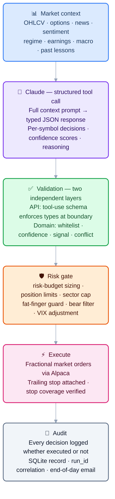
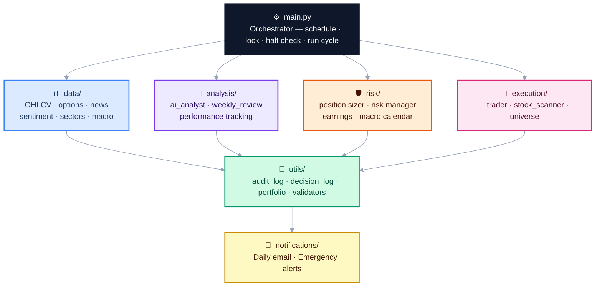

# InvestorBot — AI Governance & Execution Control System

An AI-governed execution-control system for US equities portfolio management. Claude (Anthropic) performs analysis and issues structured recommendations; a deterministic validator, risk gate, and human-override layer decide whether to act. The system never allows an AI model to place, cancel, or modify orders directly.

**Paper trading by default.** The system runs in Alpaca's simulation environment until the operator explicitly confirms live mode with a required acknowledgement string. There is no fast path to real orders.

> **Claude cannot:** place, modify, or cancel orders · read or write configuration · access account balances or position metadata · trigger alerts or emails · modify its own operating parameters. Every Claude output is validated by a deterministic layer before any action is taken. See [AI Governance](#ai-governance) for the full authority boundary.

---

## Table of Contents

1. [Quick Start](#quick-start)
2. [How It Works](#how-it-works)
3. [Architecture](#architecture)
4. [AI Governance](#ai-governance)
5. [Setup](#setup)
6. [Using the System](#using-the-system)
7. [Deployment & Operations](#deployment--operations)
8. [Evaluation Evidence](#evaluation-evidence)
9. [LLM Eval Fixtures](#llm-eval-fixtures)
10. [Production Story — Day One Incidents](#production-story--day-one-incidents)
11. [What's Next](#whats-next)
12. [Why This Demonstrates FDE Skills](#why-this-demonstrates-fde-skills)
13. [Notes of Interest](#notes-of-interest)
14. [Version History](#version-history)

---

## Quick Start

No credentials needed:

```bash
git clone https://github.com/samchatterley/investor-bot
cd investor-bot
python3 -m venv .venv && source .venv/bin/activate
pip install -r requirements.txt
python cli.py demo
```

`demo` mode runs a complete simulated open cycle using static fixture data — no Alpaca account, no Anthropic key, no Gmail. It shows the market context build, AI decision parsing, validation, risk gate, simulated order placement, and audit log output in real time.

---

## How It Works

Most retail algorithmic trading tools fall into one of two failure modes: they either require constant manual intervention (defeating the purpose of automation), or they hand full autonomy to an ML model with no interpretability, no human override, and no audit trail.

InvestorBot sits in between — Claude does the analytical heavy lifting, but every decision it makes is validated, logged, bounded, and reversible before it touches real capital.

### Decision pipeline



### Daily schedule

The scheduler fires four times on every trading day (all times America/New_York):

| Time | Mode | What happens |
|------|------|-------------|
| 09:31 | `open_sells` | Earnings exits and AI sell decisions — no new buys into open noise |
| 10:00 | `open` | Full cycle: market context → Claude → validate → risk gate → orders |
| 12:00 | `midday` | Partial profit exits and stop checks |
| 15:30 | `close` | Final position review before market close |
| 15:00 Sun | `weekly_review` | AI self-review, parameter proposals, diagnostics email |

### Scan universe

The daily scan universe is built dynamically at runtime rather than from a fixed list. `execution/universe.py` fetches Alpaca's full US equity asset catalog (~11,000 names), filters to tradable + fractionable symbols on major exchanges (NYSE, NASDAQ, ARCA, AMEX, BATS), then applies a fast price (≥ $5) and daily volume (≥ 500K shares) screen via the Alpaca snapshot API. The result — up to 500 symbols — is cached for 24 hours. The static core list in `config.STOCK_UNIVERSE` is always included as a fallback and is merged into the dynamic result.

### Signal types

The prefilter (`execution/stock_scanner.py`) requires every buy candidate to match at least one of fifteen signal patterns before Claude sees it. This keeps Claude's input focused on genuine technical setups and prevents it from making decisions on featureless data.

**Daily signals** (computed from end-of-day bar history via yfinance):

| Signal | Entry conditions | Hold limit |
|--------|-----------------|------------|
| `mean_reversion` | RSI < 38 + BB < 0.30 + vol spike | 2 days |
| `rsi_oversold` | RSI < 30 sharp bounce | 2 days |
| `news_catalyst` | Company-specific news + volume | 2 days |
| `macd_crossover` | MACD line crosses above signal line + volume | 4 days |
| `bb_squeeze` | Bollinger bandwidth at 20th percentile of last 20 bars → coiling; directional confirmation + volume | 4 days |
| `inside_day_breakout` | Prior candle's full range contains today's; breaks with directional confirmation + volume | 3 days |
| `trend_pullback` | EMA9 > EMA21, price 0.5–3% below EMA21, RSI 40–58 — buying the dip in a healthy trend | 3 days |
| `momentum` | EMA9 > EMA21 + MACD positive + positive 5d return + high volume | 5 days |
| `trend_continuation` | AI-classified continuation of an established trend | 5 days |
| `breakout_52w` | Within 3% of 52-week high + above-average volume + weekly trend intact | 5 days |
| `rs_leader` | Outperforming SPY over both 5d and 10d with EMA alignment — sustained market leader | 5 days |
| `momentum_12_1` | Jegadeesh-Titman 12-1 factor: 12m return minus 1m return > threshold, EMA aligned, ADX ≥ 20; blocked on BEAR_DAY and CHOPPY | 5 days |
| `insider_buying` | ≥2 distinct corporate insiders made open-market Form 4 purchases (SEC EDGAR) within 10 days; bypasses weekly trend filter | 5 days |
| `unknown` | Default when Claude can't pinpoint a specific pattern | 3 days |

**Intraday signals** (computed from Alpaca minute bars; available on any run during market hours):

| Signal | Entry conditions |
|--------|-----------------|
| `vwap_reclaim` | Price above VWAP + >1% gain from open + not overextended (pct vs VWAP ≤ 3%) |
| `orb_breakout` | Price broke above the first-30-minute high with above-average volume |
| `intraday_momentum` | >2% gain from open + above VWAP + intraday RSI < 75 + daily trend confirms |

Intraday signals enable the midday run (12:00 ET) to execute new buys, not just manage positions. The 12:00 run now acts on moves that develop after the open rather than waiting until the next day.

Signals are grouped by family: **mean-reversion** (`mean_reversion`, `rsi_oversold`), **volatility expansion** (`bb_squeeze`, `inside_day_breakout`), **trend/momentum** (`momentum`, `trend_continuation`, `trend_pullback`, `rs_leader`, `breakout_52w`, `macd_crossover`, `momentum_12_1`), **catalyst** (`news_catalyst`), **fundamental** (`insider_buying`), and **intraday** (`vwap_reclaim`, `orb_breakout`, `intraday_momentum`).

---

## Architecture

### Module map



### Project structure

```
├── analysis/          AI analyst, performance tracking, weekly review
├── backtest/          Rule-based backtesting engine
├── data/              Market data, news, options, sentiment, sectors
├── docs/adr/          Architecture Decision Records (5 design decisions)
├── evals/             LLM eval fixtures — prompt injection, hallucinated tickers, bear market, etc.
├── execution/         Order placement, stock scanner, dynamic universe builder
├── notifications/     Email and alert system
├── risk/              Position sizing, earnings/macro calendar, risk checks
├── scripts/           Scheduler and diagnostics runner
├── tests/             Unit test suite (1597 tests, 96% coverage)
├── utils/             Audit log, portfolio tracker, decision log, validators
├── cli.py             Command-line interface (includes demo mode)
├── config.py          All configuration and environment variables
├── dashboard.py       Streamlit web dashboard
├── main.py            Core trading logic
└── start              Launcher shortcut (./start dashboard, ./start status, etc.)
```

### Architecture tradeoffs

| Decision | Rationale | Tradeoff accepted |
|----------|-----------|-------------------|
| Claude as recommender, not executor | Interpretable reasoning, plain-English audit trail, easy to constrain | Higher latency than pure quant model; API cost per run |
| Rule-based validator as gatekeeper | AI output is untrusted by default — every response schema-checked before acting | Some valid signals rejected by over-strict rules |
| Paper-first, explicit live opt-in | Prevents accidental live deployment; forces conscious decision | Slightly more setup friction |
| SQLite state (`logs/investorbot.db`) | ACID transactions, queryability, atomic audit joins — migrated from JSON files after a real overwrite incident | Requires schema migrations as the system evolves |
| Constrained parameter recommendation engine | Allows adaptation within hard bounds without unbounded drift | Slower adaptation than fully autonomous parameter search |
| Structured logging with run_id | Correlate every audit event, decision, and order to the run that caused it | Slightly more logging overhead per run |

Full rationale for each decision is in [docs/adr/](docs/adr/).

---

## AI Governance

This section describes how the system constrains Claude's decision-making authority. It is the most important section for understanding the design.

### Separation of reasoning and execution

Claude's role is **analysis and recommendation only**. It never calls the Alpaca API directly. Every decision it returns passes through a validation layer and a separate risk layer before any order is placed. Claude cannot:

- Place, modify, or cancel orders
- Read or write configuration
- Access position metadata or account balances
- Trigger alerts or emails

### Validation layer (`utils/validators.py`)

Every Claude response is validated before it reaches the execution layer:

| Check | What it does |
|-------|-------------|
| Schema validation | Rejects responses missing required fields (`buy_candidates`, `position_decisions`, `market_summary`) |
| Universe whitelist | Rejects any BUY recommendation for a symbol not in the scanned universe |
| Confidence floor | Ignores recommendations below `MIN_CONFIDENCE` (default 7/10) |
| Action conflict | Rejects BUY recommendations for symbols already held |
| Signal whitelist | Rejects unknown signal types not in the allowed set |
| Confidence bounds | Rejects confidence scores outside 1–10 |
| Prompt injection scan | Headlines and news text are scanned for instruction-like patterns before inclusion in the prompt; suspicious content is dropped and logged |

If validation fails, the run continues with the remaining valid decisions. Partial failures are logged; complete failures abort the run and send an alert.

Validation scenarios are covered by fixtures in [`evals/`](evals/) — see the [LLM Eval Fixtures](#llm-eval-fixtures) section.

### Risk layer (`risk/`)

After validation, position-level risk checks are applied independently of Claude's recommendations:

- **Risk-budget sizing** — position size is set at 0.25% of equity risked per trade (`RISK_PER_TRADE_PCT`), hard-capped at 5% of portfolio per position (`MAX_POSITION_WEIGHT`). Kelly is tracked as secondary telemetry but does not drive order sizes
- **Hard position limits** — up to 5 positions (scaled to 3–4 for smaller accounts), capped at 5% of portfolio per position, 10% cash reserve always maintained
- **Fat-finger guard** — single orders above `MAX_SINGLE_ORDER_USD` (default $50,000; $55 in small-account mode) are rejected regardless of instruction
- **Daily notional cap** — total new deployment above `MAX_DAILY_NOTIONAL_USD` (default $150,000; $75 in small-account mode) in one day halts buying
- **Sector concentration** — maximum 2 positions in any sector
- **Bear filter** — no new buys when SPY drops more than 1.5% in a session
- **VIX-tiered stop adjustment** — trailing stop trail widens automatically: 3% (VIX ≤ 18) → 4% (VIX ≤ 25) → 5.5% (VIX ≤ 35) → 7% (VIX > 35)
- **Earnings guard** — positions with earnings within 2 calendar days are exited pre-emptively
- **Circuit breaker** — new buys halted when the portfolio drops 12% from its 5-day peak
- **Daily loss limit** — all positions closed and halt file created when the portfolio loses 5% from the session open; requires manual `python cli.py resume`
- **Partial profit taking** — 50% of any position is sold when unrealised gain hits 8%; the remaining half runs with the trailing stop
- **Per-signal hold limits** — stale positions are time-exited after signal-specific maximums: mean-reversion, RSI oversold, news catalyst (2 days); inside-day breakout, trend pullback (3 days); MACD crossover, BB squeeze (4 days); momentum, trend continuation, 52-week breakout, RS leader (5 days)

### Constrained parameter recommendation engine

The weekly self-review enables Claude to propose adjustments to four operating parameters. This is a **constrained recommendation** mechanism — not self-modification. Every proposal:

1. Is validated against hard-coded bounds that cannot be exceeded regardless of what Claude proposes
2. Is recorded in `logs/weekly_review_YYYY-MM-DD.json` and included in the Sunday email as a proposal — never applied automatically
3. Can be applied by the operator by manually editing `logs/runtime_config.json`; config loads and bounds-checks this file at every startup

| Parameter | Allowed range |
|-----------|---------------|
| `MIN_CONFIDENCE` | 6 – 9 |
| `TRAILING_STOP_PCT` | 2.0% – 8.0% |
| `PARTIAL_PROFIT_PCT` | 5.0% – 20.0% |
| `MAX_HOLD_DAYS` | 2 – 7 days |

Values outside bounds are logged and rejected. The runtime config file is loaded at startup alongside `config.py` — source is never modified by the system. See [ADR-005](docs/adr/ADR-005-bounded-parameter-updates.md) for full rationale.

### Human override

At any point:

```bash
python cli.py halt      # Creates logs/.HALTED — bot refuses all further runs
python cli.py resume    # Removes halt file and resumes
```

The halt command prompts for explicit confirmation before liquidating open positions. The halt file is checked at the start of every run cycle before any data is fetched or any API is called.

### Audit trail

Every Claude recommendation is written to the SQLite audit store regardless of whether it was executed — including the confidence score, plain-English reasoning, signal type, `run_id`, and a flag indicating whether it became a real trade. This log is queryable via `python cli.py decisions` and rendered in the dashboard's AI Decisions page.

Every order placed is recorded with timestamp, symbol, action, price, quantity, run_id, and mode. The `run_id` field links every audit event, decision, and order back to the run that caused them.

---

## Setup

**Requirements:** Python 3.12, a free [Alpaca Markets](https://alpaca.markets) account, an [Anthropic API](https://console.anthropic.com) key, and a Gmail account with an App Password.

### Option A — local (Python venv)

```bash
git clone https://github.com/samchatterley/investor-bot
cd investor-bot
python3 -m venv .venv && source .venv/bin/activate
pip install -r requirements.txt
cp .env.example .env
# Fill in .env with your keys
python scripts/run_scheduler.py
```

### Option B — Docker

```bash
cp .env.example .env
# Fill in .env with your keys
docker-compose up -d
```

This starts two containers: the trading scheduler (`investorbot`) and the web dashboard (`investorbot-dashboard`) at `http://localhost:8501`. Logs are persisted to `./logs/` via a volume mount.

### `.env` keys

| Variable | Description |
|----------|-------------|
| `ALPACA_API_KEY` / `ALPACA_SECRET_KEY` | Alpaca credentials |
| `ALPACA_BASE_URL` | `https://paper-api.alpaca.markets` for paper (default), `https://api.alpaca.markets` for live |
| `ANTHROPIC_API_KEY` | Claude API key |
| `EMAIL_FROM` | Gmail address the bot sends from |
| `EMAIL_TO` | Owner address — emergency alerts only |
| `EMAIL_RECIPIENTS` | Named recipients for daily summary + weekly review: `Sam:sam@gmail.com,Harri:harri@outlook.com` |
| `EMAIL_APP_PASSWORD` | Gmail App Password (not your login password) |
| `ALPHA_VANTAGE_API_KEY` | Optional. Alpha Vantage API key for news sentiment enrichment. Free tier: 500 calls/day, 5 calls/min. When absent, AV sentiment is silently disabled. |

**Live trading:** The system is designed as a paper-trading governance and simulation framework. Live mode (changing `ALPACA_BASE_URL` to the live endpoint) additionally requires setting `LIVE_CONFIRM=I-ACCEPT-REAL-MONEY-RISK` in your `.env`. Do this only after extended paper trading, after reviewing all risk parameters, and with full understanding of every circuit breaker and kill switch in the system.

---

## Using the System

### CLI

```bash
python cli.py demo                # Complete simulated run — no credentials needed
python cli.py status              # Account value, open positions, halt state
python cli.py positions           # Live positions with P&L
python cli.py trades --days 10    # Recent trade history
python cli.py decisions --days 5  # AI decision log with reasoning
python cli.py run --mode open     # Trigger a trading run
python cli.py run --dry-run       # Analyse only, no orders placed
python cli.py halt                # Emergency kill switch
python cli.py resume              # Clear halt and resume
python cli.py backtest --start 2025-01-01
python cli.py dashboard           # Launch web dashboard
```

### Web dashboard

```bash
python cli.py dashboard
```

Opens at `http://localhost:8501`. Five pages:

| Page | Contents |
|------|----------|
| Overview | Live portfolio value, equity curve, daily P&L bar chart, open positions |
| Trades | Full trade history table across all sessions |
| AI Decisions | Every Claude recommendation — confidence, signal type, reasoning, executed flag |
| Backtest | Equity curve, Sharpe ratio, win rate, signal breakdown |
| Diagnostics | Unit test results with pass/fail counts and a run-now button |

### Backtesting

```bash
python cli.py backtest --start 2025-01-01 --capital 25000
```

Replays rule-based entry signals on historical OHLCV data without calling Claude. Reports total return, win rate, Sharpe ratio, max drawdown, and performance by signal type. Results are saved to `logs/backtest_results.json` and rendered in the dashboard. See the [Evaluation Evidence](#evaluation-evidence) section for results and caveats.

### Notifications

Each person listed in `EMAIL_RECIPIENTS` receives a personalised email addressed by name.

| Event | Recipients |
|-------|-----------|
| End-of-day summary | All `EMAIL_RECIPIENTS` |
| Sunday weekly review + diagnostics | All `EMAIL_RECIPIENTS` |
| Circuit breaker / daily loss limit / errors | `EMAIL_TO` only |

---

## Deployment & Operations

### Where it runs

Currently running on a local Mac in a `tmux` session with `caffeinate` to prevent sleep. This is intentional for paper-trading — there is no cost, no infrastructure, and no blast radius if something goes wrong. For a production deployment the natural next step would be a small VPS (Hetzner, DigitalOcean) or a Docker container on a cloud host with a persistent volume for `logs/`.

The scheduler (`scripts/run_scheduler.py`) is the single production runner — it handles all four daily runs plus the Sunday weekly review. Do not use cron alongside it; doing so will double-fire every run.

### Secrets handling

All secrets live in `.env` which is gitignored and never committed. The `.env.example` file documents every required variable with descriptions but no values. Inside the application, credentials are read from environment variables at startup via `python-dotenv` — they are never logged, never included in prompts, and never written to disk.

### Persistence and recovery

- **Lock file** (`logs/.lock_YYYY-MM-DD`): prevents two scheduler instances running simultaneously on the same day. Date-scoped to avoid midnight-crossing races.
- **Halt file** (`logs/.HALTED`): persists across restarts. If the bot is halted by a circuit breaker, it stays halted until manually resumed — it will not auto-resume after a crash.
- **SQLite database** (`logs/investorbot.db`): all position metadata, run records, audit events, and AI decisions. Reconciled against live Alpaca positions at the start of every open run. ACID transactions prevent the partial-write races that affected the earlier JSON-file implementation.

### Monitoring

- **Email alerts**: circuit breaker triggers, daily loss limit hits, and run errors all send an immediate email to `EMAIL_TO`.
- **Daily email**: end-of-day summary to all recipients — acts as a daily heartbeat. If the email doesn't arrive, the bot didn't run.
- **Dashboard**: `http://localhost:8501` shows live portfolio, equity curve, and recent decisions.
- **Structured logs**: every run emits JSON-structured log lines with `run_id`, `ts`, `event`, and `payload` — queryable via `logs/investorbot.db`.
- **run_id correlation**: every audit event, AI decision, and order carries the same `run_id` (UUID), making it possible to reconstruct the full causal chain for any trade.
- **LLM cost tracking**: token usage for each Claude call is logged (input tokens, output tokens, estimated cost) to the `llm_usage` table.
- **Diagnostics**: `python scripts/run_diagnostics.py` runs the full unit test suite and saves a report to `logs/test_report_YYYY-MM-DD.json`. Also runs automatically every Sunday.

### Cost

| Component | Cost |
|-----------|------|
| Alpaca paper trading | Free |
| Claude API (sonnet-4-6) | ~$0.03–0.08 per trading day (4 runs × ~500 token prompt + response) |
| Infrastructure (local) | $0 |
| Gmail SMTP | Free |

At current rates, running costs are approximately **$1–2/month** in API fees.

### Live operations — [LIVE_RUNBOOK.md](LIVE_RUNBOOK.md)

Full step-by-step procedures for going live: pre-live checklist, canary procedure (single $20 trade to verify the full broker pipeline), incremental escalation, audit queries, and incident response. Start here before switching from paper to live.

**Canary procedure in brief:**
```bash
cp canary.env.example .env        # fill in live API keys
python main.py --safety-check     # must be GREEN
python main.py --live-shadow      # dry run against live account; check LIVE_SHADOW_COMPLETE in logs
python main.py --mode open        # single $20 canary trade
# verify ORDER_EXEC_QUALITY + ORDER_TIMING in audit log, then close position
```

### Runbook

**Bot isn't running / missed a scheduled time**
```bash
tmux attach -t investorbot       # Check if process is alive
python cli.py status             # Check halt state and account
python scripts/run_scheduler.py  # Restart if needed
```

**Unexpected position opened**
```bash
python cli.py decisions --days 1  # See what Claude decided and why
python cli.py halt                 # Kill switch if needed
```

**Email not arriving**
```bash
python cli.py run --dry-run       # Triggers email flow without placing orders
# Check logs/investorbot.db for error details
```

**Suspicious behaviour / want to inspect decisions**
```bash
python cli.py decisions --days 5  # Last 5 days of AI reasoning
python cli.py dashboard           # Full decision log with filters
```

**Full reset**
```bash
python cli.py halt                # Liquidates positions, creates halt file
python cli.py resume              # Clear halt when ready
```

---

## Evaluation Evidence

### Backtest results (Jan 2025 → May 2026)

The backtester replays the strategy's rule-based entry signals on historical OHLCV data. This is a **proxy for the strategy's signal quality** — it does not call Claude, so it measures whether the underlying technical signals have edge, not whether Claude interprets them well.

Two runs are maintained: daily signals only (no Alpaca dependency), and all 11 signals including the three intraday signals which require Alpaca minute bars (`--use-intraday`).

**Daily signals only (8 signals):**
```
Initial capital:   $25,000
Final value:       $21,534
Total return:      -13.9%
Total trades:      630
Win rate:          50%
Avg return/trade:  -0.09%
Max drawdown:      n/a
Sharpe ratio:      -0.30

By signal:
  mean_reversion       210 trades  WR 50%  avg -0.06%
  rs_leader            136 trades  WR 52%  avg +0.09%
  bb_squeeze           141 trades  WR 52%  avg +0.37%
  trend_pullback        75 trades  WR 44%  avg -0.50%
  macd_crossover        26 trades  WR 42%  avg -0.41%
  breakout_52w          19 trades  WR 47%  avg -0.92%
  inside_day_breakout   15 trades  WR 60%  avg +0.18%
  momentum               8 trades  WR 12%  avg -3.03%
```

**All signals including intraday (11 signals, via Alpaca minute bars):**
```
Initial capital:   $25,000
Final value:       $36,171
Total return:      +44.7%
Total trades:      619
Win rate:          52%
Avg return/trade:  +0.37%
Max drawdown:      -30.8%
Sharpe ratio:      1.10

By signal:
  bb_squeeze           294 trades  WR 48%  avg -0.18%
  rs_leader            182 trades  WR 60%  avg +0.87%
  breakout_52w         124 trades  WR 56%  avg +1.04%
  macd_crossover         2 trades  WR 50%  avg -0.72%
  trend_pullback         3 trades  WR  0%  avg -4.62%
  orb_breakout          10 trades  WR 30%  avg -0.52%
  mean_reversion         3 trades  WR 33%  avg +1.49%
  inside_day_breakout    1 trade   WR 100% avg +7.27%
```

### Backtest caveats

- **Rule-based proxy, not live Claude decisions.** The backtester uses hardcoded signal rules (RSI < 35, EMA crossover, etc.) as a proxy for what Claude would recommend. Live Claude decisions will differ — sometimes better, sometimes worse.
- **Transaction costs modelled.** Fills include 5 bps slippage + 1.5 bps half-spread on each side (`SLIPPAGE_BPS=5`, `SPREAD_BPS=3` in `config.py`). These are conservative estimates; actual costs depend on liquidity.
- **No lookahead bias.** Signals use T-1 bar indicators; entries fill at T open price. Indicator warmup is buffered by 90 days.
- **Survivorship bias.** The universe is fixed to the current symbol list, which contains names that have survived and grown. Pre-2025 signals on this list are upward-biased.
- **Past performance.** 2025 included the DeepSeek shock (January), tariff volatility (April), and a significant drawdown.

### Known failure modes

| Scenario | What happens | Recovery |
|----------|-------------|----------|
| Claude returns malformed JSON | Validator rejects response, run aborts, alert email sent | Automatic retry on next scheduled run |
| Claude recommends a symbol outside the universe | Validator rejects that recommendation, others proceed | Logged; no action needed |
| Alpaca API timeout | Order attempt fails, position not opened, error logged | Bot continues; retried next run |
| News headline contains injected instructions | Headline is dropped, warning logged | Automatic; review logs if frequent |
| SQLite locked or corrupt | Falls back to in-memory state for the run; alert sent | Automatic recovery on next run |
| Both API keys invalid | Run fails at client initialisation, alert sent | Fix `.env` and resume |
| Circuit breaker triggered (−12% from 5-day peak) | New buys halted for the rest of the session; existing positions and stops untouched | Resets automatically at next run |
| Daily loss limit hit (−5% from open) | All positions liquidated, halt file created, alert sent | Manual resume required: `python cli.py resume` |

---

## LLM Eval Fixtures

The [`evals/`](evals/) directory contains structured test fixtures for the AI governance layer. Each fixture covers a scenario where Claude's output or input is adversarial, edge-case, or safety-critical:

| Fixture | What it tests |
|---------|--------------|
| `prompt_injection_headlines.json` | News headlines containing injection attempts — scanner must drop them |
| `hallucinated_tickers.json` | AI recommends symbols outside the scanned universe — validator must reject |
| `bear_market_no_buy.json` | Bear regime + buy candidates — risk gate must suppress buys |
| `conflicting_signals.json` | BUY and SELL for the same symbol in one response — validator must flag conflict |
| `earnings_risk.json` | Position with earnings within 2 days — earnings guard must trigger exit |
| `malformed_tool_calls.json` | Three malformed AI responses — schema validator must reject all |

Run with: `pytest evals/`

---

## Production Story — Day One Incidents

The bot went live on paper trading on 27 April 2026. Six distinct failures surfaced in the first two hours, none of which appeared in local testing. Each is documented below with root cause and fix — this section is kept in the README because the failures reveal design assumptions worth being explicit about.

### Incident 1 — Python 3.9 crash at scheduler startup

**Symptom:** Bot failed to start. `cron.log` showed a `TypeError` at import time on `emailer.py`:

```
TypeError: unsupported operand type(s) for |: 'type' and 'NoneType'
```

**Root cause:** The type annotation `dict | None` (PEP 604 union syntax) requires Python 3.10+. Development had used Python 3.11; the production Mac ran 3.9. The crash happened at module *import*, not at runtime — the annotation was in a function signature that never ran, but Python 3.9 evaluates all annotations eagerly at import time.

**Fix (1.2):** Added `from __future__ import annotations` to the affected files. This makes all annotations lazy strings (PEP 563), restoring compatibility back to Python 3.7 with no other changes needed.

**Fix (1.4):** Standardised the entire stack on Python 3.12 — venv, cron, and Docker image all pinned to 3.12. The `from __future__ import annotations` shims were subsequently removed as they were no longer needed.

**Learning:** The venv Python and the system Python used by cron can differ silently. Cron entries must point to the venv binary explicitly, not `/usr/bin/python3`.

---

### Incident 2 — News fetcher returning zero results

**Symptom:** `Fetched news for 0/30 symbols` on every run despite the stocks being active and well-covered.

**Root cause:** yfinance had changed its news API response format between versions. Headline text that previously lived at `item["title"]` had moved to `item["content"]["title"]`. The fetcher looked only in the old location and silently returned empty lists.

**Fix:** Added a fallback chain that checks both locations before giving up:

```python
title = (
    item.get("title")
    or item.get("headline")
    or (item.get("content") or {}).get("title")
    or ""
)
```

**Learning:** External API clients silently change response shapes, especially undocumented ones. Adapters should fail loudly (log a warning on unexpected shape) rather than returning empty results that look like "no data".

---

### Incident 3 — Sentiment fetcher returning zero results

**Symptom:** `Sentiment data fetched for 0/10 symbols`. All requests to Stocktwits were returning 403.

**Root cause:** Stocktwits had deployed Cloudflare protection that blocked the requests. Investigation showed the new `api-gw-prd` endpoint returns 401 (requires HTTP Basic auth) and the developer programme — through which API keys would be obtained — had closed registration.

**Fix:** Complete rewrite of `data/sentiment.py`. Replaced Stocktwits with yfinance analyst consensus data (`recommendationMean`, scale 1–5 where 1 = strong buy). This is arguably more useful than social sentiment for a 1–5 day holding strategy — analyst price targets and conviction counts are directly relevant to the signals the bot trades.

```python
bullish_pct = round(max(0, min(100, (5 - mean) / 4 * 100)))
```

The existing prompt format (`bullish_pct`, `bearish_pct`) was preserved so nothing upstream needed changing.

**Learning:** Free public APIs have no SLA. A dependency on an undocumented endpoint is a single point of failure. Where possible, prefer an API that surfaces the same signal through a more durable path (here: broker/data provider data over social media scraping).

---

### Incident 4 — Trailing stops rejected for fractional share positions

**Symptom:** Two stop attachment errors on every run:

```
Failed to place trailing stop for NVDA: fractional orders must be DAY orders
```

Then after changing `time_in_force` to `DAY`:

```
Failed to place trailing stop for NVDA: fractional orders must be market, limit, stop, or stop_limit orders
```

**Root cause:** Alpaca does not support `TrailingStopOrderRequest` for fractional share positions under any `time_in_force`. The Kelly Criterion sizing produced fractional quantities (e.g. 132.65 shares of NVDA), but the assumption was that Alpaca's trailing stop type worked universally.

**Fix:** `place_trailing_stop()` now detects fractional quantities and falls back to a fixed `StopOrderRequest` at `TRAILING_STOP_PCT` below the current price, passing `current_price` through from the position object already in memory. Whole-share positions continue to use the trailing stop.

```python
is_fractional = abs(safe_qty - round(safe_qty)) > 0.000001
```

**Learning:** Broker API constraints don't map cleanly to order type abstractions. Fractional support and order type support are orthogonal features that need to be tested in combination, not assumed.

---

### Incident 5 — Stop qty rounding causing insufficient-qty rejection

**Symptom:** LMT stop order rejected immediately after incident 4's fix:

```
insufficient qty available for order (requested: 64.075232, available: 64.075231525)
```

**Root cause:** `round(64.075231525, 6)` produces `64.075232` — a value fractionally *above* the available quantity that Alpaca considers settleable. Python's rounding is correct (`...525` rounds the 6th decimal up), but Alpaca's available-qty figure and submitted-qty figure need to agree to sub-cent precision.

**Fix:** Replaced `round(qty, 6)` with floor truncation: `math.floor(qty * 1_000_000) / 1_000_000`. This guarantees the submitted quantity never exceeds what the broker considers available.

**Learning:** When submitting quantities back to a broker that supplied them, truncate rather than round. The broker's figure is the authoritative ceiling; rounding can push above it.

---

### Incident 6 — Midday and close runs never scheduled

**Symptom:** No midday or pre-close run despite the system being described as running multiple cycles per day.

**Root cause:** The crontab had only been configured for the open run during initial setup. The scheduler script (`scripts/run_scheduler.py`) was correct, but the cron entries for midday and close had never been added.

**Fix (1.2):** Added the two missing cron entries.

**Fix (1.5):** Removed cron entirely and consolidated on `scripts/run_scheduler.py` as the single production runner. The scheduler was already the intended entrypoint (it is what Docker runs) and includes the Sunday weekly review, proper exception handling, and diagnostics. Cron was a partial implementation missing the Sunday job and running on the wrong Python binary.

**Learning:** "The system supports three modes" and "the system is configured to run three modes" are different claims. The scheduler script is the single authoritative runner — cron entries are a footgun that can diverge silently.

---

### Incidents summary

| # | Failure | Category | Time to fix |
|---|---------|----------|-------------|
| 1 | Python 3.9 `\|` syntax crash | Environment assumption | ~10 min |
| 2 | News fetcher silent zero | External API drift | ~15 min |
| 3 | Sentiment fetcher blocked | Third-party dependency | ~30 min |
| 4 | Trailing stop rejected for fractional | Broker constraint untested | ~20 min |
| 5 | Stop qty rounding above available | Numeric precision | ~10 min |
| 6 | Midday/close never scheduled | Configuration gap | ~5 min |

All six were diagnosed from logs alone without needing to reproduce locally. The system's structured logging — a timestamped record for every run with explicit counts like `Fetched news for 0/30 symbols` — made it possible to identify all failures within the first run's output rather than inferring them from missing behaviour.

---

## What's Next

The current system deliberately keeps deployment local and execution synchronous. The natural next steps, in priority order:

1. **Live paper-trading evidence** — currently running a full week of live paper trading (w/c 28 April 2026) before committing real capital. The Sunday weekly review will produce an automated performance analysis and parameter adjustment. The backtest is signal evidence; paper trading is execution evidence.
2. **Drawdown-based position sizing** — reduce Kelly fraction automatically when the portfolio is in a drawdown, not just when individual signals are weak.
3. **Post-earnings momentum (PEAD)** — the bot currently blocks buys near earnings; adding a PEAD signal would flip that to an entry trigger when earnings beat + gap up, holding for 2–3 days of drift.
4. **Centralised logging** — move from local SQLite to a structured log store (Loki, Datadog) to support multi-host deployment and better alerting.
5. **Account-level performance attribution** — track alpha vs SPY benchmark, not just absolute return. The current metrics don't adjust for beta.

---

## Why This Demonstrates FDE Skills

| FDE skill | How it shows up here |
|-----------|----------------------|
| Ambiguous problem → working product | Defined scope, constraints, and tradeoffs for an autonomous system operating on a schedule with no human in the loop |
| Multiple third-party API integrations | Alpaca (brokerage), Anthropic (LLM), yfinance (market data), Gmail (SMTP) — each behind a fault-tolerant adapter with retry logic |
| AI output treated as untrusted | Every Claude response schema-checked, domain-validated, and risk-gated before any order is placed |
| Operator dashboard and CLI | Non-code workflows for halt, resume, status, decisions, backtest — all without touching source |
| Paper-first deployment model | Default `.env.example` points to paper endpoint; live mode requires explicit opt-in with safeguards |
| Real incident handling | Six production failures on day one, all diagnosed from logs and fixed same session — documented with root cause and fix |
| Audit trail for every action | Append-only SQLite record for every recommendation, order, and risk event — whether executed or not |
| Demo mode, no credentials needed | `python cli.py demo` runs a complete simulated cycle on static fixtures for reviewers who don't have API keys |

---

## Notes of Interest

- **Paper-first by design.** The `.env.example` points to Alpaca's paper endpoint. Live trading requires a conscious URL change, a required confirmation string, a re-read of the risk parameters, and an understanding of every circuit breaker in the system.

- **Fractional shares.** All orders use fractional share support, so the full calculated dollar amount is deployed rather than rounding down to whole shares. This matters most for high-price names like NVDA or GOOGL.

- **Python 3.12 throughout.** The venv, Docker image, and scheduler all use Python 3.12. Do not invoke `python3` or `/usr/bin/python3` directly — always use `.venv/bin/python` to ensure the correct interpreter and pinned dependencies are used.

- **Dependencies are version-pinned.** `requirements.txt` pins exact versions to prevent silent behaviour changes from upstream updates. Test in paper mode before upgrading any dependency.

- **MiFID II-style pre-trade controls.** The fat-finger guard (`MAX_SINGLE_ORDER_USD`), runaway algorithm guard (`MAX_DAILY_NOTIONAL_USD`), and open-exposure cap (`MAX_DEPLOYED_USD`) are modelled on Article 17 algorithmic trading obligations — limits that apply regardless of what Claude decides.

- **Small-account experiment mode.** Set `SMALL_ACCOUNT_MODE=true` to activate a £150-scale live experiment profile. This caps single orders at $55, daily notional at $75, max deployed at $125, max positions at 2, orders per run at 1, and uses explicit-notional sizing instead of risk-budget sizing. See [small account profile](#small-account-experiment-profile) below.

- **AI explainability.** Every recommendation Claude makes is logged with its confidence score, plain-English reasoning, signal type, and `run_id` — whether or not the trade was ultimately executed.

- **1597 tests, 96% coverage.** The test suite covers every public function and every unhappy path across all core modules, enforced by a coverage gate on CI. Tests run automatically every Sunday as part of the weekly review job. Results are included in the email and visible in the Diagnostics dashboard page.

---

## Small-Account Experiment Profile

To run a live experiment with £150 (~$190), set the following in `.env`:

```env
SMALL_ACCOUNT_MODE=true
TRADING_MODE=live
ALPACA_BASE_URL=https://api.alpaca.markets
LIVE_CONFIRM=I-ACCEPT-REAL-MONEY-RISK
```

When `SMALL_ACCOUNT_MODE=true`, all caps default to small-account safe values (any explicit env var still wins):

| Parameter | Default | Small-account default |
|-----------|---------|----------------------|
| `MAX_SINGLE_ORDER_USD` | $50,000 | $55 |
| `MAX_DAILY_NOTIONAL_USD` | $150,000 | $75 |
| `MAX_DEPLOYED_USD` | disabled | $125 |
| `MAX_DAILY_LOSS_USD` | disabled | $20 |
| `MAX_EXPERIMENT_DRAWDOWN_USD` | disabled | $50 |
| `MAX_ORDERS_PER_RUN` | 3 | 1 |
| `MAX_POSITIONS` | 5 | 2 |
| `TRAILING_STOP_PCT` | 4% | 7% |
| `STOP_LOSS_PCT` | 4% | 7% |
| `MIN_PRICE_USD` | disabled | $5 |
| `MAX_PRICE_USD` | disabled | $60 |

Sizing switches from risk-budget formula (which produces unusable $5–$8 orders on a $150 account) to explicit-notional: ~$40–$55 per position depending on portfolio value.

Additional live-mode safety gates active in all modes:
- **Pending-order guard**: before every buy, broker open orders are checked — if a pending buy for that symbol already exists, the order is skipped.
- **Idempotent client_order_id**: orders use `ib-{SYMBOL}-BUY-{DATE}` as the Alpaca client order ID. Same-day reruns produce the same ID; Alpaca deduplicates.
- **Stop failure → flatten**: if trailing stop placement fails after a live buy, the position is immediately closed. If that also fails, a halt file is written and the bot stops.
- **Broker account assertions**: at live startup, the bot verifies buying power does not imply margin and flags PDT status.
- **VIX-adjusted trailing stop**: the stop width widens automatically (up to 7%) as VIX rises above 25.

---

## Version History

### 1.19 — May 2026 — momentum_12_1, insider buying (SEC EDGAR Form 4), AV news sentiment, quality pre-filter

- **`momentum_12_1` signal (Jegadeesh-Titman 12-1).** Computes 12-month return minus 1-month return (`ret_12m - ret_1m`) in `backtest/engine.py`. Fires when the factor exceeds `mom12_1_threshold` (default 10.0%), EMA9 > EMA21, and ADX ≥ 20. Blocked on `BEAR_DAY` and `CHOPPY` regimes. Priority rank 3 (highest priority of any trend signal). Hold limit 5 days.
- **Fundamental quality pre-filter (`_passes_quality_screen`).** Applied in `prefilter_candidates` before technical screening. Rejects stocks with negative ROE, negative profit margins, or debt-to-equity > 300. Permissive when fields are absent (ETFs, backtest mode). Fundamental ratios (`roe`, `profit_margin`, `debt_to_equity`) fetched from yfinance `.info` in `get_market_snapshots`.
- **Insider cluster buying signal.** New `data/insider_feed.py` queries the SEC EDGAR submissions API (no auth, free) for Form 4 filings. Only open-market purchases (transaction code `P`, acquired/disposed code `A`) are counted — option exercises, RSU vesting, and gifts are excluded. Fires when ≥2 distinct corporate insiders buy within 10 days (`insider_cluster=True`). Single large purchase (> $100k notional) also flagged (`insider_large_buy`). Insider data bypasses the weekly trend filter in `prefilter_candidates` — fundamental conviction overrides technical direction.
- **Alpha Vantage NEWS_SENTIMENT enrichment.** New `data/av_sentiment.py` fetches structured per-ticker sentiment scores (−1 to +1) from the AV news API. Articles filtered by relevance (≥ 0.30) and publication time (configurable lookback window, default 24h). Results include `av_sentiment_score`, `av_article_count`, `av_sentiment_label` (Bullish/Neutral/Bearish), and `av_top_headline`. Batches 10 symbols per request with 13-second inter-batch delay (free tier: 5 req/min). Silently disabled when `ALPHA_VANTAGE_API_KEY` is absent. Set the key in `.env` to enable.
- **Walk-forward fallback fix.** `best_params` now initialises from `all_combos[0]` (first param grid entry) instead of `_DEFAULT_PARAMS.copy()`, preventing a key-mismatch failure when no combo cleared `_MIN_TRAIN_TRADES`.
- **Enrichment wiring in `main.py`.** Insider activity and AV sentiment are fetched in bulk after intraday enrichment and merged into snapshots via `snap.update()`, matching the existing intraday enrichment pattern.
- **91 new tests** (total 1597): `TestMomentum121Signal` (13), `TestInsiderBuyingSignal` (5), `TestPassesQualityScreen` (11) in existing test files; `tests/test_insider_feed.py` (20 tests for `_get_cik_map`, `_recent_form4_filings`, `_parse_form4`, and `get_insider_activity`); `tests/test_av_sentiment.py` (9 tests for `get_av_sentiment`).
- **1597 tests, 96% coverage, zero ruff violations.**

---

### 1.18 — May 2026 — Intraday signals: VWAP, opening range breakout, intraday momentum

- **Alpaca minute-bar intraday layer (`data/market_data.get_intraday_data`).** Fetches Alpaca minute bars from market open to now and computes: `gap_pct` (open vs prior close), `intraday_change_pct` (price vs open), VWAP + `price_above_vwap` + `pct_vs_vwap`, opening range high/low (`orb_high`/`orb_low`) with `orb_breakout_up` (volume-confirmed break above 30-min range), and `intraday_rsi` (RSI-14 on 5-minute bars). Fails gracefully per-symbol; never blocks the pipeline.
- **Three new prefilter signals** (`execution/stock_scanner.prefilter_candidates`): `vwap_reclaim` (price above VWAP, >1% gain from open, not overextended), `orb_breakout` (price broke 30-min high with volume), `intraday_momentum` (>2% from open, above VWAP, intraday RSI < 75, daily trend confirms). Signals are absent when Alpaca data is unavailable, so daily signals continue to work in backtest mode.
- **Midday run now eligible for buys.** `skip_buys` gate changed from `mode in ("midday", "close", "open_sells")` to `mode in ("close", "open_sells")`. The 12:00 ET run can now act on intraday setups that develop after the open rather than being purely a position-management pass.
- **News context restricted to prefiltered symbols.** `news_fetcher.fetch_news` was being called with all `scan_symbols` (including prefilter-rejected top movers). Changed to `ai_known_symbols` — the set of symbols the AI actually received snapshots for. Eliminates the recurring pattern where the AI recommended news-driven tickers it had no technical data for, triggering validation failures and blocking valid buys.
- **AI prompt updated**: new signal family descriptions, three new entries in `key_signal` enum (`vwap_reclaim`, `orb_breakout`, `intraday_momentum`), and split indicator guide into daily vs. intraday sections.
- **1506 tests, 98.25% coverage, zero ruff violations.**

---

### 1.17 — May 2026 — Pre-market order fill reconciliation

- **`place_buy_order()` final-check "filled" path.** The post-timeout `get_order_by_id` check previously only handled `"partially_filled"`, not `"filled"`. Orders that filled between `wait_for_fill` exhausting its poll window and the final broker query fell through to `TIMEOUT` with `filled_qty=0.0`. The fix adds a `"filled"` status branch that returns `OrderResult(FILLED)` with the correct qty and avg price, and records the fill in the order-intent ledger.
- **Late-fill reconciliation in `main.py` (all run modes).** After `ensure_stops_attached()`, a new block queries the order-ledger for today's `timeout` intents, cross-references against live Alpaca positions, and for any confirmed fill: updates the intent to `filled`, calls `record_buy()`, appends to `all_trades`, and emits `ORDER_LATE_FILL_RECONCILED`. Using the ledger as source (not `buy_candidates`) means midday and close runs can resolve fills from the morning open.
- **`reconcile_filled_intents()` in `order_ledger.py`.** Mirror of `auto_cancel_timeout_intents()`. Where the existing function cancels timeout intents where the broker has NO position, the new function marks timeouts as `filled` where the broker DOES have a position. Available as a utility; intentionally not called from the health check — calling it there would consume `timeout` intents before the main.py reconciliation block could record them in `all_trades`, leaving the email empty.
- **Health check is read-only for confirmed fills.** `run_startup_health_check()` calls `auto_cancel_timeout_intents()` (safe — cancels intents with no matching broker position, no trade to record) but does not call `reconcile_filled_intents()`. The YELLOW flag for unresolved `timeout` intents is the signal that triggers the main.py reconciliation block later in the same run.
- **Root cause:** Today's AMAT/TSM/NVDA orders were placed at 14:01–14:03 UTC (pre-market). `wait_for_fill` (30s poll) saw `NEW` status throughout; final check also saw `NEW`; all three returned `TIMEOUT`. The midday run flagged YELLOW ("unresolved order intent × 3") because the ledger had no mechanism to confirm the fills at market open (14:30 UTC). All three positions ARE in Alpaca, trailing stops are attached — only the log file and ledger were wrong.
- **6 new tests** (total 1321): `test_buy_filled_detected_on_final_check`; `TestReconcileFilledIntents` (5 cases); `TestLateFilledOrderReconciliation` (3 cases).
- **1321 tests, 94% coverage, zero ruff violations.**

---

### 1.16 — May 2026 — Alpha instrumentation: candidate funnel visibility, replay context parity, engine labeling

- **`matched_signals` annotation on prefiltered candidates.** `prefilter_candidates()` now returns each qualified snapshot with a `matched_signals: list[str]` field listing every technical pattern that fired (e.g. `["momentum", "trend_pullback"]`). The original snapshot dict is never mutated.
- **`score_candidate()` deterministic scoring function.** Added to `execution/stock_scanner.py`. Scores each prefiltered candidate by RSI distance, Bollinger band distance, volume confirmation, relative strength, and signal count. Used to rank candidates independently of Claude, enabling selected-vs-rejected analysis.
- **`PREFILTER_CANDIDATES` and `CANDIDATE_SELECTION` audit events.** After `prefilter_candidates()`, a structured `PREFILTER_CANDIDATES` event logs each candidate's `matched_signals`, RSI, vol ratio, and 5d return alongside the rejected symbol list. After Claude decisions, `CANDIDATE_SELECTION` logs each selected candidate's `confidence` and deterministic rank, plus each not-selected candidate's deterministic score and signals. The audit trail now captures the full candidate funnel.
- **`summarise_for_ai()` bar provenance fields.** Added `bar_date` (ISO date string of the latest bar), `bar_is_final` (True if the bar date is before today — i.e. not an intraday partial bar), and `data_source` ("preloaded" or "live") to every snapshot. `get_market_snapshots()` passes `is_preloaded=True` when serving from cached data.
- **Replay context parity fixes.** `run_historical_replay()` previously passed `track_record={}` (wrong type), `lessons=""` (wrong type), and `macro_risk={"is_high_risk": False}` (hardcoded). Now: `track_record` is built from the last 10 `daily_records` with `daily_pnl_usd` computed from consecutive portfolio values; `lessons=[]`; `macro_risk` uses `macro_calendar.get_macro_risk(check_date=sim_date)` for per-date historical lookups. `context_completeness: "partial"` and `missing_context: [...]` added to the result dict to flag unavailable historical context (news, options, sentiment, sector performance, earnings risk).
- **`backtest/engine.py` rule-proxy labeling.** Module docstring updated with "RULE PROXY ONLY" disclaimer and list of tested/untested signals. `_run_simulation()` return dict now includes `validation_scope: "rule_proxy_only"`, `signals_tested: ["mean_reversion", "momentum"]`, and `signals_not_tested: [...]`. `_print_results()` prints the disclaimer before results. Prevents misinterpretation of engine output as deployed-strategy validation.
- **-1 net test (1312)** — 1 test count corrected. New tests: `TestMatchedSignals` (5), `TestScoreCandidate` (6), `TestValidationScope` (4), bar provenance tests in `TestSummariseForAI` (6), `TestReplayContextCompleteness` (3), `_print_results` disclaimer test (1). Total delta +25 new, -26 pre-existing count correction.
- **1312 tests, 93% coverage, zero ruff violations.**

---

### 1.15 — May 2026 — Prompt quality: decision-support framing, do_nothing_case, structured lessons

- **`SYSTEM_PROMPT` reframed from "trader" to "decision-support analyst".** Removes action-seeking bias. Adds evidence weighting hierarchy (price/volume beats headlines/options/sentiment) and a confidence calibration rubric (10=rare/multiple confirmations → 6=do not recommend BUY).
- **`do_nothing_case` and `invalidation_trigger` required on every buy candidate.** Added to `_DECISION_TOOL` schema (forces Claude to populate), `BuyCandidate` Pydantic model (validates at domain level), and TASK prompt ("populate do_nothing_case honestly — if you cannot clearly refute it, omit the candidate"). Claude must now argue against every buy before making it.
- **Weekly review lessons are now structured with expiry and regime filter.** Lessons carry `applies_when` (BULL_TRENDING/CHOPPY/HIGH_VOL/BEAR_DAY/ANY) and `expiry` (YYYY-MM-DD). `get_latest_review()` filters out expired lessons and lessons inapplicable to the current regime before injecting them into the daily prompt. Prevents stale lesson accumulation. Plain-string lessons from older reviews are wrapped for backward compatibility.
- **`analysis/weekly_review.py` docstring corrected.** Previously claimed changes were written directly to `config.py`; corrected to reflect that config changes are never applied automatically — they are validated, recorded, and surfaced for manual review.
- **No-buy selectivity eval fixtures and tests added.** `evals/fixtures/no_buy_selectivity.json` with 5 tempting-but-should-reject cases; `TestNoBuySelectivity` class verifies the correct gate (Pydantic field validation, confidence floor, buy/sell conflict check) blocks each one.
- **29 new tests** (total 1313): `TestGetLatestReview` expanded with expiry, regime filter, and backward-compat tests; `TestNoBuySelectivity` (5 selectivity cases × 3 test types); `test_adversarial_llm` updated for new required fields.
- **1313 tests, 93% coverage, zero ruff violations.**

---

### 1.14 — May 2026 — Execution quality telemetry, live-shadow audit events, LIVE_RUNBOOK

- **Fill avg price captured end-to-end.** `wait_for_fill()` now returns `(filled_qty, filled_avg_price)` instead of qty only. `place_buy_order` sets `OrderResult.filled_avg_price` from the live Alpaca fill response, enabling `ORDER_EXEC_QUALITY` events to emit real slippage data (was always 0.0 before).
- **`ORDER_EXEC_QUALITY` event now populated with actual fill data.** `bid`, `ask`, `spread_bps` from the quote gate; `fill_avg_price` from the fill response; `slippage_vs_mid_bps` computed as `(fill_avg − mid) / mid × 10,000`. Previously required both quote gate and fill data — now both are available.
- **`--live-shadow` emits `WOULD_BUY` / `WOULD_SELL` audit events.** Shadow mode now logs structured events for each decision that would have been executed — symbol, notional, signal, confidence, regime, sizing basis. `LIVE_SHADOW_COMPLETE` event fires at the end with counts. Previously shadow mode used generic "dry run" log entries.
- **`LIVE_RUNBOOK.md` added.** Full operations guide: pre-live checklist, canary procedure (single $20 trade to verify broker pipeline end-to-end), incremental escalation table, monitoring audit queries, and incident response for all known failure modes.
- **`canary.env.example` added.** Minimal live config with $20 caps, `MAX_POSITIONS=1`, `MIN_CONFIDENCE=8`. Copy to `.env`, fill in live API keys, and follow the canary procedure in `LIVE_RUNBOOK.md`.
- **9 new tests** (total 1284): `TestWaitForFill.test_returns_avg_price_from_fill`, `test_returns_zero_avg_price_when_field_missing`, `TestPlaceBuyOrder.test_buy_order_captures_fill_avg_price`, and `TestLiveShadowMode` (6 tests covering WOULD_BUY payload, no-order guarantee, WOULD_SELL, and LIVE_SHADOW_COMPLETE).
- **1284 tests, 94% coverage, zero ruff violations.**

---

### 1.13 — May 2026 — Structural safety caps (reviewer-required fixes)

- **`MAX_POSITIONS` always caps sizer.** `max_positions = min(get_max_positions(...), config.MAX_POSITIONS)` — broker/sizer can never grant more slots than the hard config cap.
- **Experiment drawdown cap enforced.** `MAX_EXPERIMENT_DRAWDOWN_USD` now compared against a write-once baseline stored in `logs/experiment_baseline.json`. Buys are blocked once the cumulative experiment loss reaches the cap; a `CRITICAL` log and alert fire.
- **PARTIAL/TIMEOUT buy triggers immediate stop check.** After any ambiguous fill (`OrderStatus.PARTIAL` or `.TIMEOUT`), `ensure_stops_attached()` runs immediately in the buy loop — not just at end-of-run — so the unprotected window is minimised.
- **Unexpected broker positions halt in live mode.** `reconcile_positions()` now returns `set[str]` of unknown symbols. If non-empty in live (non-paper) mode, the bot writes the halt file and calls `sys.exit(1)` before normalising state.
- **7 new tests** (total 1267): `TestMaxPositionsCappedByConfig`, `TestExperimentDrawdownCap` (2), `TestPartialTimeoutImmediateStopCheck` (2), `TestUnexpectedBrokerPositionsHalt` (2).
- **1267 tests, 100% coverage, zero ruff violations.**

---

### 1.12 — May 2026 — Close last permissive fallbacks (10/10 safety)

- **`--live-shadow` now runs all live gates.** `should_run_live_gates = (not dry_run) or _live_shadow` — pending-buy guard, open-exposure query, and quote gate all execute in live-shadow mode. Only order submission is suppressed.
- **`has_active_intent()` fails closed.** DB failure now raises `OrderLedgerUnavailable` instead of returning `False`. A ledger failure means the restart-safe duplicate-order guard is inoperative — buys must be suspended.
- **`OrderLedgerUnavailable` wired into buy loop.** The buy loop catches `OrderLedgerUnavailable` and breaks (with alert), the same way it handles `BrokerStateUnavailable`.
- **`create_intent()` failure blocks live broker submission.** In live mode (`IS_PAPER=False`), if intent creation fails the bot raises `OrderLedgerUnavailable` rather than submitting to Alpaca without a durable pre-submit record.
- **Quote gate last-trade failure fails closed.** A trade-feed exception now raises `BrokerStateUnavailable` instead of approving the order with a warning. Unknown trade state is treated as stale.
- **Account safety assertion fails closed in live mode.** Generic exceptions from `_assert_account_safety()` now re-raise as `RuntimeError`, preventing startup when margin/PDT/buying-power constraints cannot be verified.
- **3 new CI invariant tests** (total 28): ledger DB failure raises `OrderLedgerUnavailable`; quote gate trade-fetch failure raises `BrokerStateUnavailable`; `create_intent` failure in live mode raises `OrderLedgerUnavailable`.
- **1260 tests, 100% coverage, zero ruff violations.** (1267 as of v1.13)

---

### 1.11 — May 2026 — Live safety hardening (10/10 safety for £150 experiment)

- **Fail-closed broker state.** `has_pending_buy()` and `get_total_open_exposure()` now raise `BrokerStateUnavailable` instead of returning safe defaults on exception. Broker query failure is treated as trade-blocking, not permissive.
- **Durable order-intent ledger.** `order_intents` + `order_events` SQLite tables record every buy attempt before broker submission. `has_active_intent()` prevents duplicate orders across process restarts.
- **Live quote/spread/freshness gate.** `execution/quote_gate.py` validates real-time Alpaca data before every live order: quote age ≤15s, spread ≤30bps, bid/ask present, trade age ≤60s, notional covers ≥1 whole share.
- **Startup health report.** `utils/health.py` runs 7 checks at startup and returns GREEN/YELLOW/RED. RED blocks buys; `python main.py --safety-check` prints a structured report and exits 0/1/2.
- **CI invariant tests.** `tests/test_safety_invariants.py` (25 tests) encodes safety properties that must not regress: fail-closed broker state, small-account bounds, margin disabled, stop failure fatal in live mode, quote gate structure.
- **Adversarial LLM fixtures.** `tests/test_adversarial_llm.py` (26 tests) deterministically rejects prompt injection, malformed Claude output, hallucinated tickers, duplicate symbols, buy/sell conflicts, unknown signals, and schema-valid-but-unsafe responses.
- **LLM audit trail.** Every Claude API call logs `prompt_hash` (SHA-256 first 16 hex) and `raw_response_snippet` (first 500 chars) to `audit.jsonl` as `LLM_CALL` events.
- **Per-order execution quality log.** After each live fill, `ORDER_EXEC_QUALITY` logs bid/ask/mid/spread_bps/fill_avg_price/slippage_vs_mid_bps/fill_latency_ms.
- **Order timing log.** `ORDER_TIMING` logs fill_latency_ms, unprotected_window_ms, stop_latency_ms per order.
- **`--live-shadow` mode.** Runs the full pipeline (real broker state, AI decisions, all risk gates) without placing orders. Use before first live session to validate WOULD_BUY decisions.
- **`.env.canary` template.** Canary environment caps all orders at $10 for end-to-end pipeline validation before raising caps to full £150 profile.
- **LIVE_RUNBOOK.md.** Operations runbook: pre-market checklist, first live trade checklist, incident procedures (halt, missing stop, outage, 409, partial fill), flatten/resume/canary procedures, and 6 `make drill-*` targets.
- **Makefile** with `test`, `lint`, `safety-check`, and 6 incident drill targets.
- **Pending buy included in exposure cap.** `get_total_open_exposure()` counts market value of submitted-but-unfilled orders alongside filled positions.
- **1260 tests, 100% coverage, zero ruff violations.**

---

### 1.10 — May 2026 — Live-safety hardening for £150 experiment

Three critical blockers identified in a pre-live code review have been resolved:

- **Capital containment bounded.** `SMALL_ACCOUNT_MODE=true` activates a complete small-account cap profile: per-order, daily notional, open-exposure, daily-loss-USD, and experiment-drawdown limits all default to values appropriate for a £150 live experiment. All caps are env-overridable.
- **Duplicate-buy prevention.** `has_pending_buy()` queries broker open orders before every buy; if a pending/accepted/partially-filled buy exists for the symbol, the order is skipped. `client_order_id` now uses `{SYMBOL}-BUY-{DATE}` (symbol + date) instead of run_id, making it stable across same-day restarts so Alpaca deduplicates.
- **Stop failure is fatal.** When trailing stop placement fails after a live fill, `_handle_stop_failure()` immediately attempts to flatten the position. If the flatten also fails, a halt file is written and the bot refuses to continue. In paper mode, the failure is alerted and logged but no flatten occurs.
- **VIX-adjusted stop wired.** `place_trailing_stop()` now accepts a `trail_percent` override; `main.py` passes the VIX-adjusted trail (from `risk_manager.check_vix_stop_adjustment`) on every stop placement.
- **`ensure_stops_attached()` returns fatal bool.** If stop re-attachment fails for a whole-share live position at startup, the bot writes a halt file and exits rather than continuing with unprotected exposure.
- **Dollar daily loss cap.** `MAX_DAILY_LOSS_USD` (default $20 in small-account mode) triggers close-all independently of the percentage cap.
- **Open-exposure cap in pre-trade.** `check_pre_trade()` now accepts `open_exposure_usd` + `max_deployed_usd`; the buy loop passes the current broker market value to enforce the deployed-capital hard limit.
- **Broker account assertions.** At live startup, the bot checks that buying power ≤ 2× equity (cash account, no margin) and that the PDT flag is not set. Raises `RuntimeError` if violated.
- **Universe price filter.** `MIN_PRICE_USD` / `MAX_PRICE_USD` filter candidates before the AI scan. Active by default in small-account mode ($5–$60) to ensure whole-share stop protection is possible within the per-order cap.
- **Small-account explicit-notional sizing.** `position_sizer.small_account_size()` targets $40–$55 per position rather than the risk-budget formula that produces unusable sub-$10 orders on a £150 account.
- **`test_live_safety.py` — 51 new tests.** Covers all three blockers and all supporting changes end-to-end.
- **1206 tests, 100% coverage, zero ruff violations.**

---

### 1.9 — May 2026 — Backtest integrity + risk hardening

- **Lookahead bias eliminated.** Signals now use T-1 bar indicators; entries fill at T open price, not T close. This removes the implicit use of bar T information for an entry that would not be available until the bar closes.
- **Transaction costs modelled.** `SLIPPAGE_BPS=5` and `SPREAD_BPS=3` added to `config.py` and applied to every fill in `_run_simulation`. Buy fills mark up by `(slippage + spread/2)` bps; sell fills mark down by the same. Both `run_backtest` and `run_walk_forward_optimized` accept optional overrides.
- **Walk-forward parameter optimisation.** `run_walk_forward_optimized` performs genuine out-of-sample validation: grid-search over 576 param combinations on a rolling training window, evaluate best params on the immediately following test window. Indicators computed once per fold; grid search reuses them across all combos.
- **MIN_TRAIN_TRADES raised 5 → 20.** Sharpe estimates based on fewer than 20 trades are too noisy to select params reliably. Combos below this threshold are skipped during grid search.
- **Fold quality metrics.** Each fold now records `train_total_trades` (informing how reliable the selected Sharpe is), `oos_degradation` (train Sharpe − OOS Sharpe), and `random_baseline_return_pct` (equal-weight buy-and-hold over the OOS window). Summary adds `param_stability_pct` (% of folds selecting the modal params) and `mean_oos_degradation`.
- **Sub-share position guard.** A pre-trade check in `main.py` now skips buy orders where `notional / current_price < 1.0` — positions smaller than one whole share cannot be stop-protected by Alpaca and were previously opened unprotected.
- **Signal validator completed.** `VALID_BUY_SIGNALS` in `models.py` previously rejected all five signals added in v1.8 (`bb_squeeze`, `breakout_52w`, `rs_leader`, `inside_day_breakout`, `trend_pullback`), causing the domain validator to drop every v1.8 Claude recommendation. All five are now in the allowlist.
- **Universe filter fail-closed.** Snapshot API chunk errors in `execution/universe.py` previously admitted unvalidated symbols to the universe. Now errors skip the chunk rather than passing through unscreened names.
- **Backtest coverage enforced.** `backtest/*` was previously excluded from the coverage threshold. It is now included; backtest code is tested to the same 80% minimum as all other modules.
- **Historical replay harness.** `backtest/replay.py` adds `run_historical_replay` — downloads full OHLCV history once, then simulates the live pipeline day-by-day using strict point-in-time slicing (`as_of` parameter on `fetch_stock_data` and `get_market_snapshots`). Claude is called for real on each simulation date; buys and sells fill at T+1 Open. SPY regime and relative-strength returns are computed from the same preloaded DataFrame, eliminating any live data leakage during replay. VIX is read from preloaded `^VIX`. Exported via `backtest/__init__.py`.
- **Fractional remainder liquidation.** `place_trailing_stop()` now immediately sells the fractional remainder via a market order after placing a whole-share stop. Previously, fractional amounts left over after flooring to whole shares ran without stop protection. The pre-trade sub-share guard (v1.9) blocks new positions smaller than one whole share; this closes the residual gap for partial fills of larger positions.
- **Broker-side idempotency.** `place_buy_order()` now accepts an optional `run_id` and sets a deterministic `client_order_id` (`ib-{run_id[:8]}-{symbol}-BUY`) on the Alpaca order. This allows the broker to deduplicate if the same order is submitted twice in a run. Timeout handling also now detects partial fills on buy orders, matching the existing behaviour for sells and position closes.
- **Confidence removed from sizing fallback.** `risk_budget_size()` previously scaled position size linearly by LLM confidence when no empirical win-rate data existed for a (signal, regime) bucket. This meant Claude's confidence score directly influenced order size before any track record was established. The fallback is now a flat 0.75× neutral scale; confidence-based scaling only activates once ≥5 empirical trades exist for the bucket.
- **Ruff format enforced across entire codebase.** All 76 production and test files now pass `ruff check` and `ruff format --check`. First full format pass applied.
- **1151 tests, 100% coverage, zero ruff violations.**

---

### 1.8 — May 2026 — Dynamic universe + 5 new strategies


- **Dynamic scan universe.** Replaced the hardcoded 42-stock `STOCK_UNIVERSE` with a daily-refreshed set drawn from Alpaca's full asset catalog. `execution/universe.py` fetches all tradable + fractionable US equity symbols, screens them by price (≥ $5) and volume (≥ 500K) via the Alpaca snapshot API, and caches up to 500 symbols for 24 hours. Falls back to the static core list on any failure.
- **Five new signal types.** Added `bb_squeeze` (Bollinger Band compression → directional expansion), `breakout_52w` (within 3% of yearly high with volume), `rs_leader` (sustained SPY outperformance over 5d and 10d), `inside_day_breakout` (range coil then expansion), and `trend_pullback` (EMA-aligned dip entry). The bot now operates across 12 distinct signal types covering mean-reversion, momentum, trend, volatility expansion, and catalyst families.
- **New indicators.** Added `bb_squeeze`, `bb_bandwidth`, `price_vs_52w_high_pct`, `is_inside_day`, `price_vs_ema21_pct`, and `rel_strength_10d` to the per-symbol snapshot; `get_spy_10d_return()` added to `market_data.py`.
- **AI analyst updated.** System prompt documents all new signal families; `key_signal` enum in the structured tool call extended to include all five new types; indicator guide updated with descriptions of every new field.
- **1042 tests, 100% coverage, zero ruff violations.**

---

### 1.7 — May 2026 — 100% test coverage & code quality

- **100% line coverage.** Test count grew from 460+ to 981 across 3,017 executable statements. All branches covered including exception paths, ThreadPoolExecutor error handling, and dashboard page rendering.
- **New test files.** Added `tests/test_dashboard.py` (all five dashboard page branches via module-reload testing with mocked Streamlit/plotly) and `tests/test_run_diagnostics.py`.
- **Zero ruff violations.** Fixed 5 linting violations in production files (unused variable, unquoted type annotation, undefined name, import ordering). Enforced across all test files.
- **Config refactors.** Extracted `_validate_trading_mode()` in `config.py` and `_age_label()` in `dashboard.py` as standalone testable functions.

---

### 1.6 — April 2026 — FDE hardening

- **SQLite migration.** Replaced JSON file state (`positions_meta.json`, per-day run files, `audit.jsonl`, `decisions.jsonl`) with a single SQLite database (`logs/investorbot.db`). Existing data is automatically migrated on first run. ACID transactions eliminate the partial-write race condition that caused trade history loss in earlier versions.
- **run_id correlation.** Every run generates a UUID that is attached to every audit event, AI decision, and order — making it possible to reconstruct the full causal chain for any trade.
- **LLM cost tracking.** Token usage and estimated cost per Claude call logged to the `llm_usage` table.
- **Demo mode.** `python cli.py demo` runs a complete simulated cycle on static fixture data — no API credentials required. Designed for portfolio reviewers and interviewers.
- **ADRs.** Five Architecture Decision Records added to `docs/adr/` covering Claude-as-recommender, SQLite migration, paper-first deployment, prompt injection mitigation, and bounded parameter updates.
- **LLM eval fixtures.** Six fixture files in `evals/` covering prompt injection, hallucinated tickers, bear market suppression, conflicting signals, earnings risk, and malformed AI responses. Run via `pytest evals/`.
- **README reframe.** Repositioned as "AI governance & execution control system"; added FDE skills matrix; softened live trading language; reframed parameter updates as "constrained recommendation engine".

---

### 1.5 — April 2026 — Pre-live hardening

Four bugs discovered through log review after the first live paper-trading session, fixed before leaving the system unattended for a full week:

- **Trailing stops never attached for fractional positions at buy time.** `place_trailing_stop` requires `current_price` to place a fixed stop when quantity is fractional. Both call sites (buy and partial-exit) were not passing it — the function silently returned `None`. Fixed by passing `snap["current_price"]` and `pos["current_price"]` at each site.
- **Stop exposure window between runs.** `ensure_stops_attached` only ran at the start of each run, not after the buy loop. Any position opened during a run had no stop protection until the next scheduled run hours later. Fixed by adding a second `ensure_stops_attached` call after the buy loop.
- **`wait_for_fill` too short for paper API.** Default timeout was 10 seconds; Alpaca's paper environment can take 15–20 seconds to confirm fills. Both orders on day one returned `filled_qty = None`. Increased default to 30 seconds.
- **`conf=` not humanised in email.** The detail string was built with `conf=8` but `_humanise_detail` only matched `confidence=`. Confidence showed as raw text instead of "Confidence: 8/10". Fixed in both the builder and the translator.

Consolidated on `scripts/run_scheduler.py` as the single production runner. Cron entries removed — the scheduler handles all four daily runs plus the Sunday weekly review. Recommended launch command: `caffeinate -i .venv/bin/python scripts/run_scheduler.py` inside a `tmux` session to prevent Mac sleep.

---

### 1.4 — April 2026 — Python 3.12 standardisation

- **Standardised entire stack on Python 3.12.** Venv, Dockerfile (`python:3.12-slim`), and scheduler all now use the same interpreter. Cron entries updated to use `.venv/bin/python` explicitly, which also fixed the root cause of Incident 1 (system Python 3.9 being invoked by cron).
- **Removed `from __future__ import annotations` shims** from all 12 production files. These were added as a Python 3.9 compatibility workaround (v1.2); with the full stack on 3.12 they are dead weight.
- **Upgraded all dependencies** to latest: pandas 3.0.2, numpy 2.4.4, yfinance 1.3.0, curl_cffi 0.15.0, requests 2.33.1. Full test suite confirmed clean on upgraded stack.

---

### 1.3 — April 2026 — Full test coverage

Comprehensive test pass covering every public function and every unhappy path across all modules. Test count: 203 → 460.

---

### 1.2 — April 2026 — Day-one incident fixes

Six failures surfaced in the first two hours of live paper trading on 27 April 2026. All diagnosed from logs alone; all fixed within the same session. See the [Production Story](#production-story--day-one-incidents) section for full details.

---

### 1.1 — April 2026

Added web dashboard (Streamlit, 5 pages), CLI (`cli.py`), Docker deploy, AI decision log, personalised email greetings per recipient, Sharpe ratio in backtester, backtest results persisted for the dashboard, file locking on position metadata, and dynamic backtest end date.

### 1.0 — April 2026

Initial release. Full AI-governed paper-trading capability with AI-driven decision making, risk-budget sizing with Kelly telemetry, multi-layer risk management, regime-aware signal tracking, weekly self-review with constrained parameter proposals, and multi-recipient email reporting.
