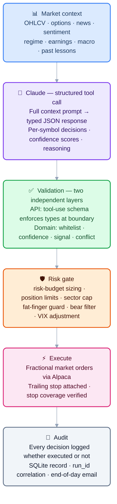
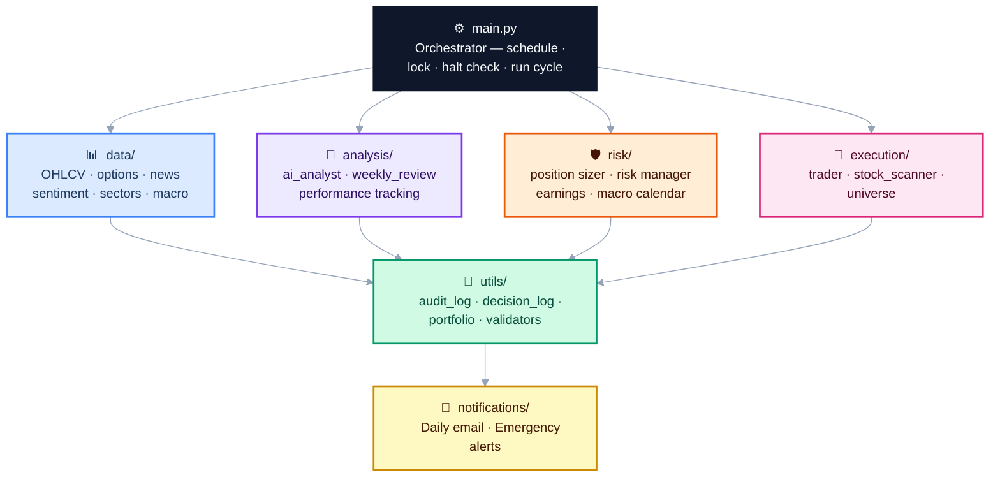

# InvestorBot — AI Governance & Execution Control System

An AI-governed execution-control system for US equities portfolio management. Claude (Anthropic) performs analysis and issues structured recommendations; a deterministic validator, risk gate, and human-override layer decide whether to act. The system never allows an AI model to place, cancel, or modify orders directly.

**Paper trading by default.** The system runs in Alpaca's simulation environment until the operator explicitly confirms live mode with a required acknowledgement string. There is no fast path to real orders.

> **Claude cannot:** place, modify, or cancel orders · read or write configuration · access account balances or position metadata · trigger alerts or emails · modify its own operating parameters. Every Claude output is validated by a deterministic layer before any action is taken. See [AI Governance](#ai-governance) for the full authority boundary.

---

## Table of Contents

1. [Quick Start](#quick-start)
2. [How It Works](#how-it-works)
3. [Architecture](#architecture)
4. [AI Governance](#ai-governance)
5. [Setup](#setup)
6. [Using the System](#using-the-system)
7. [Deployment & Operations](#deployment--operations)
8. [Evaluation Evidence](#evaluation-evidence)
9. [LLM Eval Fixtures](#llm-eval-fixtures)
10. [Production Story — Day One Incidents](#production-story--day-one-incidents)
11. [What's Next](#whats-next)
12. [Why This Demonstrates FDE Skills](#why-this-demonstrates-fde-skills)
13. [Notes of Interest](#notes-of-interest)
14. [Version History](#version-history)

---

## Quick Start

No credentials needed:

```bash
git clone https://github.com/samchatterley/investor-bot
cd investor-bot
python3 -m venv .venv && source .venv/bin/activate
pip install -r requirements.txt
python cli.py demo
```

`demo` mode runs a complete simulated open cycle using static fixture data — no Alpaca account, no Anthropic key, no Gmail. It shows the market context build, AI decision parsing, validation, risk gate, simulated order placement, and audit log output in real time.

---

## How It Works

Most retail algorithmic trading tools fall into one of two failure modes: they either require constant manual intervention (defeating the purpose of automation), or they hand full autonomy to an ML model with no interpretability, no human override, and no audit trail.

InvestorBot sits in between — Claude does the analytical heavy lifting, but every decision it makes is validated, logged, bounded, and reversible before it touches real capital.

### Decision pipeline



### Daily schedule

The scheduler fires four times on every trading day (all times America/New_York):

| Time | Mode | What happens |
|------|------|-------------|
| 09:31 | `open_sells` | Earnings exits and AI sell decisions — no new buys into open noise |
| 10:00 | `open` | Full cycle: market context → Claude → validate → risk gate → long buys + short hedges |
| 12:00 | `midday` | Partial profit exits, stop checks; intraday-signal buys if setups present |
| 15:30 | `close` | Force-cover all intraday positions; final position review before market close |
| 15:00 Sun | `weekly_review` | AI self-review, parameter proposals, diagnostics email |

### Scan universe

The daily scan universe is built dynamically at runtime. `execution/universe.py` fetches Alpaca's full US equity asset catalog (~11,000 names), filters to tradable + fractionable symbols on major exchanges, then applies a fast price (≥ $5) and daily volume (≥ 500K shares) screen via the Alpaca snapshot API. The result — up to 500 symbols — is cached for 24 hours. The static core list in `config.STOCK_UNIVERSE` (509 symbols including the full S&P 500 + 6 ETFs) is always included as a fallback and is merged into the dynamic result.

### Signal types

The prefilter (`execution/stock_scanner.py`) requires every buy candidate to match at least one of **31 active signal patterns** across 10 families before Claude sees it. Ten signals are in `GLOBALLY_DISABLED` after backtest evidence confirmed no edge. See [docs/signals.md](docs/signals.md) for the full signal table with entry conditions, hold limits, regime blocking, fundamental quality gates, and the short signal catalogue.

Signal families: **mean-reversion** · **volatility/IV** · **trend/momentum** · **OHLCV technical** · **catalyst/fundamental** · **options** · **short squeeze** · **sentiment/alt-data** · **cross-asset** · **intraday**

Intraday signals (`vwap_reclaim`, `orb_breakout`, `intraday_momentum`) are computed from Alpaca minute bars and enable the midday run to execute new buys, not just manage positions.

---

## Architecture

### Module map



### Project structure

```
├── analysis/          AI analyst, performance tracking, weekly review
├── backtest/          Rule-based backtesting engine
├── data/              Market data, news, options, sentiment, sectors
├── docs/              Signal reference, incident log, ADRs (5 design decisions)
├── evals/             LLM eval fixtures — prompt injection, hallucinated tickers, bear market, etc.
├── execution/         Order placement, stock scanner, dynamic universe builder
├── notifications/     Email and alert system
├── risk/              Position sizing, earnings/macro calendar, risk checks
├── scripts/           Scheduler and diagnostics runner
├── tests/             Unit test suite (4,494 tests, 100% coverage)
├── utils/             Audit log, portfolio tracker, decision log, validators
├── cli.py             Command-line interface (includes demo mode)
├── config.py          All configuration and environment variables
├── dashboard.py       Streamlit web dashboard
├── main.py            Core trading logic
└── start              Launcher shortcut (./start dashboard, ./start status, etc.)
```

### Architecture tradeoffs

| Decision | Rationale | Tradeoff accepted |
|----------|-----------|-------------------|
| Claude as recommender, not executor | Interpretable reasoning, plain-English audit trail, easy to constrain | Higher latency than pure quant model; API cost per run |
| Rule-based validator as gatekeeper | AI output is untrusted by default — every response schema-checked before acting | Some valid signals rejected by over-strict rules |
| Paper-first, explicit live opt-in | Prevents accidental live deployment; forces conscious decision | Slightly more setup friction |
| SQLite state (`logs/investorbot.db`) | ACID transactions, queryability, atomic audit joins — migrated from JSON files after a real overwrite incident | Requires schema migrations as the system evolves |
| Constrained parameter recommendation engine | Allows adaptation within hard bounds without unbounded drift | Slower adaptation than fully autonomous parameter search |

Full rationale for each decision is in [docs/adr/](docs/adr/).

---

## AI Governance

This section describes how the system constrains Claude's decision-making authority. It is the most important section for understanding the design.

### Separation of reasoning and execution

Claude's role is **analysis and recommendation only**. It never calls the Alpaca API directly. Every decision it returns passes through a validation layer and a separate risk layer before any order is placed. Claude cannot:

- Place, modify, or cancel orders
- Read or write configuration
- Access position metadata or account balances
- Trigger alerts or emails

### Validation layer (`utils/validators.py`)

Every Claude response is validated before it reaches the execution layer:

| Check | What it does |
|-------|-------------|
| Schema validation | Rejects responses missing required fields (`buy_candidates`, `position_decisions`, `market_summary`) |
| Universe whitelist | Rejects any BUY recommendation for a symbol not in the scanned universe |
| Confidence floor | Ignores recommendations below `MIN_CONFIDENCE` (default 7/10) |
| Action conflict | Rejects BUY recommendations for symbols already held |
| Signal whitelist | Rejects unknown signal types not in the allowed set |
| Confidence bounds | Rejects confidence scores outside 1–10 |
| Prompt injection scan | Headlines and news text are scanned for instruction-like patterns before inclusion in the prompt; suspicious content is dropped and logged |

If validation fails, the run continues with the remaining valid decisions. Partial failures are logged; complete failures abort the run and send an alert.

Validation scenarios are covered by fixtures in [`evals/`](evals/) — see the [LLM Eval Fixtures](#llm-eval-fixtures) section.

### Risk layer (`risk/`)

After validation, position-level risk checks are applied independently of Claude's recommendations:

- **Risk-budget sizing** — position size is set at 0.6% of equity risked per trade (`RISK_PER_TRADE_PCT`), hard-capped at 15% of portfolio per position (`MAX_POSITION_WEIGHT`) enforced after all 12 scalar multipliers are applied. Kelly fraction is tracked as secondary telemetry but does not drive order sizes
- **Hard position limits** — up to 5 positions (2 in small-account mode), capped at 15% of portfolio per position, 10% cash reserve always maintained
- **Fat-finger guard** — single orders above `MAX_SINGLE_ORDER_USD` (default $50,000; $55 in small-account mode) are rejected regardless of instruction
- **Daily notional cap** — total new deployment above `MAX_DAILY_NOTIONAL_USD` (default $150,000; $75 in small-account mode) in one day halts buying
- **Sector concentration** — maximum 2 positions in any sector
- **Bear filter** — no new buys when SPY drops more than 1.5% in a session
- **VIX-tiered stop adjustment** — trailing stop trail widens automatically: 3% (VIX ≤ 18) → 4% (VIX ≤ 25) → 5.5% (VIX ≤ 35) → 7% (VIX > 35)
- **Earnings guard** — positions with earnings within 2 calendar days are exited pre-emptively
- **Circuit breaker** — new buys halted when the portfolio drops 12% from its 5-day peak
- **Daily loss limit** — all positions closed when the portfolio loses 5% from the session open; bot auto-resumes the next trading day. If any position close fails during liquidation a halt file is written and manual resume is required (`python cli.py resume`)
- **Partial profit taking** — 50% of any position is sold when unrealised gain hits 8% (15% in small-account mode); the remaining half runs with the trailing stop
- **Per-signal hold limits** — stale positions are time-exited after signal-specific maximums (2–5 days depending on signal family)
- **Short hedge** — after long buys each open run, bottom-quartile RS stocks are scanned for short positions (max 3 concurrent; capped at 0.5× long notional; sized at 0.5× standard long size); regime-gated to bear regimes only (`STRESS_RISK_OFF`, `HIGH_VOL_DOWNTREND`, `DEFENSIVE_DOWNTREND`, `CREDIT_STRESS`); standalone short book active in bear regimes when no longs are held. Every short is priced against an estimated borrow rate (`data/borrow_cost.py`) — hard-to-borrow names are skipped live and borrow cost is netted from short backtests
- **Index regime hedge** (opt-in, `INDEX_HEDGE_ENABLED`) — shorts an index ETF (default SPY) at a configurable portfolio weight in confirmed bear regimes and covers on regime exit; a structurally cleaner short than crowded single names (cheap borrow, deep liquidity, no squeeze risk)
- **Same-day open guard** — only one buy phase executes per calendar day in `open` mode; subsequent open runs skip buys entirely

### Constrained parameter recommendation engine

The weekly self-review enables Claude to propose adjustments to four operating parameters. This is a **constrained recommendation** mechanism — not self-modification. Every proposal:

1. Is validated against hard-coded bounds that cannot be exceeded regardless of what Claude proposes
2. Is recorded in `logs/weekly_review_YYYY-MM-DD.json` and included in the Sunday email as a proposal — never applied automatically
3. Can be applied by the operator by manually editing `logs/runtime_config.json`; config loads and bounds-checks this file at every startup

| Parameter | Allowed range |
|-----------|---------------|
| `MIN_CONFIDENCE` | 7 – 10 |
| `TRAILING_STOP_PCT` | 2.0% – 10.0% |
| `PARTIAL_PROFIT_PCT` | 3.0% – 20.0% |
| `MAX_HOLD_DAYS` | 1 – 10 days |
| `MAX_ORDERS_PER_RUN` | 1 – 5 |

Values outside bounds are logged and rejected. The runtime config file is loaded at startup alongside `config.py` — source is never modified by the system. See [ADR-005](docs/adr/ADR-005-bounded-parameter-updates.md) for full rationale.

### Human override

At any point:

```bash
python cli.py halt      # Creates logs/.HALTED — bot refuses all further runs
python cli.py resume    # Removes halt file and resumes
```

The halt command prompts for explicit confirmation before liquidating open positions. The halt file is checked at the start of every run cycle before any data is fetched or any API is called.

### Audit trail

Every Claude recommendation is written to the SQLite audit store regardless of whether it was executed — including the confidence score, plain-English reasoning, signal type, `run_id`, and a flag indicating whether it became a real trade. This log is queryable via `python cli.py decisions` and rendered in the dashboard's AI Decisions page.

Every order placed is recorded with timestamp, symbol, action, price, quantity, run_id, and mode. The `run_id` field links every audit event, decision, and order back to the run that caused them.

---

## Setup

**Requirements:** Python 3.12, a free [Alpaca Markets](https://alpaca.markets) account, an [Anthropic API](https://console.anthropic.com) key, and a Gmail account with an App Password.

### Option A — local (Python venv)

```bash
git clone https://github.com/samchatterley/investor-bot
cd investor-bot
python3 -m venv .venv && source .venv/bin/activate
pip install -r requirements.txt
cp .env.example .env
# Fill in .env with your keys
python scripts/run_scheduler.py
```

### Option B — Docker

```bash
cp .env.example .env
# Fill in .env with your keys
docker-compose up -d
```

This starts two containers: the trading scheduler (`investorbot`) and the web dashboard (`investorbot-dashboard`) at `http://localhost:8501`. Logs are persisted to `./logs/` via a volume mount.

### `.env` keys

| Variable | Description |
|----------|-------------|
| `ALPACA_API_KEY` / `ALPACA_SECRET_KEY` | Alpaca credentials |
| `ALPACA_BASE_URL` | `https://paper-api.alpaca.markets` for paper (default), `https://api.alpaca.markets` for live |
| `ANTHROPIC_API_KEY` | Claude API key |
| `EMAIL_FROM` | Gmail address the bot sends from |
| `EMAIL_TO` | Owner address — emergency alerts only |
| `EMAIL_RECIPIENTS` | Named recipients for daily summary + weekly review: `Sam:sam@gmail.com,Harri:harri@outlook.com` |
| `EMAIL_APP_PASSWORD` | Gmail App Password (not your login password) |
| `ALPHA_VANTAGE_API_KEY` | Optional. Alpha Vantage API key for news sentiment enrichment. Free tier: 500 calls/day, 5 calls/min. When absent, AV sentiment is silently disabled. |

**Live trading:** The system is designed as a paper-trading governance and simulation framework. Live mode (changing `ALPACA_BASE_URL` to the live endpoint) additionally requires setting `LIVE_CONFIRM=I-ACCEPT-REAL-MONEY-RISK` in your `.env`. Do this only after extended paper trading, after reviewing all risk parameters, and with full understanding of every circuit breaker and kill switch in the system.

---

## Using the System

### CLI

```bash
python cli.py demo                # Complete simulated run — no credentials needed
python cli.py status              # Account value, open positions, halt state
python cli.py positions           # Live positions with P&L
python cli.py trades --days 10    # Recent trade history
python cli.py decisions --days 5  # AI decision log with reasoning
python cli.py run --mode open     # Trigger a trading run
python cli.py run --dry-run       # Analyse only, no orders placed
python cli.py halt                # Emergency kill switch
python cli.py resume              # Clear halt and resume
python cli.py backtest --start 2025-01-01
python cli.py dashboard           # Launch web dashboard
```

### Web dashboard

```bash
python cli.py dashboard
```

Opens at `http://localhost:8501`. Five pages:

| Page | Contents |
|------|----------|
| Overview | Live portfolio value, equity curve, daily P&L bar chart, open positions |
| Trades | Full trade history table across all sessions |
| AI Decisions | Every Claude recommendation — confidence, signal type, reasoning, executed flag |
| Backtest | Equity curve, Sharpe ratio, win rate, signal breakdown |
| Diagnostics | Unit test results with pass/fail counts and a run-now button |

### Backtesting

```bash
python cli.py backtest --start 2015-01-01 --capital 25000
```

Replays rule-based entry signals on historical OHLCV data without calling Claude. Reports total return, win rate, Sharpe ratio, max drawdown, and performance by signal type. Results are saved to `logs/backtest_results.json` and rendered in the dashboard. See the [Evaluation Evidence](#evaluation-evidence) section for results and caveats.

### Notifications

Each person listed in `EMAIL_RECIPIENTS` receives a personalised email addressed by name.

| Event | Recipients |
|-------|-----------|
| End-of-day summary | All `EMAIL_RECIPIENTS` |
| Sunday weekly review + diagnostics | All `EMAIL_RECIPIENTS` |
| Circuit breaker / daily loss limit / errors | `EMAIL_TO` only |

---

## Deployment & Operations

### Where it runs

Currently running on a local Mac in a `tmux` session with `caffeinate` to prevent sleep. This is intentional for paper-trading — there is no cost, no infrastructure, and no blast radius if something goes wrong. For a production deployment the natural next step would be a small VPS (Hetzner, DigitalOcean) or a Docker container on a cloud host with a persistent volume for `logs/`.

The scheduler (`scripts/run_scheduler.py`) is the single production runner — it handles all four daily runs plus the Sunday weekly review. Do not use cron alongside it; doing so will double-fire every run.

### Secrets handling

All secrets live in `.env` which is gitignored and never committed. Inside the application, credentials are read from environment variables at startup via `python-dotenv` — they are never logged, never included in prompts, and never written to disk.

### Persistence and recovery

- **Lock file** (`logs/.lock_YYYY-MM-DD`): prevents two scheduler instances running simultaneously on the same day.
- **Halt file** (`logs/.HALTED`): persists across restarts. If the bot is halted by a circuit breaker, it stays halted until manually resumed.
- **SQLite database** (`logs/investorbot.db`): all position metadata, run records, audit events, and AI decisions. Reconciled against live Alpaca positions at the start of every open run.

### Monitoring

- **Email alerts**: circuit breaker triggers, daily loss limit hits, and run errors all send an immediate email to `EMAIL_TO`.
- **Daily email**: end-of-day summary to all recipients — acts as a daily heartbeat.
- **Dashboard**: `http://localhost:8501` shows live portfolio, equity curve, and recent decisions.
- **Structured logs**: every run emits JSON-structured log lines with `run_id`, `ts`, `event`, and `payload` — queryable via `logs/investorbot.db`.
- **LLM cost tracking**: token usage for each Claude call is logged (input tokens, output tokens, estimated cost) to the `llm_usage` table.

### Cost

| Component | Cost |
|-----------|------|
| Alpaca paper trading | Free |
| Claude API (sonnet-4-6) | ~$0.03–0.08 per trading day |
| Infrastructure (local) | $0 |
| Gmail SMTP | Free |

At current rates, running costs are approximately **$1–2/month** in API fees.

### Runbook

**Bot isn't running / missed a scheduled time:**
```bash
tmux attach -t investorbot       # Check if process is alive
python cli.py status             # Check halt state and account
python scripts/run_scheduler.py  # Restart if needed
```

**Unexpected position or suspicious behaviour:**
```bash
python cli.py decisions --days 1  # See what Claude decided and why
python cli.py halt                 # Kill switch if needed
```

**Full live pre-flight:** See [LIVE_RUNBOOK.md](LIVE_RUNBOOK.md) for the pre-live checklist, canary procedure (single $20 trade to verify the full broker pipeline), and incident response.

---

## Evaluation Evidence

### Combined long/short backtest (2015–2026)

The backtester replays rule-based entry signals on historical OHLCV data. This is a **proxy for signal quality** — it does not call Claude, and it does not include news, options data, or macro context that Claude sees in live runs.

```
COMBINED LONG/SHORT — 2015-01-01 → 2026-06-12
Initial capital:   $25,000
Total return:      +31.01%
Total trades:      5,256  (long: 4,889 · short: 367)
Win rate:          51.0%  (long: 52% · short: 44%)
Avg return/trade:  +0.06%
Max drawdown:      -37.8%
Sharpe ratio:       0.22
```

Regime distribution over the backtest window: 63% NEUTRAL_CHOP, 9% STRESS_RISK_OFF, 8% DEFENSIVE_DOWNTREND, 6% BULL_TREND. The predominance of NEUTRAL_CHOP explains why many momentum-oriented signals fire infrequently — they are regime-gated to BULL_TREND.

### Backtest caveats

- **Rule-based proxy, not live Claude decisions.** The backtester uses hardcoded signal rules as a proxy for what Claude would recommend. Live Claude decisions will differ — sometimes better, sometimes worse.
- **Transaction costs modelled.** Fills include 5 bps slippage, a liquidity-scaled half-spread, and a square-root market impact cost. Costs widen automatically for illiquid names and large orders relative to ADV.
- **Gap-through-stop.** If today's open is already at or below the stop price, the fill executes at open, reflecting realistic gap risk.
- **No lookahead bias.** Signals use T-1 bar indicators; entries fill at T open price. Indicator warmup is buffered by 90 days.
- **Survivorship bias.** The universe is fixed to current S&P 500 constituents — names that have survived and grown. Pre-2020 results are upward-biased.
- **Fundamental quality data (look-ahead).** Altman Z and Piotroski scores used in signal gates are derived from today's financials projected backwards. Distress-based short signals are particularly affected: the backtest scores companies against today's data, but all are still alive today — a form of survivorship that inflates the short book's edge. The 44% short win rate should be treated with caution.

### Known failure modes

| Scenario | What happens | Recovery |
|----------|-------------|----------|
| Claude returns malformed JSON | Validator rejects response, run aborts, alert email sent | Automatic retry on next scheduled run |
| Claude recommends a symbol outside the universe | Validator rejects that recommendation, others proceed | Logged; no action needed |
| Alpaca API timeout | Order attempt fails, position not opened, error logged | Bot continues; retried next run |
| News headline contains injected instructions | Headline is dropped, warning logged | Automatic; review logs if frequent |
| SQLite locked or corrupt | Falls back to in-memory state for the run; alert sent | Automatic recovery on next run |
| Both API keys invalid | Run fails at client initialisation, alert sent | Fix `.env` and resume |
| Circuit breaker triggered (−12% from 5-day peak) | New buys halted for the rest of the session | Resets automatically at next run |
| Daily loss limit hit (−5% from open) | All positions liquidated, alert sent; auto-resumes next day | Automatic; halt file written + manual resume required only if a close fails |

---

## LLM Eval Fixtures

The [`evals/`](evals/) directory contains structured test fixtures for the AI governance layer. Each fixture covers a scenario where Claude's output or input is adversarial, edge-case, or safety-critical:

| Fixture | What it tests |
|---------|--------------|
| `prompt_injection_headlines.json` | News headlines containing injection attempts — scanner must drop them |
| `hallucinated_tickers.json` | AI recommends symbols outside the scanned universe — validator must reject |
| `bear_market_no_buy.json` | Bear regime + buy candidates — risk gate must suppress buys |
| `conflicting_signals.json` | BUY and SELL for the same symbol in one response — validator must flag conflict |
| `earnings_risk.json` | Position with earnings within 2 days — earnings guard must trigger exit |
| `malformed_tool_calls.json` | Three malformed AI responses — schema validator must reject all |

Run with: `pytest evals/`

---

## Production Story — Day One Incidents

The bot went live on paper trading on 27 April 2026. Six distinct failures surfaced in the first two hours, none of which appeared in local testing. All six were diagnosed from logs alone without needing to reproduce locally. See [docs/incidents.md](docs/incidents.md) for full root-cause analysis, fixes, and learnings.

| # | Failure | Category | Time to fix |
|---|---------|----------|-------------|
| 1 | Python 3.9 `\|` syntax crash at import | Environment assumption | ~10 min |
| 2 | News fetcher silent zero results | External API drift | ~15 min |
| 3 | Sentiment fetcher blocked (Cloudflare) | Third-party dependency | ~30 min |
| 4 | Trailing stop rejected for fractional shares | Broker constraint untested | ~20 min |
| 5 | Stop qty rounding above available qty | Numeric precision | ~10 min |
| 6 | Midday and close runs never scheduled | Configuration gap | ~5 min |

The key pattern: the system's structured logging — a timestamped record for every run with explicit counts like `Fetched news for 0/30 symbols` — made it possible to identify all failures within the first run's output rather than inferring them from missing behaviour.

---

## What's Next

The current system deliberately keeps deployment local and execution synchronous. The natural next steps, in priority order:

1. **Live paper-trading evidence** — running continuous paper trading since April 2026. The backtest is signal evidence; paper trading is execution evidence. Next step: move to a small live experiment after sustained paper performance.
2. **Drawdown-based position sizing** — reduce Kelly fraction automatically when the portfolio is in a drawdown, not just when individual signals are weak.
3. ~~Post-earnings momentum (PEAD)~~ — implemented in v1.20.
4. **Centralised logging** — move from local SQLite to a structured log store (Loki, Datadog) to support multi-host deployment and better alerting.
5. **Account-level performance attribution** — track alpha vs SPY benchmark, not just absolute return. The current metrics don't adjust for beta.

---

## Why This Demonstrates FDE Skills

| FDE skill | How it shows up here |
|-----------|----------------------|
| Ambiguous problem → working product | Defined scope, constraints, and tradeoffs for an autonomous system operating on a schedule with no human in the loop |
| Multiple third-party API integrations | Alpaca (brokerage), Anthropic (LLM), yfinance (market data), Gmail (SMTP) — each behind a fault-tolerant adapter with retry logic |
| AI output treated as untrusted | Every Claude response schema-checked, domain-validated, and risk-gated before any order is placed |
| Operator dashboard and CLI | Non-code workflows for halt, resume, status, decisions, backtest — all without touching source |
| Paper-first deployment model | Default `.env.example` points to paper endpoint; live mode requires explicit opt-in with safeguards |
| Real incident handling | Six production failures on day one, all diagnosed from logs and fixed same session — documented in [docs/incidents.md](docs/incidents.md) |
| Audit trail for every action | Append-only SQLite record for every recommendation, order, and risk event — whether executed or not |
| Demo mode, no credentials needed | `python cli.py demo` runs a complete simulated cycle on static fixtures for reviewers who don't have API keys |

---

## Notes of Interest

- **Paper-first by design.** The `.env.example` points to Alpaca's paper endpoint. Live trading requires a conscious URL change, a required confirmation string, a re-read of the risk parameters, and an understanding of every circuit breaker in the system.

- **Fractional shares.** All orders use fractional share support, so the full calculated dollar amount is deployed rather than rounding down to whole shares. This matters most for high-price names like NVDA or GOOGL.

- **Python 3.12 throughout.** The venv, Docker image, and scheduler all use Python 3.12. Do not invoke `python3` or `/usr/bin/python3` directly — always use `.venv/bin/python` to ensure the correct interpreter and pinned dependencies are used.

- **MiFID II-style pre-trade controls.** The fat-finger guard (`MAX_SINGLE_ORDER_USD`), runaway algorithm guard (`MAX_DAILY_NOTIONAL_USD`), and open-exposure cap (`MAX_DEPLOYED_USD`) are modelled on Article 17 algorithmic trading obligations — limits that apply regardless of what Claude decides.

- **Small-account experiment mode.** Set `SMALL_ACCOUNT_MODE=true` to activate a £150-scale live experiment profile. This caps single orders at $55, daily notional at $75, max deployed at $125, max positions at 2, and uses explicit-notional sizing ($40–$55 per position) instead of the risk-budget formula.

- **AI explainability.** Every recommendation Claude makes is logged with its confidence score, plain-English reasoning, signal type, and `run_id` — whether or not the trade was ultimately executed.

- **4,494 tests, 100% coverage.** The test suite covers every public function and every unhappy path across all core modules, enforced by a coverage gate on CI. Tests run automatically every Sunday as part of the weekly review job. Results are included in the email and visible in the Diagnostics dashboard page.

---

## Version History

See [CHANGELOG.md](CHANGELOG.md) for the full version history (v1.0 → v1.99).

### Recent

**1.99 — June 2026** — Signal book rationalisation + short-book rebuild. Disabled `obv_divergence` + `obv_acceleration` (joint ΔSharpe +0.12, ΔReturn +7.0% — slot competition was crowding out `pead`) and the three lagging fundamental shorts (`death_cross`, `altman_distress_short`, `gross_margin_deterioration_short`). Rebuilt the short side around the structural problems identified: a **borrow-cost model** (`data/borrow_cost.py` — netted from short backtests, gates hard-to-borrow names live), a **catalyst short** `post_earnings_gapdown_failed_bounce` (negative-PEAD continuation entered after the bounce fails, computed live from daily OHLCV), and an opt-in **index regime hedge** (short SPY in bear regimes — cheap borrow, no squeeze risk). `SIGNAL_PRIORITY` 41 entries (31 active, 10 disabled); `SHORT_SIGNAL_PRIORITY` gains the failed-bounce short.

**1.98 — June 2026** — Institutional-grade codebase audit: 12 critical and high findings across AI governance, broker safety, signal wiring, and observability hardened. Signal book rationalised: 3 signals disabled (`range_reversion`, `volume_climax_reversal`, `tax_loss_reversal`) after combined production backtest confirmed no edge; `fcf_yield_signal` elevated to priority 12 on 563-trade evidence. Options and short-squeeze signals fully wired post-C3 dead-code fix. SYSTEM_PROMPT rewritten for parity with live signal book (41 entries, 8 disabled, 33 active). `SIGNAL_PRIORITY` now 41 entries (33 active, 8 in `GLOBALLY_DISABLED`). Tests: see below.

**1.97 — June 2026** — The deepest signal expansion to date: 15 new long signals and 6 new short signals spanning options microstructure, fundamental quality, short-squeeze mechanics, alternative data, and cross-asset pairs. Five new data pipelines (`analyst_revisions`, `fear_greed`, `google_trends`, `lockup_calendar`; plus `fred_client` / `fundamental_cache` extensions). Nine new fundamental and microstructure gates in the signal evaluator. Fixes a latent options dead-code bug where options signals were evaluated before options data was injected. `SIGNAL_PRIORITY` now 41 entries (36 active, 5 in `GLOBALLY_DISABLED`). `SHORT_SIGNAL_PRIORITY` now 23 entries (9 active, 14 in `SHORT_GLOBALLY_DISABLED`). 4,494 tests total.

**1.96 — June 2026** — Institutional-grade system review: 17 findings across crash safety, sizing, signal governance, and data integrity. Critical fixes include `REGIME_POLICY` `KeyError` on 3 missing states, fail-closed ledger getters, daily-loss liquidation error handling, and scoped cancel-order logic. Signal registry unification via `signals/registry.py`. Stop-exit outcome recording to fix win-rate survivorship bias. 11 new wiring/consistency tests. 4,220 tests total.
