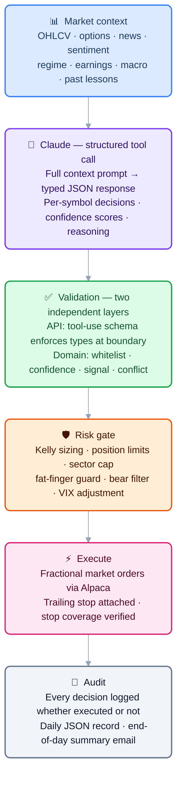
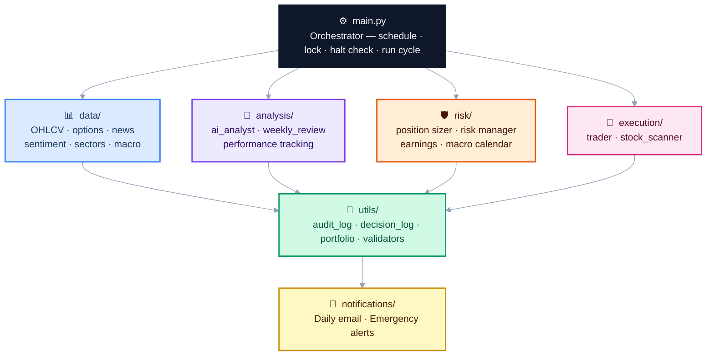

# InvestorBot

An autonomous AI trading agent that manages a US equities portfolio using Claude as its reasoning engine. It runs on a fixed schedule three times per trading day, sizes positions with Kelly Criterion, enforces a multi-layer pre-trade risk framework, and conducts a weekly self-review — proposing bounded adjustments to its own parameters based on what is and isn't working.

**Paper trading by default.** The bot runs in Alpaca's paper environment until you explicitly change one environment variable and accept the associated risks. Live mode is a deliberate opt-in, not the default path.

---

## Case study

### Problem

Most retail algorithmic trading tools fall into one of two failure modes: they either require constant manual intervention (defeating the purpose of automation), or they hand full autonomy to an ML model with no interpretability, no human override, and no audit trail.

The goal here was to build something in between — a system where an AI model does the analytical heavy lifting, but every decision it makes is validated, logged, bounded, and reversible before it touches real capital.

### Who it's for

- Personal use: an autonomous portfolio manager that runs while you're at work
- Portfolio demonstration: evidence of production-grade system design with AI in the loop
- Research: a reproducible framework for testing AI-driven trading strategies in a safe environment

### Workflow



### Architecture



### Architecture tradeoffs

| Decision | Rationale | Tradeoff accepted |
|----------|-----------|-------------------|
| Claude as decision engine, not execution engine | Interpretable reasoning, plain-English audit trail, easy to constrain | Higher latency than pure quant model; API cost per run |
| Rule-based validator as gatekeeper | AI output is untrusted by default — every response schema-checked before acting | Some valid signals rejected by over-strict rules |
| Paper-first, explicit live opt-in | Prevents accidental live deployment; forces conscious decision | Slightly more setup friction |
| File-based state (`positions_meta.json`) | No infrastructure dependency, runs anywhere | Requires file locking; wouldn't scale beyond a single host |
| Bounded self-modification (4 params, hard range limits) | Allows adaptation without unbounded drift | Slower adaptation than fully autonomous parameter search |
| All logs local | No external dependency, no data leakage | No centralised observability; logs are lost if disk is lost |

---

## AI governance

This section describes how the system constrains Claude's decision-making authority. It is the most important section for understanding the design.

### Separation of reasoning and execution

Claude's role is **analysis and recommendation only**. It never calls the Alpaca API directly. Every decision it returns passes through a validation layer and a separate risk layer before any order is placed. Claude cannot:

- Place, modify, or cancel orders
- Read or write configuration
- Access position metadata or account balances
- Trigger alerts or emails

### Validation layer (`utils/validators.py`)

Every Claude response is validated before it reaches the execution layer:

| Check | What it does |
|-------|-------------|
| Schema validation | Rejects responses missing required fields (`buy_candidates`, `position_decisions`, `market_summary`) |
| Universe whitelist | Rejects any BUY recommendation for a symbol not in the scanned universe |
| Confidence floor | Ignores recommendations below `MIN_CONFIDENCE` (default 7/10) |
| Action conflict | Rejects BUY recommendations for symbols already held |
| Signal whitelist | Rejects unknown signal types not in the allowed set |
| Confidence bounds | Rejects confidence scores outside 1–10 |
| Prompt injection scan | Headlines and news text are scanned for instruction-like patterns before inclusion in the prompt; suspicious content is dropped and logged |

If validation fails, the run continues with the remaining valid decisions. Partial failures are logged; complete failures abort the run and send an alert.

### Risk layer (`risk/`)

After validation, position-level risk checks are applied independently of Claude's recommendations:

- **Kelly Criterion sizing** — position size is a function of historical win rate, not Claude's stated confidence alone
- **Hard position limits** — maximum 5 positions, maximum 45% in any single name, always 10% cash reserve
- **Fat-finger guard** — single orders above $50,000 are rejected regardless of instruction
- **Daily notional cap** — total new deployment above $150,000 in one day halts buying
- **Sector concentration** — maximum 2 positions in any sector
- **Bear filter** — no new buys when SPY drops more than 1.5% in a session
- **VIX adjustment** — trailing stops widen automatically above VIX 25
- **Earnings guard** — positions with earnings within 2 calendar days are exited pre-emptively

### Bounded self-modification

The weekly self-review allows Claude to propose changes to its own operating parameters. Changes are applied only within hard-coded bounds that cannot be exceeded regardless of what Claude proposes:

| Parameter | Allowed range |
|-----------|---------------|
| `MIN_CONFIDENCE` | 6 – 9 |
| `TRAILING_STOP_PCT` | 2.0% – 8.0% |
| `PARTIAL_PROFIT_PCT` | 5.0% – 20.0% |
| `MAX_HOLD_DAYS` | 2 – 7 days |

All proposed changes are written to `logs/weekly_review_YYYY-MM-DD.json` with evidence-based reasoning before being applied. If the regex substitution fails to find the target line in config, the change is rejected and logged — the file is never written in a partially-modified state.

### Human override

At any point:

```bash
python cli.py halt      # Creates logs/.HALTED — bot refuses all further runs
python cli.py resume    # Removes halt file and resumes
```

The halt command prompts for explicit confirmation before liquidating open positions. The halt file is checked at the start of every run cycle before any data is fetched or any API is called.

### Audit trail

Every Claude recommendation is written to `logs/decisions.jsonl` regardless of whether it was executed — including the confidence score, plain-English reasoning, signal type, and a flag indicating whether it became a real trade. This log is queryable via `python cli.py decisions` and rendered in the dashboard's AI Decisions page.

Every order placed is written to `logs/audit_log.jsonl` with a timestamp, symbol, action, price, quantity, and run mode.

---

## Live testing — day one incidents (2026-04-27)

The bot went live on paper trading on 27 April 2026. Six distinct failures surfaced in the first two hours, none of which appeared in local testing. Each is documented below with root cause and fix — this section is kept in the README because the failures reveal design assumptions worth being explicit about.

---

### Incident 1 — Python 3.9 crash at scheduler startup

**Symptom:** Bot failed to start. `cron.log` showed a `TypeError` at import time on `emailer.py`:

```
TypeError: unsupported operand type(s) for |: 'type' and 'NoneType'
```

**Root cause:** The type annotation `dict | None` (PEP 604 union syntax) requires Python 3.10+. Development had used Python 3.11; the production Mac ran 3.9. The crash happened at module *import*, not at runtime — the annotation was in a function signature that never ran, but Python 3.9 evaluates all annotations eagerly at import time.

**Fix:** Added `from __future__ import annotations` to the affected files. This makes all annotations lazy strings (PEP 563), restoring compatibility back to Python 3.7 with no other changes needed.

**Learning:** Host Python version should be pinned in `.env.example` or the setup instructions, and tested explicitly. The venv Python and the system Python used by cron can differ silently.

---

### Incident 2 — News fetcher returning zero results

**Symptom:** `Fetched news for 0/30 symbols` on every run despite the stocks being active and well-covered.

**Root cause:** yfinance had changed its news API response format between versions. Headline text that previously lived at `item["title"]` had moved to `item["content"]["title"]`. The fetcher looked only in the old location and silently returned empty lists.

**Fix:** Added a fallback chain that checks both locations before giving up:

```python
title = (
    item.get("title")
    or item.get("headline")
    or (item.get("content") or {}).get("title")
    or ""
)
```

**Learning:** External API clients silently change response shapes, especially undocumented ones. Adapters should fail loudly (log a warning on unexpected shape) rather than returning empty results that look like "no data".

---

### Incident 3 — Sentiment fetcher returning zero results

**Symptom:** `Sentiment data fetched for 0/10 symbols`. All requests to Stocktwits were returning 403.

**Root cause:** Stocktwits had deployed Cloudflare protection that blocked the requests. Investigation showed the new `api-gw-prd` endpoint returns 401 (requires HTTP Basic auth) and the developer programme — through which API keys would be obtained — had closed registration.

**Fix:** Complete rewrite of `data/sentiment.py`. Replaced Stocktwits with yfinance analyst consensus data (`recommendationMean`, scale 1–5 where 1 = strong buy). This is arguably more useful than social sentiment for a 1–5 day holding strategy — analyst price targets and conviction counts are directly relevant to the signals the bot trades.

```python
bullish_pct = round(max(0, min(100, (5 - mean) / 4 * 100)))
```

The existing prompt format (`bullish_pct`, `bearish_pct`) was preserved so nothing upstream needed changing.

**Learning:** Free public APIs have no SLA. A dependency on an undocumented endpoint is a single point of failure. Where possible, prefer an API that surfaces the same signal through a more durable path (here: broker/data provider data over social media scraping).

---

### Incident 4 — Trailing stops rejected for fractional share positions

**Symptom:** Two stop attachment errors on every run:

```
Failed to place trailing stop for NVDA: fractional orders must be DAY orders
```

Then after changing `time_in_force` to `DAY`:

```
Failed to place trailing stop for NVDA: fractional orders must be market, limit, stop, or stop_limit orders
```

**Root cause:** Alpaca does not support `TrailingStopOrderRequest` for fractional share positions under any `time_in_force`. The Kelly Criterion sizing produced fractional quantities (e.g. 132.65 shares of NVDA), but the assumption was that Alpaca's trailing stop type worked universally.

**Fix:** `place_trailing_stop()` now detects fractional quantities and falls back to a fixed `StopOrderRequest` at `TRAILING_STOP_PCT` below the current price, passing `current_price` through from the position object already in memory. Whole-share positions continue to use the trailing stop.

```python
is_fractional = abs(safe_qty - round(safe_qty)) > 0.000001
```

**Learning:** Broker API constraints don't map cleanly to order type abstractions. Fractional support and order type support are orthogonal features that need to be tested in combination, not assumed.

---

### Incident 5 — Stop qty rounding causing insufficient-qty rejection

**Symptom:** LMT stop order rejected immediately after incident 4's fix:

```
insufficient qty available for order (requested: 64.075232, available: 64.075231525)
```

**Root cause:** `round(64.075231525, 6)` produces `64.075232` — a value fractionally *above* the available quantity that Alpaca considers settleable. Python's rounding is correct (`...525` rounds the 6th decimal up), but Alpaca's available-qty figure and submitted-qty figure need to agree to sub-cent precision.

**Fix:** Replaced `round(qty, 6)` with floor truncation: `math.floor(qty * 1_000_000) / 1_000_000`. This guarantees the submitted quantity never exceeds what the broker considers available.

**Learning:** When submitting quantities back to a broker that supplied them, truncate rather than round. The broker's figure is the authoritative ceiling; rounding can push above it.

---

### Incident 6 — Midday and close runs never scheduled

**Symptom:** No 17:00 or 20:45 run despite the system being described as running three cycles per day.

**Root cause:** The crontab had only been configured for the open run during initial setup. The scheduler script (`scripts/run_scheduler.py`) was correct, but the cron entries for midday and close had never been added.

**Fix:** Added the two missing cron entries:

```
0  17 * * 1-5  ... main.py --mode midday
45 20 * * 1-5  ... main.py --mode close
```

**Learning:** "The system supports three modes" and "the system is configured to run three modes" are different claims. Setup instructions should include explicit verification steps, not just configuration snippets.

---

### Summary

| # | Failure | Category | Time to fix |
|---|---------|----------|-------------|
| 1 | Python 3.9 `\|` syntax crash | Environment assumption | ~10 min |
| 2 | News fetcher silent zero | External API drift | ~15 min |
| 3 | Sentiment fetcher blocked | Third-party dependency | ~30 min |
| 4 | Trailing stop rejected for fractional | Broker constraint untested | ~20 min |
| 5 | Stop qty rounding above available | Numeric precision | ~10 min |
| 6 | Midday/close never scheduled | Configuration gap | ~5 min |

All six were diagnosed from logs alone without needing to reproduce locally. The system's structured logging — a timestamped record for every run with explicit counts like `Fetched news for 0/30 symbols` — made it possible to identify all failures within the first run's output rather than inferring them from missing behaviour.

---

## Evaluation evidence

### Backtest results (Jan 2025 → Apr 2026)

The backtester replays the strategy's rule-based entry signals on historical OHLCV data. This is a **proxy for the strategy's signal quality** — it does not call Claude, so it measures whether the underlying technical signals have edge, not whether Claude interprets them well.

```
Initial capital:   $25,000
Final value:       $29,486
Total return:      +17.9%
Total trades:      290
Win rate:          53%
Avg return/trade:  +0.37%
Max drawdown:      -10.7%
Sharpe ratio:      0.94

By signal:
  momentum        158 trades  WR 58%  avg +0.48%
  mean_reversion  132 trades  WR 48%  avg +0.23%
```

### Backtest caveats

- **Rule-based proxy, not live Claude decisions.** The backtester uses hardcoded signal rules (RSI < 35, EMA crossover, etc.) as a proxy for what Claude would recommend. Live Claude decisions will differ — sometimes better, sometimes worse.
- **No transaction costs or slippage.** Real fills, especially on momentum signals, will be worse than the backtested prices.
- **Look-ahead bias risk.** Indicator warmup windows are buffered by 90 days, but subtle data leakage is possible.
- **Survivorship bias.** The universe is fixed to the current 28-symbol list, which contains names that have survived and grown. Pre-2025 signals on this list are upward-biased.
- **Past performance.** 2025 included the DeepSeek shock (January), tariff volatility (April), and a significant drawdown. Sharpe of 0.94 over this period is reasonable but not exceptional.

### Known failure modes

| Scenario | What happens | Recovery |
|----------|-------------|----------|
| Claude returns malformed JSON | Validator rejects response, run aborts, alert email sent | Automatic retry on next scheduled run |
| Claude recommends a symbol outside the universe | Validator rejects that recommendation, others proceed | Logged; no action needed |
| Alpaca API timeout | Order attempt fails, position not opened, error logged | Bot continues; retried next run |
| News headline contains injected instructions | Headline is dropped, warning logged | Automatic; review logs if frequent |
| `positions_meta.json` corrupted | Falls back to empty dict, reconciliation run restores state from live Alpaca positions | Automatic |
| Both API keys invalid | Run fails at client initialisation, alert sent | Fix `.env` and resume |
| Daily loss limit hit | All positions liquidated, halt file created, alert sent | Manual resume required: `python cli.py resume` |

---

## Deployment story

### Where it runs

Currently running on a local Mac in a `tmux` session. This is intentional for paper-trading — there is no cost, no infrastructure, and no blast radius if something goes wrong. For a production deployment the natural next step would be a small VPS (Hetzner, DigitalOcean) or a Docker container on a cloud host with a persistent volume for `logs/`.

### Secrets handling

All secrets live in `.env` which is gitignored and never committed. The `.env.example` file documents every required variable with descriptions but no values. Inside the application, credentials are read from environment variables at startup via `python-dotenv` — they are never logged, never included in prompts, and never written to disk.

### Persistence and recovery

- **Lock file** (`logs/.bot.lock`): prevents two scheduler instances running simultaneously. If the process dies mid-run, the lock is cleaned up on next start.
- **Halt file** (`logs/.HALTED`): persists across restarts. If the bot is halted by a circuit breaker, it stays halted until manually resumed — it will not auto-resume after a crash.
- **Position metadata** (`logs/positions_meta.json`): reconciled against live Alpaca positions at the start of every open run. If the file is missing or corrupt, state is rebuilt from the broker.
- **File locking**: `positions_meta.json` uses `fcntl.LOCK_EX` for all read-modify-write operations, preventing corruption if a manual `cli.py run` and the scheduler overlap.

### Monitoring

- **Email alerts**: circuit breaker triggers, daily loss limit hits, and run errors all send an immediate email to `EMAIL_TO`.
- **Daily email**: end-of-day summary to all recipients — acts as a daily heartbeat. If the email doesn't arrive, the bot didn't run.
- **Dashboard**: `http://localhost:8501` shows live portfolio, equity curve, and recent decisions.
- **Logs**: `logs/YYYY-MM-DD.json` for every run, `logs/decisions.jsonl` for every AI decision, `logs/audit_log.jsonl` for every order.
- **Diagnostics**: `python scripts/run_diagnostics.py` runs 203 unit tests and saves a report to `logs/test_report_YYYY-MM-DD.json`. Also runs automatically every Sunday.

### Cost

| Component | Cost |
|-----------|------|
| Alpaca paper trading | Free |
| Claude API (sonnet-4-6) | ~$0.03–0.08 per trading day (3 runs × ~500 token prompt + response) |
| Infrastructure (local) | $0 |
| Gmail SMTP | Free |

At current rates, running costs are approximately **$1–2/month** in API fees.

### Runbook

**Bot isn't running / missed a scheduled time**
```bash
tmux attach -t investorbot       # Check if process is alive
python cli.py status             # Check halt state and account
python scripts/run_scheduler.py  # Restart if needed
```

**Unexpected position opened**
```bash
python cli.py decisions --days 1  # See what Claude decided and why
python cli.py halt                 # Kill switch if needed
```

**Email not arriving**
```bash
python cli.py run --dry-run       # Triggers email flow without placing orders
# Check logs/YYYY-MM-DD.json for error details
```

**Suspicious behaviour / want to inspect decisions**
```bash
python cli.py decisions --days 5  # Last 5 days of AI reasoning
python cli.py dashboard           # Full decision log with filters
```

**Full reset**
```bash
python cli.py halt                # Liquidates positions, creates halt file
python cli.py resume              # Clear halt when ready
```

---

## What it does

Each trading day the bot runs three cycles:

| Time (ET) | Time (BST) | Mode | What happens |
|-----------|------------|------|--------------|
| 09:31 | 14:31 | Open | Full AI analysis → new buys + position review |
| 12:00 | 17:00 | Midday | Partial profit-taking + stop-loss sweep, no new buys |
| 15:30 | 20:30 | Close | Final position review, end-of-day summary email |

At the end of each trading day a summary email is sent to all recipients with portfolio value, P&L, trades executed, and the AI's market commentary.

Every Sunday evening the bot runs a weekly self-review: Claude reads seven days of performance data and trade history, writes lessons learned, and applies bounded adjustments to its own configuration parameters.

---

## How it works

### AI decision layer

At the open run, the bot builds a structured prompt for Claude containing:

- 30 days of price and volume data for a 28-stock universe (mega-cap tech, financials, energy, broad ETFs)
- Options chain data (put/call ratio, implied volatility)
- Macro calendar (Fed meetings, CPI, NFP dates)
- Earnings calendar (positions with earnings within 2 days are exited pre-emptively)
- Market regime classification: `BULL_TRENDING`, `CHOPPY`, `HIGH_VOL`, or `BEAR_DAY`
- Performance feedback from the signal tracking system — win rates by regime and confidence tier
- Lessons from the most recent weekly self-review

Claude returns structured decisions for each current position (hold / partial sell / full sell) and a ranked list of buy candidates with confidence scores (1–10) and reasoning.

Only candidates scoring 7 or above are acted on. All decisions, including those below the threshold, are logged.

### Position sizing

Positions are sized using half-Kelly Criterion against a rolling win-rate estimate. Hard limits apply regardless:

- Maximum 5 open positions simultaneously
- Maximum 45% of portfolio in any single position
- Always retain 10% cash reserve
- Maximum $50,000 per individual order
- Maximum $150,000 total daily notional deployed

### Risk management

- **Trailing stops**: Alpaca-native trailing stop orders placed at entry (default 4% trail)
- **Partial profit taking**: Half the position sold when unrealised gain hits 8%
- **Take profit**: Full exit at 15%
- **Hold limit**: Positions auto-exit after 3 trading days regardless of P&L
- **Sector cap**: Maximum 2 positions in any single sector at once
- **Bear filter**: No new buys when SPY drops more than 1.5% in a single session
- **VIX adjustment**: Stops widen automatically when VIX exceeds 25
- **Circuit breaker**: All buying halted if intraday drawdown breaches threshold; alert sent to owner
- **Daily loss limit**: All positions closed if daily loss limit is hit
- **Earnings guard**: Positions with earnings within 2 calendar days are exited at open

### Self-improvement

The bot tracks every trade outcome against two dimensions:

- **Regime**: which of the four market states was active at entry
- **Confidence**: the AI's stated confidence score at the time of the buy

Over time this builds per-bucket win rates that feed back into the daily prompt as directive text ("In BULL_TRENDING markets, high-confidence signals have a 72% win rate — lean into these").

On Sunday evenings Claude reviews the full week, writes explicit lessons, and may adjust the four parameters listed in the AI Governance section above. All changes are applied directly to `config.py` via bounded regex replacement and reported in the Sunday email with evidence-based reasoning.

---

## Setup

**Requirements:** Python 3.10+, a free [Alpaca Markets](https://alpaca.markets) account, an [Anthropic API](https://console.anthropic.com) key, and a Gmail account with an App Password.

### Option A — local (Python venv)

```bash
git clone https://github.com/samchatterley/investor-bot
cd investor-bot
python3 -m venv .venv && source .venv/bin/activate
pip install -r requirements.txt
cp .env.example .env
# Fill in .env with your keys
python scripts/run_scheduler.py
```

### Option B — Docker

```bash
cp .env.example .env
# Fill in .env with your keys
docker-compose up -d
```

This starts two containers: the trading scheduler (`investorbot`) and the web dashboard (`investorbot-dashboard`) at `http://localhost:8501`. Logs are persisted to `./logs/` via a volume mount.

### `.env` keys

| Variable | Description |
|----------|-------------|
| `ALPACA_API_KEY` / `ALPACA_SECRET_KEY` | Alpaca credentials |
| `ALPACA_BASE_URL` | `https://paper-api.alpaca.markets` for paper (default), `https://api.alpaca.markets` for live |
| `ANTHROPIC_API_KEY` | Claude API key |
| `EMAIL_FROM` | Gmail address the bot sends from |
| `EMAIL_TO` | Owner address — emergency alerts only |
| `EMAIL_RECIPIENTS` | Named recipients for daily summary + weekly review: `Sam:sam@gmail.com,Harri:harri@outlook.com` |
| `EMAIL_APP_PASSWORD` | Gmail App Password (not your login password) |

**Live trading:** changing `ALPACA_BASE_URL` to the live endpoint will cause the bot to place real orders. Do this only after extended paper trading, after reviewing the risk parameters in `config.py`, and with full understanding of the system's behaviour.

### CLI

```bash
python cli.py status              # Account value, open positions, halt state
python cli.py positions           # Live positions with P&L
python cli.py trades --days 10    # Recent trade history
python cli.py decisions --days 5  # AI decision log with reasoning
python cli.py run --mode open     # Trigger a trading run
python cli.py run --dry-run       # Analyse only, no orders placed
python cli.py halt                # Emergency kill switch
python cli.py resume              # Clear halt and resume
python cli.py backtest --start 2025-01-01
python cli.py dashboard           # Launch web dashboard
```

### Web dashboard

```bash
python cli.py dashboard
```

Opens at `http://localhost:8501`. Five pages:

| Page | Contents |
|------|----------|
| Overview | Live portfolio value, equity curve, daily P&L bar chart, open positions |
| Trades | Full trade history table across all sessions |
| AI Decisions | Every Claude recommendation — confidence, signal type, reasoning, executed flag |
| Backtest | Equity curve, Sharpe ratio, win rate, signal breakdown |
| Diagnostics | Unit test results with pass/fail counts and a run-now button |

### Backtesting

```bash
python cli.py backtest --start 2025-01-01 --capital 25000
```

Replays rule-based entry signals on historical OHLCV data without calling Claude. Reports total return, win rate, Sharpe ratio, max drawdown, and performance by signal type. Results are saved to `logs/backtest_results.json` and rendered in the dashboard. See the Evaluation Evidence section for results and caveats.

### Kill switch

```bash
python cli.py halt     # Interactive — prompts for confirmation, then liquidates all positions
python cli.py resume   # Clear halt file and resume
```

### Project structure

```
├── analysis/          AI analyst, performance tracking, weekly review
├── backtest/          Rule-based backtesting engine
├── data/              Market data, news, options, sentiment, sectors
├── execution/         Order placement, stock scanner
├── notifications/     Email and alert system
├── risk/              Position sizing, earnings/macro calendar, risk checks
├── scripts/           Scheduler and diagnostics runner
├── tests/             Unit test suite (203 tests)
├── utils/             Audit log, portfolio tracker, decision log, validators
├── cli.py             Command-line interface
├── config.py          All configuration and environment variables
├── dashboard.py       Streamlit web dashboard
├── main.py            Core trading logic
└── start              Launcher shortcut (./start dashboard, ./start status, etc.)
```

---

## Notifications

Each person listed in `EMAIL_RECIPIENTS` receives a personalised email addressed by name.

| Event | Recipients |
|-------|-----------|
| End-of-day summary | All `EMAIL_RECIPIENTS` |
| Sunday weekly review + diagnostics | All `EMAIL_RECIPIENTS` |
| Circuit breaker / daily loss limit / errors | `EMAIL_TO` only |

---

## What's next

The current system deliberately keeps all state local and all execution synchronous. The natural next steps, in priority order:

1. **Live paper-trading evidence** — accumulate 4–8 weeks of real paper results before considering live capital. The backtest is signal evidence; paper trading is execution evidence.
2. **Drawdown-based position sizing** — reduce Kelly fraction automatically when the portfolio is in a drawdown, not just when individual signals are weak.
3. **Multi-timeframe signals** — the current 30-day lookback is a single timeframe. Adding weekly trend confirmation would reduce false positives on the momentum signal.
4. **Centralised logging** — move from local JSON files to a structured log store (Loki, Datadog) to support multi-host deployment and better alerting.
5. **Account-level performance attribution** — track alpha vs SPY benchmark, not just absolute return. The current metrics don't adjust for beta.

---

## Notes of interest

- **Paper-first by design.** The `.env.example` points to Alpaca's paper endpoint. There is no fast path to live trading — it requires a conscious URL change, a re-read of the risk parameters, and an understanding of every circuit breaker in the system.

- **Fractional shares.** All orders use fractional share support, so the full calculated dollar amount is deployed rather than rounding down to whole shares. This matters most for high-price names like NVDA or GOOGL.

- **Dependencies are version-pinned.** `requirements.txt` pins exact versions to prevent silent behaviour changes from upstream updates. Test in paper mode before upgrading any dependency.

- **Logs stay local.** The `logs/` directory is gitignored and never leaves the machine. Each run writes a timestamped JSON record.

- **MiFID II-style pre-trade controls.** The fat-finger guard (`MAX_SINGLE_ORDER_USD`) and runaway algorithm guard (`MAX_DAILY_NOTIONAL_USD`) are modelled on Article 17 algorithmic trading obligations — limits that apply regardless of what Claude decides.

- **AI explainability.** Every recommendation Claude makes is logged to `logs/decisions.jsonl` with its confidence score, plain-English reasoning, and signal type — whether or not the trade was ultimately executed.

- **203 unit tests.** The test suite covers all core logic modules and runs automatically every Sunday as part of the weekly review job. Results are included in the email and visible in the Diagnostics dashboard page.

---

## Version history

### 1.1 — April 2026
Added web dashboard (Streamlit, 5 pages), CLI (`cli.py`), Docker deploy, AI decision log (`logs/decisions.jsonl`), personalised email greetings per recipient, Sharpe ratio in backtester, backtest results persisted for the dashboard, file locking on position metadata, and dynamic backtest end date. Unit test suite expanded to 203 tests.

### 1.0 — April 2026
Initial release. Full autonomous paper-trading capability with AI-driven decision making, Kelly Criterion sizing, multi-layer risk management, regime-aware signal tracking, weekly self-review with bounded self-modification, and multi-recipient email reporting.
